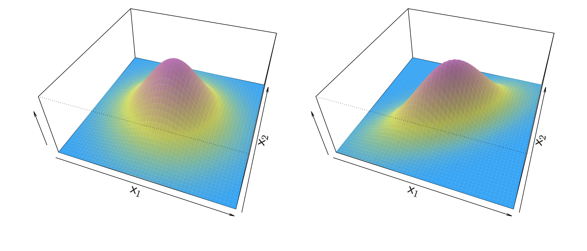
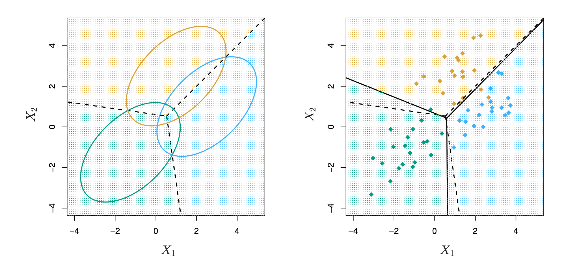

```{r setup, include=FALSE}
options(htmltools.dir.version = FALSE)

library(xaringanthemer)


#See slide on xaringanthemer
library(xaringanthemer)
# style_duo_accent(
# primary_color = "#d19f2a",     # KHP color
# secondary_color = "#e2c47c",   # KHP light
style_mono_accent(
base_color = "#002147",
header_font_google = google_font("Josefin Sans"),
text_font_google = google_font("Montserrat", "300", "300i"),
code_font_google = google_font("Fira Mono")
)

```

```{r  echo=FALSE, message=FALSE, warning=FALSE}
knitr::opts_chunk$set(fig.retina = 5)
```

```{r packages, echo=FALSE, message=FALSE, warning=FALSE}

 
if (!require("emo")) devtools::install_github("")
library(emo)


library(knitr)
options(
  dplyr.print_min = 10, 
  dplyr.print_max = 10
  )


library(tidyverse)
library(tidymodels)
library(ggtext)
library(knitr)
library(kableExtra)
library(plotly)
library(widgetframe)
library(patchwork)
library(bestglm)
library(gridExtra)
library(dplyr)
library(MASS)
require(ISLR)


set.seed(1234)
```

## Lecture overview 


 - The classification vs. regression problem
 
 - Logistic regression
  + two classes 
  + more than two classes
  
- Discriminant analysis

- Logistic regression vs. Latent Discriminant Analysis 


---

## Classification 

Qualitative variables take values in an unordered set $C$, such as:
   $$ \text{eye color} \in {\{} \text{brown, blue, green} \} $$
  $$ \text{email} \in \{ \text{spam, ham} \} $$

Given a feature vector $X$ and a qualitative response $Y \in \mathcal{C}$. The classification tasks is to build a function $C(X)$ that takes as input the feature vector $X$ and predicts its value for $Y; i.e. C(X) \in \mathcal{C}$

Often, we estimate the *probabilities* of $X$ belonging to each category in $\mathcal{C}$

--

For example, it is more valuable to have an estimate of the probability that an insurance claim is fraudulent, than a classifiation fraudulent or not.

---


## Example: Credit Card Default
.pull-left[
```{r echo=FALSE}
data(Default)

ggplot(Default, aes(x = balance, y = income, color = default)) +
  geom_point(size = 0.5, alpha = 1, shape = 4) +
  scale_color_manual(values = c("No" = "cornflowerblue", "Yes" = "coral")) +
  labs(title = "Scatter Plot of Balance vs. Income by Default Status",
       x = "Income",
       y = "Balance") +
  theme_minimal()
```
]


.pull-right[
```{r echo=FALSE}
plot_income <- ggplot(Default, aes(x = default, y = income, fill = default)) +
  geom_boxplot() +
  scale_fill_manual(values = c("No" = "cornflowerblue", "Yes" = "coral")) +
  labs(title = "Income by Default Status",
       x = "Default Status",
       y = "Income") +
  theme_minimal()

plot_balance <- ggplot(Default, aes(x = default, y = balance, fill = default)) +
  geom_boxplot() +
  scale_fill_manual(values = c("No" = "cornflowerblue", "Yes" = "coral")) +
  labs(title = "Balance by Default Status",
       x = "Default Status",
       y = "Balance") +
  theme_minimal()

grid.arrange(plot_income, plot_balance, ncol = 2)
```
]
---
## Can we use Linear regression?

Suppose for the `Default` classification tasks that we code

$$
Y =
\begin{cases}
0, & \text{if No} \\
1, & \text{if Yes.}
\end{cases}
$$
Can we simply perform a linear regression of $Y$ on $X$ and classify as `Yes` if $\hat{Y} > 0.5$?
--
  + In this case of a binary outcome, linear regression does a good job as a classifier, and is equivalent to linear discriminant analysis, which we discuss later.
  
  + Since in the population $E(Y | X = x) = \Pr(Y = 1 | X = x)$, we might think that regression is perfect for this task.
  
  + However, linear regression might produce probabilities less than zero or greater than one. Logistic regression is more appropriate.

---

## Linear versus Logistic Regression

```{r echo=FALSE, fig.height=5, fig.width=10, warning=FALSE}
lm_model <- lm(default ~ balance, data = Default)

glm_model <- glm(default ~ balance, data = Default, family = "binomial")

Default$pred_lm <- predict(lm_model, newdata = Default)
Default$pred_glm <- 1+predict(glm_model, newdata = Default, type = "response")

plot_lm <- ggplot(Default, aes(x = balance, y = default)) +
  geom_point(color = "coral", shape = 3, alpha = 0.5) +
  geom_line(aes(y = pred_lm), color = "cornflowerblue", size = 1) +
  labs(title = "Linear Regression",
       x = "Balance",
       y = "Probability of Default") +
  theme_minimal()

plot_glm <- ggplot(Default, aes(x = balance, y = default)) +
  geom_point(color = "coral", shape = 3, alpha = 0.5) +
  geom_line(aes(y = pred_glm), color = "cornflowerblue", size = 1) +
  labs(title = "Logistic Regression",
       x = "Balance",
       y = "Probability of Default") +
  theme_minimal()

grid.arrange(plot_lm, plot_glm, ncol = 2)

```

The orange marks indicate the response $Y$ , either 0 or 1. Linear regression does not estimate $Pr(Y = 1|X)$ well. Logistic regression seems well suited to the task.

---
## Linear Regression continued

Now suppose we have a response variable with three possible values. A patient presents at the emergency room, and we must classify them according to their symptoms.

$$
Y =
\begin{cases}
1, & \text{if stroke;} \\
2, & \text{if drug overdose;} \\
3, & \text{if epileptic seizure.}
\end{cases}
$$
This coding suggests an ordering, and in fact implies that the difference between **stroke** and **drug overdose** is the same as between **drug overdose** and **epileptic seizure**.

<br>
--

Linear regression is not appropriate here. **Multiclass Logistic Regression** or **Discriminant Analysis** are more appropriate.

---
## Logistic regression

Let’s write $p(X) = \Pr(Y = 1 | X)$ for short and consider using balance to predict default. Logistic regression uses the form

$$p(X) = \frac{e^{\beta_0 + \beta_1 X}}{1 + e^{\beta_0 + \beta_1 X}}.$$
( $e \approx 2.71828$ is a mathematical constant, Euler’s number.)

It is easy to see that no matter what values $\beta_0$, $\beta_1$, or $X$ take, $p(X)$ will have values between 0 and 1.

--
A bit of rearrangement gives

$$\log \left( \frac{p(X)}{1 - p(X)} \right) = \beta_0 + \beta_1 X.$$
This monotone transformation is called the **log odds** or **logit transformation** of $p(X)$. (By $\log$ we mean the natural log: $\ln$.)

---

## Linear versus Logistic Regression

```{r echo=FALSE, fig.height=5, fig.width=10, warning=FALSE}
lm_model <- lm(default ~ balance, data = Default)

glm_model <- glm(default ~ balance, data = Default, family = "binomial")

Default$pred_lm <- predict(lm_model, newdata = Default)
Default$pred_glm <- 1+predict(glm_model, newdata = Default, type = "response")

plot_lm <- ggplot(Default, aes(x = balance, y = default)) +
  geom_point(color = "coral", shape = 3, alpha = 0.5) +
  geom_line(aes(y = pred_lm), color = "cornflowerblue", size = 1) +
  labs(title = "Linear Regression",
       x = "Balance",
       y = "Probability of Default") +
  theme_minimal()

plot_glm <- ggplot(Default, aes(x = balance, y = default)) +
  geom_point(color = "coral", shape = 3, alpha = 0.5) +
  geom_line(aes(y = pred_glm), color = "cornflowerblue", size = 1) +
  labs(title = "Logistic Regression",
       x = "Balance",
       y = "Probability of Default") +
  theme_minimal()

grid.arrange(plot_lm, plot_glm, ncol = 2)

```

Logistic regression ensures that our estimate for $p(X)$ lies between 0 and 1.
---

## Maximum Likelihood

We use maximum likelihood to estimate the parameters.

$$\mathcal{l}(\beta_0, \beta_1) = \prod_{i : y_i = 1} p(x_i) \prod_{i : y_i = 0} (1 - p(x_i)).$$

This likelihood gives the probability of the observed zeros and ones in the data. We pick $\beta_0$ and $\beta_1$ to maximize the likelihood of the observed data.

Most statistical packages can fit linear logistic regression models
by maximum likelihood. In `R` we use the `glm` function


---
## Making prediction 

$$\begin{array}{c c c c c }
\hline
& \text{Coefficient} & \text{Std. Error} & \text{Z-statistic} & \text{P-value} \\
\hline
\text{Intercept} & -10.6513 & 0.3612 & -29.5 & < 0.0001 \\
\text{Balance} & 0.0055 & 0.0002 & 24.9 & < 0.0001 \\\hline
\end{array}$$
What is our estimated probability of default for someone with a balance of 1000$?

$$\hat{p}(X) = \frac{e^{\hat{\beta}_0 + \hat{\beta}_1 X}}{1 + e^{\hat{\beta}_0 + \hat{\beta}_1 X}} = \frac{e^{-10.6513 + 0.0055 \times 1000}}{1 + e^{-10.6513 + 0.0055 \times 1000}} = 0.006.$$
With a balance of 2000$?

--

$$\hat{p}(X) = \frac{e^{\hat{\beta}_0 + \hat{\beta}_1 X}}{1 + e^{\hat{\beta}_0 + \hat{\beta}_1 X}} = \frac{e^{-10.6513 + 0.0055 \times 2000}}{1 + e^{-10.6513 + 0.0055 \times 2000}} = 0.586$$


---
Lets do it again, using **student** as the predictor.

$$\begin{array}{c c c c c }
\hline
& \text{Coefficient} & \text{Std. Error} & \text{Z-statistic} & \text{P-value} \\
\hline
\text{Intercept} & -3.5041 & 0.0707 & -49.55 & < 0.0001 \\
\text{student[Yes]} & 0.4049 & 0.1150 & 3.52 & 0.0004 \\
\hline
\end{array}$$

$$\Pr(\text{default} = \text{Yes} | \text{student} = \text{Yes}) = \frac{e^{-3.5041 + 0.4049 \times 1}}{1 + e^{-3.5041 + 0.4049 \times 1}} = 0.0431$$

$$\Pr(\text{default} = \text{Yes} | \text{student} = \text{No}) = \frac{e^{-3.5041 + 0.4049 \times 0}}{1 + e^{-3.5041 + 0.4049 \times 0}} = 0.0292$$
---
## Logistic regression with several variables 
$$\log \left( \frac{p(X)}{1 - p(X)} \right) = \beta_0 + \beta_1 X_1 + \cdots + \beta_p X_p$$

$$p(X) = \frac{e^{\beta_0 + \beta_1 X_1 + \cdots + \beta_p X_p}}{1 + e^{\beta_0 + \beta_1 X_1 + \cdots + \beta_p X_p}}$$
$$\begin{array}{c c c c c }
\hline
& \text{Coefficient} & \text{Std. Error} & \text{Z-statistic} & \text{P-value} \\
\hline
\text{Intercept} & -10.8690 & 0.4923 & -22.08 & < 0.0001 \\
\text{balance} & 0.0057 & 0.0002 & 24.74 & < 0.0001 \\
\text{income} & 0.0030 & 0.0082 & 0.37 & 0.7115 \\
\text{student[Yes]} & -0.6468 & 0.2362 & -2.74 & 0.0062 \\
\hline
\end{array}$$
Why is coefficient for **student** negative, while it was positive before?
---
## Confounding

```{r echo=FALSE, fig.height=5, fig.width=10, message=FALSE, warnings=FALSE}

Default$default <- as.numeric(Default$default == "Yes")

plot_data <- Default %>%
  group_by(student, balance = cut(balance, breaks = seq(500, 2500, by = 500))) %>%
  summarise(default_rate = mean(default, na.rm = TRUE)) %>%
  filter(!is.na(balance))

plot_default_rate <- ggplot(plot_data, aes(x = as.numeric(gsub("[^0-9]", "", balance)), 
                                           y = default_rate, color = student)) +
  geom_line(size = 1, show.legend = FALSE) +
  labs(title = "Default Rate by Credit Card Balance \n and Student Status",
       x = "Credit Card Balance",
       y = "Default Rate") +
  theme_minimal() +
  scale_color_manual(values = c("No" = "cornflowerblue", "Yes" = "coral"))

plot_balance_boxplot <- ggplot(Default, aes(x = student, y = balance, fill = student)) +
  geom_boxplot() +
  labs(title = "Credit Card Balance by Student Status",
       x = "Student Status",
       y = "Credit Card Balance") +
  theme_minimal() +
  scale_fill_manual(values = c("No" = "cornflowerblue", "Yes" = "coral"))


grid.arrange(plot_default_rate, plot_balance_boxplot, ncol = 2, widths = c(2, 2), padding = unit(1, "cm"))
```
 - Students tend to have higher balances than non-students, so their marginal default rate is higher than for non-students.
 - But for each level of balance, students default less than non-students.
 - Multiple logistic regression can tease this out.

---
## Example: South African Heart Disease

- 160 cases of MI (myocardial infarction) and 302 controls (all male in age range 15-64), from Western Cape, South Africa in early 80s.
-  Overall prevalence very high in this region: 5.1%.
- Measurements on seven predictors (risk factors), shown in scatterplot matrix.
- Goal is to identify relative strengths and directions of risk factors.
- This was part of an intervention study aimed at educating the public on healthier diets.

```{r}
#install.packages('bestglm')
data(SAheart)
```

---

```{r echo=FALSE, fig.height=7, fig.width=10, message=FALSE, warning=FALSE, paged.print=TRUE, warnings=FALSE}
data(SAheart)
library(GGally)
SAheart$MI <-  factor(SAheart$chd)
ggpairs(SAheart,
        columns = c("sbp", "tobacco", "ldl", "famhist", "obesity", "alcohol", "age"),
        aes(color = MI, alpha = 0.7),
        lower = list(continuous = wrap("points")),
        diag = list(continuous = wrap("densityDiag")),
        upper = list(continuous = wrap("cor", size = 3))) +
  scale_color_manual(values = c("1" = "red", "0" = "turquoise")) +
  theme_minimal()

```
Scatterplot matrix of the South African Heart Disease data. The response is color
coded — The cases (MI) are red, the controls turquoise. `famhist` is a binary variable, with 1 indicating family history of MI.
---

```{r echo=TRUE, message=FALSE, warning=FALSE, paged.print=FALSE}
data(SAheart)
heartfit <- glm (chd ~ ., data = SAheart , family = binomial)
summary(heartfit)
```
---
## Case control 

- In the South African data, there are 160 cases and 302 controls — $\tilde{\pi} = 0.35$ are cases. Yet the prevalence of MI in this region is $\pi = 0.05$.

- With case-control samples, we can estimate the regression parameters $\beta_j$ accurately (if our model is correct); however, the constant term $\beta_0$ is incorrect.

- We can correct the estimated intercept by a simple transformation:

$$\hat{\beta}_0^* = \hat{\beta}_0 + \log \frac{\pi}{1 - \pi} - \log \frac{\tilde{\pi}}{1 - \tilde{\pi}}.$$
---

## Logistic regression with more than two classes

So far we have discussed logistic regression with two classes. It is easily generalized to more than two classes. One version (used in the R package `glmnet`) has the symmetric form:

$$\Pr(Y = k | X) = \frac{e^{\beta_{0k} + \beta_{1k} X_1 + \dots + \beta_{pk} X_p}}{\sum_{k'=1}^{K} e^{\beta_{0k'} + \beta_{1k'} X_1 + \dots + \beta_{pk'} X_p}}$$

Here, there is a linear function for **each** class.

Multiclass logistic regression is also referred to as **multinomial regression**.
---
## Discriminant Analysis

- Here, the approach is to model the distribution of $X$ in each of the classes separately, and then use **Bayes' theorem** to flip things around and obtain $\Pr(Y | X)$.

- When we use normal (Gaussian) distributions for each class, this leads to linear or quadratic discriminant analysis. 

- However, this approach is quite general, and other distributions can be used as well. We will focus on normal distributions.
---
## Bayes theorem for classification

Thomas Bayes was a famous mathematician whose name represents a significant subfield of statistical and probabilistic modeling. Here, we focus on a simple result known as Bayes' theorem:

$$\Pr(Y = k | X = x) = \frac{\Pr(X = x | Y = k) \cdot \Pr(Y = k)}{\Pr(X = x)}.$$

One writes this slightly differently for discriminant analysis:

$$\Pr(Y = k | X = x) = \frac{\pi_k f_k(x)}{\sum_{l=1}^{K} \pi_l f_l(x)},$$

- $f_k(x) = \Pr(X = x | Y = k)$ is the ***density*** for $X$ in class $k$. Here we will use normal densities for these, separately in each class.
- $\pi_k = \Pr(Y = k)$ is the marginal or **prior** probability for class $k$.
---
## Classify to the highest density
```{r echo=FALSE, fig.height=5, fig.width=10}
# Create data for the plots
x <- seq(-5, 5, length.out = 100)
set.seed(42)

# Define the densities for each class
density1 <- dnorm(x, mean = -2, sd = 1)  # Class 1 (left)
density2 <- dnorm(x, mean = 2, sd = 1)   # Class 2 (right)

# Create data frames for ggplot
data1 <- data.frame(x = x, density = density1, class = "Class 1")
data2 <- data.frame(x = x, density = density2, class = "Class 2")

# Combine data frames for equal mass distributions
plot_data_equal <- rbind(data1, data2)

# Create the same data for unequal mass distributions
data1_unequal <- data.frame(x = x, density = 0.3 * density1, class = "Class 1 (0.3 mass)")
data2_unequal <- data.frame(x = x, density = 0.7 * density2, class = "Class 2 (0.7 mass)")

# Combine data frames for unequal mass distributions
plot_data_unequal <- rbind(data1_unequal, data2_unequal)

# Plot for equal mass (pi1 = 0.5, pi2 = 0.5)
plot1 <- ggplot(plot_data_equal, aes(x = x, y = density, color = class)) +
  geom_line(size = 1) +
  geom_vline(xintercept = 0, linetype = "dashed") +  # Decision boundary at 0
  labs(title = expression(pi[1] == 0.5 * "," ~ pi[2] == 0.5),
       x = NULL, y = "Density") +
  theme_minimal() +
  scale_color_manual(values = c("Class 1" = "cornflowerblue", "Class 2" = "coral")) +
  theme(legend.position = "none")

# Plot for unequal mass (pi1 = 0.3, pi2 = 0.7)
plot2 <- ggplot(plot_data_unequal, aes(x = x, y = density, color = class)) +
  geom_line(size = 1) +
  geom_vline(xintercept = -0.22, linetype = "dashed") +  
  labs(title = expression(pi[1] == 0.3 * "," ~ pi[2] == 0.7),
       x = NULL, y = "Density") +
  theme_minimal() +
  scale_color_manual(values = c("Class 1 (0.3 mass)" = "cornflowerblue", "Class 2 (0.7 mass)" = "coral")) +
  theme(legend.position = "none")

grid.arrange(plot1, plot2, ncol = 2)

```
We classify a new point according to which density is highest.
When the priors are different, we take them into account as well, and compare $\pi_k f_k(x)$. On the right, we favor the orange class — the decision boundary has shifted to the left.
---
## Why discriminant analysis?

 When the classes are well-separated, the parameter estimates for the logistic regression model are surprisingly unstable. Linear discriminant analysis does not suffer from this problem.

If $n$ is small and the distribution of the predictors $X$ is approximately normal in each of the classes, the linear discriminant model is again more stable than the logistic regression model.

 Linear discriminant analysis is popular when we have more than two response classes, because it also provides low-dimensional views of the data.

---
### Linear Discriminant Analysis when $p = 1$

The Gaussian density has the form:
$$    f_k(x) = \frac{1}{\sqrt{2\pi\sigma_k}} e^{-\frac{1}{2} \left( \frac{x - \mu_k}{\sigma_k} \right)^2}$$
where $\mu_k$ is the mean, and $\sigma_k^2$ is the variance (in class $k$). We assume that all $\sigma_k = \sigma$ are the same.

Plugging this into Bayes' formula, we get a rather complex expression for $p_k(x) = \Pr(Y = k | X = x)$:

$$p_k(x) = \frac{\pi_k \frac{1}{\sqrt{2\pi\sigma}} e^{-\frac{1}{2} \left( \frac{x - \mu_k}{\sigma} \right)^2}}{\sum_{l=1}^K \pi_l \frac{1}{\sqrt{2\pi\sigma}} e^{-\frac{1}{2} \left( \frac{x - \mu_l}{\sigma} \right)^2}}$$
Happily, there are simplifications and cancellations.

---
### Disciminant function

To classify at the value $X = x$, we need to see which of the $p_k(x)$ is largest. Taking logs and discarding terms that do not depend on $k$, we find that this is equivalent to assigning $x$ to the class with the largest **discriminant score**:

$$\delta_k(x) = x \cdot \frac{\mu_k}{\sigma^2} - \frac{\mu_k^2}{2\sigma^2} + \log(\pi_k)$$

Note that $\delta_k(x)$ is a linear function of $x$.

If there are $K = 2$ classes and $\pi_1 = \pi_2 = 0.5$, then one can see that the decision boundary is at:

$$x = \frac{\mu_1 + \mu_2}{2}$$
---
```{r echo=FALSE, fig.height=5, fig.width=10}
# Parameters for the distributions
set.seed(42)
mu1 <- -2
mu2 <- 2
sigma <- 1
n_samples <- 50  # Number of samples to draw

# Create density data for plotting
x <- seq(-5, 5, length.out = 100)
density1 <- dnorm(x, mean = mu1, sd = sigma)
density2 <- dnorm(x, mean = mu2, sd = sigma)

# Create data frames for the density plots
data1 <- data.frame(x = x, density = density1, class = "Class 1")
data2 <- data.frame(x = x, density = density2, class = "Class 2")
plot_data_equal <- rbind(data1, data2)

# Sample data to create empirical distributions
samples_class1 <- rnorm(n_samples, mean = mu1, sd = sigma)
samples_class2 <- rnorm(n_samples, mean = mu2, sd = sigma)
plot_data_hist <- data.frame(
  x = c(samples_class1, samples_class2),
  class = factor(rep(c("Class 1", "Class 2"), each = n_samples))
)

plot1 <- ggplot(plot_data_equal, aes(x = x, y = density, color = class)) +
  geom_line(size = 1) +
  geom_vline(xintercept = 0, linetype = "dashed") +  # Decision boundary at 0
  labs(title = expression(pi[1] == 0.5 * "," ~ pi[2] == 0.5),
       x = NULL, y = "Density") +
  theme_minimal() +
  scale_color_manual(values = c("Class 1" = "cornflowerblue", "Class 2" = "coral")) +
  theme(legend.position = "none")

plot2 <- ggplot(plot_data_hist, aes(x = x, fill = class)) +
  geom_histogram(aes(y = ..density..), color = "black", alpha = 0.6, position = "identity", bins = 30) +
  geom_vline(xintercept = 0, linetype = "dashed") + 
  geom_vline(xintercept = 0.3, linetype = "solid") +  
  labs(title = "", x = NULL, y = "Frequency") +
  theme_minimal() +
  scale_fill_manual(values = c("Class 1" = "cornflowerblue", "Class 2" = "coral")) +
  theme(legend.position = "none")

grid.arrange(plot1, plot2, ncol = 2)

```
Example with $\mu_1=-2, \mu_2 = 2, \sigma^2 = 1$

Typically we don’t know these parameters; we just have the training data. In that case we simply estimate the parameters and plug them into the rule.

---
## Estimating the parameters 

$$\hat{k} = \frac{n_k}{n}$$
$$\hat{\mu}_k = \frac{1}{n_k} \sum_{i: y_i = k} x_i$$

$$\hat{\sigma}^2 = \frac{1}{n - K} \sum_{k=1}^{K} \sum_{i: y_i = k} (x_i - \hat{\mu}_k)^2 = \sum_{k=1}^{K} \frac{n_k - 1}{n - K} \cdot \hat{\sigma_k}^2$$


where 
$$\hat{\sigma}^2_k = \frac{1}{n_k - 1} \sum_{i: y_i = k} (x_i - \hat{\mu}_k)^2$$
is the usual formula for the estimated variance in the $k$th class.

---
## Linear Discriminant Analysis when $p > 1$ 

<center>

Source: ISLR
</center>

Density: $f(x) = \frac{1}{(2\pi)^{p/2} |\Sigma|^{1/2}} e^{-\frac{1}{2} (x - \mu)^T \Sigma^{-1} (x - \mu)}$

Discriminant function: $\delta_k(x) = x^T \Sigma^{-1} \mu_k - \frac{1}{2} \mu_k^T \Sigma^{-1} \mu_k + \log \pi_k$

Despite its complex form, $\delta_k(x) = c_{k0} + c_{k1} x_1 + c_{k2} x_2 + \dots + c_{kp} x_p$ — a linear function.

---
### Illustration: p = 2 and K = 3 classes

<center>

Source: ISLR


</center>

Here $\pi_1 = \pi_2 = \pi_3 = 1/3$

The dashed lines are known as the Bayes decision boundaries. Were they known, they would yield the fewest misclassification errors, among all possible classifiers.

---
```{r echo=FALSE, fig.height=7, fig.width=10, message=FALSE, warning=FALSE, paged.print=TRUE, warnings=FALSE}
# Load the Iris dataset
data(iris)

# Create the pair plot using ggpairs
pair_plot <- ggpairs(
  iris, 
  mapping = aes(color = Species),
  columns = 1:4,  # Use the first four columns (Sepal.Length, Sepal.Width, Petal.Length, Petal.Width)
  title = "Fisher's Iris Data",
  upper = list(continuous = wrap("points", alpha = 0.5)),
  lower = list(continuous =  wrap("points", alpha = 0.5)),
  diag = list(continuous = "blankDiag")  
) +
  theme_minimal() +
  scale_color_manual(values = c("setosa" = "skyblue", "versicolor" = "orange", "virginica" = "seagreen"))  +
  theme(legend.position = "right")
pair_plot
```

4 variables, 3 species, 50 samples/class.

LDA classifies all but 3 of the 150 training samples correctly

---
```{r echo=FALSE, fig.height=7, fig.width=10, message=FALSE, warning=FALSE, paged.print=TRUE, warnings=FALSE}

# Perform LDA on the iris dataset
lda_model <- lda(Species ~ ., data = iris)

# Predict the LDA values
lda_values <- predict(lda_model)

# Create a data frame with LDA results
lda_df <- data.frame(lda_values$x, Species = iris$Species)

# Plot the LDA results
ggplot(lda_df, aes(x = LD1, y = LD2, color = Species)) +
  geom_point(size = 2) +
  labs(x = "Discriminant Variable 1", y = "Discriminant Variable 2") +
  theme_minimal() +
  scale_color_manual(values = c("setosa" = "skyblue", "versicolor" = "orange", "virginica" = "seagreen"))
```

---
# From $\delta_{k}(x)$ to probabilities

From $\delta_{k}(x)$ to probabilities

Once we have estimates $\delta_{k}(x)$, we can turn these into estimates for class probabilities:

$$\Pr(Y = k \mid X = x) = \frac{e^{\delta_{k}(x)}}{\sum_{l=1}^{K} e^{\delta_{l}(x)}}.$$

Thus, classifying to the largest $\delta_{k}(x)$ amounts to classifying to the class for which $\Pr(Y = k \mid X = x)$ is largest.

When $K = 2$, we classify to class 2 if $\Pr(Y = 2 \mid X = x) \geq 0.5$, 
else to class 1.

---
# LDA on Credit Data

$$\begin{array}{l|ccc}
\textit{Predicted Default Status} & {\textit{True Default Status}} \\
& \textit{No} & \textit{Yes} & \textbf{Total} \\
\hline
\textit{No} & 9644 & \mathbf{252} & 9896 \\
\textit{Yes} & \mathbf{23} & 81 & 104 \\
\hline
\textbf{Total} & 9667 & \mathbf{333} & 10000
\end{array}$$

  + This is \textbf{training error}, and we may be overfitting. Not a big concern here since $n = 10000$ and $p = 2$.
  + If we classified to the prior (i.e., always to class No in this case), we would make $\frac{333}{10000} = 3.33\%$ errors.
  + Of the true No's, we make $\frac{23}{9667} \approx 0.2\%$ errors. 
  + Of the true Yes's, we make $\frac{252}{333} \approx 75.7\%$ errors.


---
## Types of errors 

**False positive rate:** The fraction of negative examples that are classified as positive -- $0.2\%$ in this example.  

**False negative rate:** The fraction of positive examples that are classified as negative -- $75.7\%$ in this example.

We produced this table by classifying to class \textit{Yes} if:
$$\Pr(\text{Default = Yes} \mid \text{Balance, Student}) \geq 0.5.$$

We can change the two error rates by changing the threshold from $0.5$ to some other value in $[0, 1]$:
$$\Pr(\text{Default = Yes} \mid \text{Balance, Student}) \geq \text{threshold};$$
and vary the threshold.

---
## Other Forms of Discriminant Analysis

$$\Pr(Y = k \mid X = x) = \frac{\pi_k f_k(x)}{\sum_{l=1}^{K} \pi_l f_l(x)}.$$

When $f_k(x)$ are Gaussian densities with the same covariance matrix $\Sigma$ in each class, this leads to linear discriminant analysis (LDA).

By altering the forms for $f_k(x)$, we get different classifiers:

  + With Gaussians but different $\Sigma_k$ in each class, we get **quadratic discriminant analysis (QDA)**.
  + With $f_k(x) = \prod_{j=1}^p f_{jk}(x_j)$ (a conditional independence model) in each class, we get **naive Bayes**. For Gaussian densities, this means that $\Sigma_k$ are diagonal.
  + Many other forms arise by proposing specific density models for $f_k(x)$, including **nonparametric approaches**.

--- 
---
# Naive Bayes

Assumes features are independent in each class.  
Useful when $p$ is large, and so multivariate methods like QDA and even LDA break down.

Gaussian naive Bayes assumes each $\Sigma_k$ is diagonal:  
$$\delta_k(x) \propto \log \left( \pi_k \prod_{j=1}^p f_{kj}(x_j) \right)
= -\frac{1}{2} \sum_{j=1}^p \left[ \frac{(x_j - \mu_{kj})^2}{\sigma_{kj}^2} + \log \sigma_{kj}^2 \right] + \log \pi_k.$$

It can be used for **mixed** feature vectors (qualitative and quantitative).  
If $X_j$ is qualitative, replace $f_{kj}(x_j)$ with the probability mass function (histogram) over discrete categories.

Despite strong assumptions, naive Bayes often produces good classification results.

--- 
---
## Logistic Regression versus LDA

For a two-class problem, one can show that for LDA:
$$\log \frac{p_1(x)}{1 - p_1(x)} = \log \frac{p_1(x)}{p_2(x)} = c_0 + c_1 x_1 + \dots + c_p x_p.$$

So it has the same form as logistic regression.  
The difference is in how the parameters are estimated.


  + Logistic regression uses the conditional likelihood based on $\Pr(Y \mid X)$ (known as discriminative learning).
  + LDA uses the full likelihood based on $\Pr(X, Y)$ (known as generative learning).

Despite these differences, in practice the results are often very similar.

Footnote: Logistic regression can also fit quadratic boundaries, by explicitly including quadratic terms in the model.

---
---
# Summary
Logistic regression is very popular for classification, especially when $K = 2$.

LDA is useful when $n$ is small, or the classes are well separated, and Gaussian assumptions are reasonable. It is also useful when $K > 2$.

Naive Bayes is useful when $p$ is very large.

---
# Sources

- [Introduction to Statistical Learning, Gareth James, Daniela Witten, Trevor Hasie, Robert Tibshirani](https://www.statlearning.com/)
---