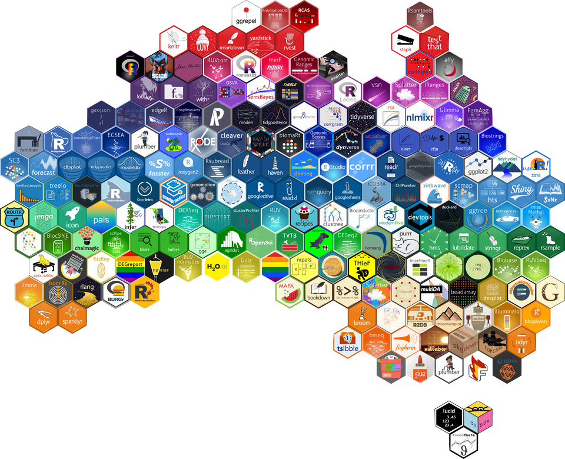

```{r setup, include=FALSE}
options(htmltools.dir.version = FALSE)

library(xaringanthemer)
library(emoji)
library(emojifont)

#See slide on xaringanthemer
library(xaringanthemer)
# style_duo_accent(
# primary_color = "#d19f2a",     # KHP color
# secondary_color = "#e2c47c",   # KHP light
style_mono_accent(
base_color = "#002147",
header_font_google = google_font("Josefin Sans"),
text_font_google = google_font("Montserrat", "300", "300i"),
code_font_google = google_font("Fira Mono")
)

```

```{r packages, echo=FALSE, message=FALSE, warning=FALSE}
# Remember to compile
#xaringan::inf_mr(cast_from = "..")
#       slideNumberFormat: ""  
library(tidyverse)
if (!require("emo")) devtools::install_github("")
library(emo)
if (!require("jasmines")) devtools::install_github("djnavarro/jasmines")
if (!require("mathart")) devtools::install_github("marcusvolz/mathart")
```


## Reproducible data analysis

.question[
What does it mean for a data analysis to be "reproducible"?
]

--

Near-term goals:

- Are the tables and figures reproducible from the code and data?
- Does the code actually do what you think it does?
- In addition to what was done, is it clear *why* it was done? 

Long-term goals:

- Can the code be used for other data?
- Can you extend the code to do other things?

---

## Toolkit for reproducibility

- Scriptability $\rightarrow$ R
- Literate programming (code, narrative, output in one place) $\rightarrow$ R Markdown
- Version control $\rightarrow$ Git / GitHub

---


## R and RStudio

.pull-left[
```{r echo=FALSE, out.width="25%"}
knitr::include_graphics("img/r-logo.png")
```
- R is an open-source statistical **programming language**
- R is also an environment for statistical computing and graphics
- It's easily extensible with *packages*
]
.pull-right[
```{r echo=FALSE, out.width="50%"}
knitr::include_graphics("img/RStudio-Logo-Flat.png")
```
- RStudio is a convenient interface for R called an **IDE** (integrated development environment), e.g. *"I write R code in the RStudio IDE"*
- RStudio is not a requirement for programming with R, but it's very commonly used by R programmers and data scientists
]


---

## R packages

- **Packages** are the fundamental units of reproducible R code. They include reusable R functions, the documentation that describes how to use them, and sample data<sup>1</sup>

- As of September 2020, there are over 16,000 R packages available on **CRAN** (the Comprehensive R Archive Network)<sup>2</sup>

- We're going to work with a small (but important) subset of these!

.footnote[
<sup>1</sup> Wickham and Bryan, [R Packages](https://r-pkgs.org/).

<sup>2</sup> [CRAN contributed packages](https://cran.r-project.org/web/packages/).
]

---

## Tour: R and RStudio

```{r echo=FALSE, out.width="100%"}
knitr::include_graphics("img/tour-r-rstudio.png")
```

---

## A short list (for now) of R essentials

- Functions are (most often) verbs, followed by what they will be applied to in parentheses:

```{r eval=FALSE}
do_this(to_this)
do_that(to_this, to_that, with_those)
```

--

- Packages are installed with the `install.packages` function and loaded with the `library` function, once per session:

```{r eval=FALSE}
install.packages("package_name")
library(package_name)
```

---

## R essentials (continued)

- Columns (variables) in data frames are accessed with `$`:

.small[
```{r eval=FALSE}
dataframe$var_name
```
]

--

- Object documentation can be accessed with `?`

```{r eval=FALSE}
?mean
```

---

## tidyverse

.pull-left[
```{r echo=FALSE, out.width="99%"}
knitr::include_graphics("img/tidyverse.png")
```
]

.pull-right[
.center[.large[
[tidyverse.org](https://www.tidyverse.org/)
]]

- The **tidyverse** is an opinionated collection of R packages designed for data science
- All packages share an underlying philosophy and a common grammar
]

---

## rmarkdown

.pull-left[
.center[.large[
[rmarkdown.rstudio.com](https://rmarkdown.rstudio.com/)
]]

- **rmarkdown** and the various packages that support it enable R users to write their code and prose in reproducible computational documents
- We will generally refer to R Markdown documents (with `.Rmd` extension), e.g. *"Do this in your R Markdown document"* and rarely discuss loading the rmarkdown package
]

.pull-right[
```{r echo=FALSE, out.width="60%"}
knitr::include_graphics("img/rmarkdown.png")
```
]

---

class: middle

# R Markdown

---


## R Markdown

- Fully reproducible reports -- each time you knit the analysis is ran from the beginning
- Simple markdown syntax for text
- Code goes in chunks, defined by three backticks, narrative goes outside of chunks

---

## Tour: R Markdown

```{r echo=FALSE, out.width="90%"}
knitr::include_graphics("img/tour-rmarkdown.png")
```

---

## Environments

.tip[
The environment of your R Markdown document is separate from the Console!
]

Remember this, and expect it to bite you a few times as you're learning to work 
with R Markdown!

---

## Environments

.pull-left[
First, run the following in the console

.small[
```{r eval = FALSE}
x <- 2
x * 3
```
]

.question[
All looks good, eh?
]
]

--

.pull-right[
Then, add the following in an R chunk in your R Markdown document

.small[
```{r eval = FALSE}
x * 3
```
]

.question[
What happens? Why the error?
]
]

---

## R Markdown help

.pull-left[
.center[
.midi[R Markdown Cheat Sheet  
`Help -> Cheatsheets`]
]
```{r echo=FALSE, out.width="80%"}
knitr::include_graphics("img/rmd-cheatsheet.png")
```
]
.pull-right[
.center[
.midi[Markdown Quick Reference  
`Help -> Markdown Quick Reference`]
]
```{r echo=FALSE, out.width="80%"}
knitr::include_graphics("img/md-cheatsheet.png")
```
]

---

## How will we use R Markdown?

- Every assignment / report / project / etc. is an R Markdown document
- You'll always have a template R Markdown document to start with
- The amount of scaffolding in the template will decrease over the semester

---


---

## Working with R at the command line 

- Launch RStudio/R.
- Notice the default panes:
    - Console (entire left)
    - Environment/History (tabbed in upper right)
    - Files/Plots/Packages/Help (tabbed in lower right)


--

- FYI: You can change the default location of the panes, among many other things
  - [Customizing RStudio](https://support.rstudio.com/hc/en-us/articles/200549016-Customizing-RStudio)

---


## R essentials

A short list (for now):

- Functions are (most often) verbs, followed by what they will be applied to in parentheses:

```{r eval=FALSE}
do_this(to_this)
do_that(to_this, to_that, with_those)
```

--

- Columns (variables) in data frames are accessed with `$`:

```{r eval=FALSE}
dataframe$var_name
```

--

- Packages are installed with the `install.packages` function and loaded with the `library` function, once per session:

```{r eval=FALSE}
install.packages("package_name")
library(package_name)
```

---
### R objects

- Numbers

```{r  error = FALSE}
result <- 5-3
result
class(result)
```
--
- Strings
```{r}
Result <- "4"
Result
class(Result)
```

---
- Logicals
```{r}
RESULTS <- c(TRUE,FALSE,FALSE)
class(RESULTS)

as.integer(RESULTS)
class(RESULTS)
mean(RESULTS)
```
---
## Logical operators in R

<br>

operator    | definition                   || operator     | definition
------------|------------------------------||--------------|----------------
`<`         | less than                    ||`x`&nbsp;&#124;&nbsp;`y`     | `x` OR `y` 
`<=`        |	less than or equal to        ||`is.na(x)`    | test if `x` is `NA`
`>`         | greater than                 ||`!is.na(x)`   | test if `x` is not `NA`
`>=`        |	greater than or equal to     ||`x %in% y`    | test if `x` is in `y`
`==`        |	exactly equal to             ||`!(x %in% y)` | test if `x` is not in `y`
`!=`        |	not equal to                 ||`!x`          | not `x`
`x & y`     | `x` AND `y`                  ||              |


---


### Vectors

```{r}
world.pop <- c(2525779, 3026003, 3691173, 4449049, 5320817, 6127700,
6916183)
world.pop[2]
world.pop[c(2,4)]
world.pop[-3]
pop.rate <- world.pop / world.pop[1]
pop.rate
```

---
### Basic functions
```{r}
length(world.pop)
min(world.pop)
max(world.pop)
range(world.pop)
mean(world.pop)
```
---

### Basic functions

- Create names of observations

```{r}
year <- seq(from = 1950, to = 2010, by = 10)
year
```
--

- Name the observations

```{r}
names(world.pop)
names(world.pop) <- year
names(world.pop)
world.pop
```

---
### Creating a function

- Structure of a function `r emo::ji('construction')` :
```
myfunction <- function(input1, input2, ..., inputN) {
DEFINE “output” USING INPUTS 
return(output)
}
```
--
- Create the function to count sum, lenght and mean of vector `r emo::ji('award')` :

```{r}
my.summary <- function(x){ # function takes one input
s.out <- sum(x)
l.out <- length(x)
m.out <- s.out / l.out
out <- c(s.out, l.out, m.out) # define the output
names(out) <- c("sum", "length", "mean") # add labels
return(out) # end function by calling output
}
z <- 1:10
my.summary(z)
```
---

### Data files


- Read data from file


```{r}
UNpop <- read.csv("data/UNpop.csv")
class(UNpop)

names(UNpop)
nrow(UNpop)
ncol(UNpop)
dim(UNpop)
```

---

### Explore data

- Summary statistics 

```{r}
summary(UNpop)
```
--
- Extract parts 

```{r}
UNpop$world.pop
UNpop[, "world.pop"]
```
---

### Explore data (pt 2)

- Take elements 1, 3, 5, ... of the "world.pop" variable

```{r}
UNpop$world.pop[seq(from = 1, to = nrow(UNpop), by = 2)]
world.pop <- c(UNpop$world.pop, NA)
world.pop
mean(world.pop)
mean(world.pop, na.rm = TRUE)
```
---
### Saving the data

- Saving the data

```{r}
save(UNpop, file = "data/population.RData")
write.csv(UNpop, file = "data/population.csv")
```

--
- Loading the data

```{r} 
load("data/population.RData")
```
--- 

---
- Saving the data to 'foreign' data formats

```{r}
library("foreign") 
write.dta(UNpop, file = "data/UNpop.dta")
read.dta("data/UNpop.dta")
```
---
## Getting help
```{r echo=FALSE, out.width="60%"}
knitr::include_graphics("img/r-help.png")
```
---

## Asking good questions


.pull-left[
- **Good:** Describe your intention and include your code and the error
- **Better:** Describe your intention and create a minimum working example
]
--
.pull-right[

- Use code formatting
- For issues with R code: copy / paste your code and resulting error, don't use screenshots!
]

---
## What's with all the hexes?

```{r echo=FALSE, out.width="60%"}

```

.footnote[
Mitchell O'Hara-Wild, [useR! 2018 feature wall](https://www.mitchelloharawild.com/blog/user-2018-feature-wall/)
]

---

class: middle

# Excercise

---

**Your turn:** `GitHub Bechdel.Rmd`
- [The Bechdel test](https://en.wikipedia.org/wiki/Bechdel_test) asks whether a work of fiction features at least two women who talk to each other about something other than a man, and there must be two women named characters.
- Go to [@tomas oles GitHub](https://rstudio.cloud/) and start the assignment ` - Bechdel.Rmd`. 
- Open and knit the R Markdown document `bechdel.Rmd`, review the document, and fill in the blanks.


---

# Sources

- [Data science in a Box](https://datasciencebox.org/)

---