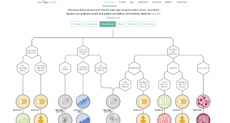

```{r setup, include=FALSE}
options(htmltools.dir.version = FALSE)


#See slide on xaringanthemer
library(xaringanthemer)
# style_duo_accent(
# primary_color = "#d19f2a",     # KHP color
# secondary_color = "#e2c47c",   # KHP light
style_mono_accent(
base_color = "#d19f2a",
header_font_google = google_font("Josefin Sans"),
text_font_google = google_font("Montserrat", "300", "300i"),
code_font_google = google_font("Fira Mono")
)

```

```{r packages, echo=FALSE, message=FALSE, warning=FALSE}
# Remember to compile
#xaringan::inf_mr(cast_from = "..")
#       slideNumberFormat: ""  
library(tidyverse)
if (!require("emo")) devtools::install_github("")
library(emo)
library(emo)
library(Tmisc)
if (!require("dsbox")) devtools::install_github("rstudio-education/dsbox")
library(dsbox)
library(palmerpenguins)


```

```{r  echo=FALSE, message=FALSE, warning=FALSE}
knitr::opts_chunk$set(fig.retina = 5)
```

---
class: middle

# Numerical data
---

```{r include=FALSE}
library(openintro)
loans_full_schema <- loans_full_schema %>%
  mutate(grade = factor(grade, ordered = TRUE))

write.csv(loans_full_schema, file = "/Users/tomasoles/Dropbox/Teaching/EconomicPolicyDataScienceApproach/2_week/loans_data.csv")
```

## Number of variables involved

- Univariate data analysis - distribution of single variable
- Bivariate data analysis - relationship between two variables
- Multivariate data analysis - relationship between many variables at once, 
  - usually focusing on the relationship between two while conditioning for others

---

## Types of variables

- **Numerical variables** can be classified as **continuous** or **discrete** based on whether or not the variable can take on an infinite number of values or only non-negative whole numbers, respectively.
- If the variable is **categorical**, we can determine if it is **ordinal** based on whether or not the levels have a natural ordering.


---


## Data: Lending Club

```{r}
loans_full_schema <- read.csv(file = "/Users/tomasoles/Dropbox/Teaching/EconomicPolicyDataScienceApproach/2_week/loans_data.csv")
```

.pull-left-wide[

- Thousands of loans made through the Lending Club,
  - a platform that allows individuals to lend to each other
- Not all loans are created equal 
  - ease of getting a loan depends on (apparent) ability to repay the loan
- Data includes loans *made* 
  - (these data are not loan applications)
]
---


## Take a peek at data

```{r output.lines=15}
library(openintro)
glimpse(loans_full_schema)
```

---

## Selected variables

```{r}
loans <- loans_full_schema %>%
  select(loan_amount, interest_rate, term, grade, 
         state, annual_income, homeownership, debt_to_income)
glimpse(loans)
```

---

## Selected variables

<br>

.midi[
variable        | description
----------------|-------------
`loan_amount`   |	Amount of the loan received, in US dollars
`interest_rate` |	Interest rate on the loan, in an annual percentage
`term`	        | The length of the loan, which is always set as a whole number of months
`grade`	        | Loan grade, which takes a values A through G and represents the quality of the loan and its likelihood of being repaid
`state`         |	US state where the borrower resides
`annual_income` |	Borrower’s annual income, including any second income, in US dollars
`homeownership`	| Indicates whether the person owns, owns but has a mortgage, or rents
`debt_to_income` | Debt-to-income ratio
]

---

## Variable types

<br>

variable        | type
----------------|-------------
`loan_amount`   |	numerical, continuous
`interest_rate` |	numerical, continuous
`term`	        | numerical, discrete
`grade`	        | categorical, ordinal
`state`         |	categorical, not ordinal
`annual_income` |	numerical, continuous
`homeownership`	| categorical, not ordinal
`debt_to_income` | numerical, continuous

---

class: middle

# Histogram

---

## Histogram

```{r message = TRUE, out.width = "30%", fig.retina=3}
ggplot(loans, aes(x = loan_amount)) +
  geom_histogram()
```

---

## Histograms and binwidth 

+ binwidth = 1000

```{r out.width = "30%", fig.retina=3}
ggplot(loans, aes(x = loan_amount)) +
  geom_histogram(binwidth = 1000)
```

---

## binwidth = 5000
```{r out.width = "30%", fig.retina=3}
ggplot(loans, aes(x = loan_amount)) +
  geom_histogram(binwidth = 5000)
```

---

## binwidth = 20000

```{r out.width = "50%", fig.retina=3}
ggplot(loans, aes(x = loan_amount)) +
  geom_histogram(binwidth = 20000)
```

---

## Customizing histograms

.pull-left[
```{r ref.label = "hist-custom",out.width = "100%", echo = FALSE, warning = FALSE, fig.retina=3}
```

]
.pull-right[.small[
```{r hist-custom, fig.show = "hide", warning = FALSE, fig.retina=3}
ggplot(loans, aes(x = loan_amount)) +
  geom_histogram(binwidth = 5000) +
  labs( #<<
    x = "Loan amount ($)", #<<
    y = "Frequency", #<<
    title = "Amounts of Lending Club loans" #<<
  ) #<<
```
]
]


---

## Fill with a categorical variable

.pull-left[
```{r ref.label = "hist-fill",out.width = "100%", echo = FALSE, warning = FALSE, fig.retina=3}
```
]
.pull-right[.small[
```{r hist-fill, fig.show = "hide", warning = FALSE, fig.retina=3}
ggplot(loans, aes(x = loan_amount, 
                  fill = homeownership)) + #<<
  geom_histogram(binwidth = 5000,
                 alpha = 0.5) + #<<
  labs(
    x = "Loan amount ($)",
    y = "Frequency",
    title = "Amounts of Lending Club loans"
  )
```
]
]

---

## Facet with a categorical variable

.pull-left[
```{r ref.label = "hist-facet", out.width = "100%",echo = FALSE, warning = FALSE, fig.retina=3}
```
]
.pull-right[.small[
```{r hist-facet, fig.show = "hide", warning = FALSE, fig.retina=3}
ggplot(loans, aes(x = loan_amount, fill = homeownership)) + 
  geom_histogram(binwidth = 5000) +
  labs(
    x = "Loan amount ($)",
    y = "Frequency",
    title = "Amounts of Lending Club loans"
  ) +
  facet_wrap(~ homeownership, nrow = 3) #<<
```
]
]

---

class: middle

# Density plot

---

## Density plot

```{r,out.width = "50%", fig.retina=3}
ggplot(loans, aes(x = loan_amount)) +
  geom_density()
```

---

## Density plots and adjusting bandwidth

.pull-left[
+ adjust = 0.5
```{r out.width = "50%", fig.retina=3}
ggplot(loans, aes(x = loan_amount)) +
  geom_density(adjust = 0.5)
```
]
.pull-right[
+ adjust = 1
```{r out.width = "50%", fig.retina=3}
ggplot(loans, aes(x = loan_amount)) +
  geom_density(adjust = 1) # default bandwidth
```
]
---

# adjust = 2
```{r out.width = "50%", fig.retina=3}
ggplot(loans, aes(x = loan_amount)) +
  geom_density(adjust = 2)
```

---

## Customizing density plots

.pull-left[
```{r ref.label = "density-custom", echo = FALSE, warning = FALSE,out.width = "100%", fig.retina=3}
```
]
.pull-right[.small[
```{r density-custom, fig.show = "hide", warning = FALSE, fig.retina=3}
ggplot(loans, aes(x = loan_amount)) +
  geom_density(adjust = 2) +
  labs( #<<
    x = "Loan amount ($)", #<<
    y = "Density", #<<
    title = "Amounts of Lending Club loans" #<<
  ) #<<
```
]
]

---

## Adding a categorical variable

.pull-left[
```{r ref.label = "density-cat", echo = FALSE, warning = FALSE,out.width = "100%",  fig.retina=3 }
```
]
.pull-right[.small[
```{r density-cat, fig.show = "hide", warning = FALSE,  fig.retina=3}
ggplot(loans, aes(x = loan_amount, 
                  fill = homeownership)) + #<<
  geom_density(adjust = 2, 
               alpha = 0.5) + #<<
  labs(
    x = "Loan amount ($)",
    y = "Density",
    title = "Amounts of Lending Club loans", 
    fill = "Homeownership" #<<
  )
```
]
]

---

class: middle

# Box plot

---

## Box plot
.pull-left[
```{r  warning = FALSE}
ggplot(loans, aes(x = interest_rate)) +
  geom_boxplot()
```
]


.pull-right[


```{r  warning = FALSE}
ggplot(loans, aes(x = annual_income)) +
  geom_boxplot()
```
]

---

## Customizing box plots

.pull-left[
```{r ref.label = "box-custom", echo = FALSE, warning = FALSE,out.width = "100%", fig.retina=3}
```
]
.pull-right[.small[
```{r box-custom, fig.show = "hide", warning = FALSE,  fig.retina=3}
ggplot(loans, aes(x = interest_rate)) +
  geom_boxplot() +
  labs(
    x = "Interest rate (%)",
    y = NULL,
    title = "Interest rates of Lending Club loans"
  ) +
  theme( #<<
    axis.ticks.y = element_blank(), #<<
    axis.text.y = element_blank() #<<
  ) #<<
```
]
]

---

## Adding a categorical variable

.pull-left[
```{r ref.label = "box-cat", echo = FALSE, warning = FALSE,  fig.retina=3}
```
]
.pull-right[.small[
```{r box-cat, fig.show = "hide", warning = FALSE,  fig.retina=3}
ggplot(loans, aes(x = interest_rate,
                  y = grade)) + #<<
  geom_boxplot() +
  labs(
    x = "Interest rate (%)",
    y = "Grade",
    title = "Interest rates of Lending Club loans",
    subtitle = "by grade of loan" #<<
  )
```
]
]

---

class: middle

# Relationships numerical variables

---

## Scatterplot

```{r warning = FALSE, out.width="45%",  fig.retina=3}
ggplot(loans, aes(x = debt_to_income, y = interest_rate)) +
  geom_point()
```

---

class: middle

# Categorical variables

---

### Remember this Data?

```{r message=FALSE}
library(tidyverse)
starwars
```


---
### Perhaps now?
```{r}
glimpse(starwars)
```

---
#### Recode hair color

```{r }
starwars <- starwars %>%
  mutate(hair_color2 =
           fct_other(hair_color,
                     keep = c("black", "brown", "grey", "blond")
           )
  )
```
---


class: middle

# Bar plot

---

## Bar plot

```{r out.width="45%", fig.retina=4}
ggplot(data = starwars, mapping = aes(x = gender)) +
  geom_bar()
```

---

## Segmented bar plot: counts

```{r out.width="45%", fig.retina=4}

ggplot(data = starwars, mapping = aes(x = gender, 
                  fill = hair_color))+ #<<
  geom_bar()

```

---


## Segmented bar plots

```{r out.width="45%", fig.retina=4}
ggplot(data = starwars, mapping = aes(x = gender, 
	   fill = hair_color2))+ #<<
  geom_bar()
```

---

## Segmented bar plots

```{r out.width="45%", fig.retina=4}
ggplot(data = starwars, mapping = aes(x = gender, 
	   fill = hair_color2))+ #<<
  geom_bar()+ 
  coord_flip() #<<
```

---

## Segmented bar plots: proportions

```{r out.width="45%", fig.retina=4}
ggplot(data = starwars,
       mapping = aes(x = gender, fill = hair_color2)) +
  geom_bar(position = "fill") +
  coord_flip()
labs(y = "proportion")
```


---

.question[
    Which bar plot is a more useful representation for visualizing the relationship between gender and hair color?
  ]

.pull-left[
```{r echo=FALSE, out.width = "100%", fig.retina=4}
ggplot(data = starwars, mapping = aes(x = gender, 
                  fill = hair_color2)) +
  geom_bar() +
  coord_flip()
```
]

.pull-right[
```{r echo=FALSE, out.width = "100%", fig.retina=4}
ggplot(data = starwars, mapping = aes(x = gender, 
                  fill = hair_color2)) +
  geom_bar(position = "fill") +
  coord_flip() +
  labs(y = "proportion")
```
]

---

## Customizing bar plots

.pull-left[
```{r ref.label = "bar-custom", echo = FALSE, warning = FALSE, fig.retina=4}
```
]

.pull-right[
```{r bar-custom, fig.show = "hide", warning = FALSE, fig.retina=4}
ggplot(starwars, aes(y = gender, #<<
                  fill = hair_color2)) +
  geom_bar(position = "fill") +
  labs( #<<
    x = "Proportion", #<<
    y = "Gender", #<<
    fill = "Hair Color", #<<
    title = "Hair Colors of Starwars", #<<
    subtitle = "by gender" #<<
  ) #<<
```
]
---


class: middle

# Relationships between numerical and categorical variables

---

## Already talked about...

- Coloring and faceting histograms and density plots
- Side-by-side box plots

---

## Violin plots

```{r warning = FALSE, out.width="45%", fig.retina=4}
ggplot(loans, aes(x = homeownership, y = loan_amount)) +
  geom_violin()
```

---

## Ridge plots

```{r warning = FALSE, out.width="45%", fig.retina=4}
library(ggridges)
ggplot(loans, aes(x = loan_amount, y = grade, fill = grade, color = grade)) + 
  geom_density_ridges(alpha = 0.5)
```

---

### From Data to Viz

```{r echo=FALSE, out.width="60%"}

```

.footnote[
Holtz, Y., Healy, C., [From Data to Viz wall](https://www.data-to-viz.com/)
]


---

class: middle

# Excercise

---

**Your turn:** `GitHub Starwars.Rmd`

- Go to [@tomas oles GitHub](https://github.com/tomasoles/applied_data_analysis) and and start the assignment ` - Starwars.Rmd`. 
- Open and knit the R Markdown document `Starwars.Rmd`, review the document, fill in the blanks and complete and interpret the analysis.


---

# Sources

- [Data science in a Box](https://datasciencebox.org/)

---