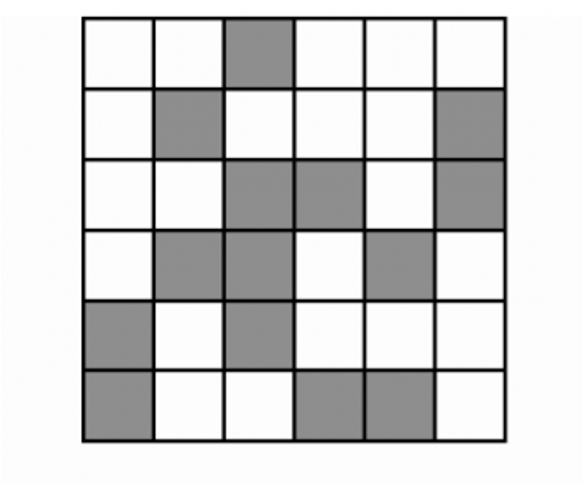
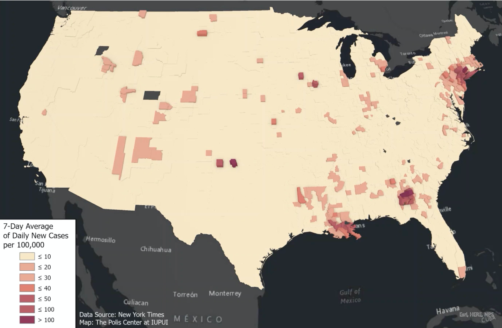

```{r setup, include=FALSE}
options(htmltools.dir.version = FALSE)
#See slide on xaringanthemer
library(xaringanthemer)
# style_duo_accent(
# primary_color = "#d19f2a",     # KHP color
# secondary_color = "#e2c47c",   # KHP light
style_mono_accent(
base_color = "#d19f2a",
header_font_google = google_font("Josefin Sans"),
text_font_google = google_font("Montserrat", "300", "300i"),
code_font_google = google_font("Fira Mono")
)

```

```{r packages, echo=FALSE, message=FALSE, warning=FALSE}
# Remember to compile
#xaringan::inf_mr(cast_from = "..")
#       slideNumberFormat: ""  
library(tidyverse)
if (!require("emo")) devtools::install_github("")
library(emo)
library(DiagrammeR)
library(Tmisc)
library(ggplot2)
library(gridExtra)
if (!require("dsbox")) devtools::install_github("rstudio-education/dsbox")
library(dsbox)
library(palmerpenguins)
```

```{r  echo=FALSE, message=FALSE, warning=FALSE}
knitr::opts_chunk$set(fig.retina = 5)
```

## Lecture overview 

.pull-left[ 
-   Spatial data types 
  + points, lines, polygons, and rasters
- Brief introduction to analysis of spatial health data
- Case example: Lyme disease in New York State
- Global clustering analysis (Moran’s I)
- Local clustering analysis (LISA – local Moran’s I)
]

.pull-right[ 
```{r echo=FALSE, fig.align='center', out.width='40%'}

```
<br> 
```{r echo=FALSE, fig.align='center', out.width='40%'}
knitr::include_graphics("img/heat_map.png")
```
<br> 
```{r echo=FALSE, fig.align='center', out.width='40%'}

```


]
---

## R for spatial analysis

- Wide capabilities and many packages
  + `sp` framework has formed the backbone of R GIS tools for over a decade
  + `sf` framework (much more user-friendly and compatible with `tidyverse`!) introduced several years and gradually replacing `sp`
- Advantages of performing geospatial analysis in R
  + Statistical computing capabilities and impressive graphics engine makes it adept for spatial analysis and mapping
  + Command-line interface enables analysis and visualization to be customizable, transparent, and reproducible


```{r echo=FALSE, fig.align='center', out.width='70%'}
knitr::include_graphics("img/spsf_downloads.png")
```

---
## Geospatial data types 

.pull-left[
Vector data
```{r data-types, echo=FALSE, warning=FALSE}
# Points
points_data <- data.frame(x = c(1, 2, 3), y = c(1, 2, 1))
points_plot <- ggplot(points_data, aes(x, y)) +
  geom_point(size=5, color = "#d19f2a") +
  geom_text(aes(label = paste0("(x", 1:3, ", y", 1:3, ")")),
            nudge_y = 0.3, color = "#d19f2a", size = 4) +
  theme_void() +
  ggtitle("Points") +  
    theme(plot.title = element_text(size = 20))

# Lines
lines_data <- data.frame(x = c(1, 2, 3, 4), y = c(1, 3, 2, 4))
lines_plot <- ggplot(lines_data, aes(x, y)) +
  geom_line(size=1.2, color = "#d19f2a") +
  geom_point(size=5, color = "#d19f2a") +
  theme_void() +
  ggtitle("Lines") +  
    theme(plot.title = element_text(size = 20))

# Polygons
polygon_data <- data.frame(x = c(1, 3, 4, 2), y = c(1, 1, 3, 4))
polygon_plot <- ggplot(polygon_data, aes(x, y)) +
  geom_polygon(fill = "#d19f2a", alpha = 0.4) +
  geom_point(size=5, color = "#d19f2a") +
  theme_void() +
  ggtitle("Polygons")+  
    theme(plot.title = element_text(size = 20))

grid.arrange(points_plot, lines_plot, polygon_plot, ncol=1)
```
]


.pull-right[
Raster data
- Data stored in a regular grid of cells, e.g. elevation and satellite images

```{r echo=FALSE}
# Raster (simplified as squares)
raster_data <- expand.grid(x = 1:10, y = 1:20)

raster_data$cluster <- ifelse(raster_data$x > 5 & raster_data$x < 9 & raster_data$y > 10 & raster_data$y < 15, "#debb69",  "#d19f2a")


ggplot(raster_data, aes(x, y)) +
  geom_tile(aes(fill = cluster), color = "#debb69", size = 0.8) +
  scale_fill_identity() +  # Use identity scale to apply custom colors
  theme_void() +
  ggtitle("")
```
]
---
### Vector data example 

<div style="display: flex;">
  
  <div style="text-align: center;">
    
  </div>
  <div style="text-align: center;">
    
  <div style="text-align: center;">
    
  </div>
</div>

---
### Raster data example 
.pull-left[
Satellite map
```{r echo=FALSE, fig.align='center', out.width='100%'}

```
]

.pull-right[
Land usage
```{r echo=FALSE, fig.align='center', out.width='100%'}

```
]


---

## R spatial data classes (sf)

```{r echo=FALSE, fig.align='center', out.width='100%'}
knitr::include_graphics("img/wkt_multipart.png")
```
* sf can only handle vector data 

---
## R spatial objects comprise spatial and data attributes 


```{r echo=FALSE, out.width="100%"}
grViz("
digraph flowchart {
  
  graph [layout = dot, rankdir = LR]
  
  # Node definitions
  node [shape = box, style = filled, fillcolor = white, fontsize = 14]
  
  A [label = 'sp or sf \n object']
  B [label = 'Spatial\nattributes']
  C [label = 'Geocoordinates']
  D [label = 'Boundaries']
  E [label = 'Projection']
  F [label = 'Data\nattributes \n(data.frame format)']

  # Edge definitions
  A -> B
  A -> F
  B -> C
  B -> D
  B -> E
}
")
```
---
## Analysis of spatial economic/health data

- Broadly speaking, goal is to assess for spatial patterns of disease risk or economic activity

- Presence of spatial patterns may support specific etiologies or risk factors (e.g., environmental hazards or infectious processes) or spatial lock-in or spillovers of unobserved technology 

- Formal investigation of spatial patterns relies on spatial statistics

---

## Types of spatial patterns

<div style="display: flex; justify-content: space-around;">
  
  <div style="text-align: center;">
    <div><strong>No sp. autocorr. </strong></div>
    
  </div>

  <div style="text-align: center;">
    <div><strong>Positive sp. autocorr. </strong></div>
    
  </div>

  <div style="text-align: center;">
    <div><strong>Negative  sp. autocorr.</strong></div>
    
  </div>

</div>

---
## An example of positive spatial autocorrelation


```{r echo=FALSE, fig.align='center', out.width='90%'}

```

---
## Covid incidence (7-d average) 10/4/20
```{r echo=FALSE, fig.align='center', out.width='80%'}

```
---
## Covid incidence (7-d average) 15/7/20
```{r echo=FALSE, fig.align='center', out.width='80%'}

```
---
## Covid incidence (7-d average) 14/11/20
```{r echo=FALSE, fig.align='center', out.width='80%'}

```

---

## Spatial hypothesis testing 

- As a reminder, the goal of spatial statistics is to assess for significant spatial patterns or trends

- There are two broad categories of tests:

 1. Tests of GLOBAL trends: looks for evidence of spatial heterogeneity across the entire study area 

 2. Tests of LOCAL trends: able to assess specific clusters 
 

---

## Assessing global trends 
- $H_0$: constant risk hypothesis – i.e., disease risk is constant throughout space 

  + Disease counts are the same for regions with the same total population at risk
  
  + Incidence rates are the same if regions differ by total population at risk
  
- $Moran's I$ statistic is a measure of global spatial autocorrelation
  + If $p-value$ is significant (e.g., $p < 0.05$): evidence of spatial heterogeneity
  
  + If $p-value$ is not significant: fail to reject null hypothesis

---
## Morans's I 
.center[
$I = \frac{N}{\sum_{n=1}^2(x_i - \bar{x})^2} \frac {\sum_{i=1}^N \sum_{j=1}^N w_{ij}(x_i-\bar x) (x_j-\bar x)} {\sum_{i=1}^N (w_{ij})}$
]

- Moran’s I is essentially a WEIGHTED COVARIANCE FUNCTION
 It is LARGE when $x_i$ and $x_j$ are large at the same time
- How do we pick weights?
  
---
## Different neighbor definition 

<div style="display: flex; justify-content: space-around;">
  
  <div style="text-align: center;">
    <div><strong>Contiguity based </strong></div>
    
  </div>

  <div style="text-align: center;">
    <div><strong>Distance based </strong></div>
    
  </div>

  <div style="text-align: center;">
    <div><strong>k-nearest neighbors</strong></div>
    
  </div>

</div>

---

## Queen's vs rooks's case contiguity

```{r echo=FALSE, fig.align='center', out.width='100%'}

```
---
## Assessing local trends 
- A local indicator of spatial association (LISA) provides a statistic for each location with an assessment of significance

- It allows for the identification of specific disease clusters 

- Local Moran’s I is an extension of the Moran’s I that is defined for each region i 
.center[
$I = \frac {x_i - \bar{X}}{S_i^2}\sum_{i=1}^N w_{i,j}(x_j-\bar{X})$
]
---
## Local Moran’s I

- Local Moran’s I statistic and measure of significance (pseudo p-value) is calculated for each location (polygon)

- A polygon with a HIGH local Moran’s I value is one with a high disease count/rate that is surrounded by other polygons with a high count/rate

- A polygon with a low value is one with a low disease count/rate that is surrounded by other polygons with a low count/rate

- High-High and Low-Low clusters indicate significant disease hot spots and cold spots, respectively


---
# Sources
- [Sherrie Xie, Spatial Analysis in R](https://github.com/sherriexie/SpatialAnalysisinR/tree/main)

- [Claudia, Englel, Using Spatial Data with R](https://cengel.github.io/R-spatial/intro.html)
---