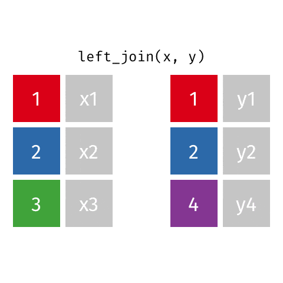
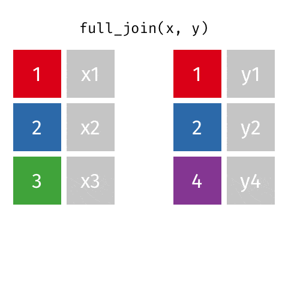
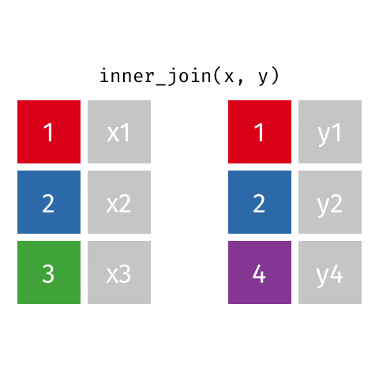
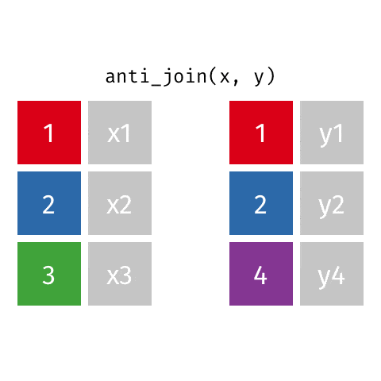

```{r setup, include=FALSE}
options(htmltools.dir.version = FALSE)

library(xaringanthemer)
library(emoji)
library(emojifont)

#See slide on xaringanthemer
library(xaringanthemer)
# style_duo_accent(
# primary_color = "#d19f2a",     # KHP color
# secondary_color = "#e2c47c",   # KHP light
style_mono_accent(
base_color = "#d19f2a",
header_font_google = google_font("Josefin Sans"),
text_font_google = google_font("Montserrat", "300", "300i"),
code_font_google = google_font("Fira Mono")
)

```

```{r  echo=FALSE, message=FALSE, warning=FALSE}
knitr::opts_chunk$set(fig.retina = 5)
```

```{r packages, echo=FALSE, message=FALSE, warning=FALSE}
# Remember to compile
#xaringan::inf_mr(cast_from = "..")
#       slideNumberFormat: ""  
library(tidyverse)
if (!require("emo")) devtools::install_github("")
library(emo)
if (!require("jasmines")) devtools::install_github("djnavarro/jasmines")
if (!require("mathart")) devtools::install_github("marcusvolz/mathart")


library(knitr)
options(
  dplyr.print_min = 10, 
  dplyr.print_max = 10
  )


```


---
class: middle, center
# Joining 

---

---
```{r echo=TRUE}
professions <- read_csv("data/scientists/professions.csv")
dates <- read_csv("data/scientists/dates.csv")
works <- read_csv("data/scientists/works.csv")
```

---
## Data: Women in science 

Information on 10 women in science who changed the world

.small[
```{r echo=FALSE}
professions %>% select(name) %>% kable()
```
]


.footnote[
Source: [Discover Magazine](https://www.discovermagazine.com/the-sciences/meet-10-women-in-science-who-changed-the-world)
]

---

## Inputs

+ Professions
```{r}
professions
```

---
## Inputs

+ Dates
```{r}
dates
```

---

## Inputs

+ Works

```{r}
works
```

---

## Desired output

.small[
```{r echo=FALSE}
professions %>%
  left_join(dates) %>%
  left_join(works)
```
]
---

## Inputs, reminder

.pull-left[.midi[
```{r}
names(professions)
names(dates)
names(works)
```
]
]
.pull-right[
```{r}
nrow(professions)
nrow(dates)
nrow(works)
```
]

---

class: middle

# Joining data frames

---

## Joining data frames

```{r eval=FALSE}
something_join(x, y)
```

- `left_join()`: all rows from x
- `right_join()`: all rows from y
- `full_join()`: all rows from both x and y
- `semi_join()`: all rows from x where there are matching values in y, keeping just columns from x
- `inner_join()`: all rows from x where there are matching values in y, return 
all combination of multiple matches in the case of multiple matches
- `anti_join()`: return all rows from x where there are not matching values in y, never duplicate rows of x
- ...
 
---

## Setup

For the next few slides...

.pull-left[
```{r echo=FALSE}
x <- tibble(
  id = c(1, 2, 3),
  value_x = c("x1", "x2", "x3")
  )
```
```{r}
x
```
]
.pull-right[
```{r echo=FALSE}
y <- tibble(
  id = c(1, 2, 4),
  value_y = c("y1", "y2", "y4")
  )
```
```{r}
y
```
]

---

## `left_join()`

.pull-left[
```{r echo=FALSE, out.width="80%", out.extra ='style="background-color: #FDF6E3"'}

```
]
.pull-right[
```{r}
left_join(x, y)
```
]

---

## `left_join()`

```{r}
professions %>%
  left_join(dates) #<<
```

---

## `right_join()`

.pull-left[
```{r echo=FALSE, out.width="80%", out.extra ='style="background-color: #FDF6E3"'}

```
]
.pull-right[
```{r}
right_join(x, y)
```
]

---

## `right_join()`


```{r}
professions %>%
  right_join(dates) #<<
```

---

## `full_join()`

.pull-left[
```{r echo=FALSE, out.width="80%", out.extra ='style="background-color: #FDF6E3"'}

```
]
.pull-right[
```{r}
full_join(x, y)
```
]

---

## `full_join()`

```{r}
dates %>%
  full_join(works) #<<
```

---

## `inner_join()`

.pull-left[
```{r echo=FALSE, out.width="80%", out.extra ='style="background-color: #FDF6E3"'}

```
]
.pull-right[
```{r}
inner_join(x, y)
```
]

---

## `inner_join()`

```{r}
dates %>%
  inner_join(works) #<<
```

---

## `semi_join()`

.pull-left[
```{r echo=FALSE, out.width="80%", out.extra ='style="background-color: #FDF6E3"'}

```
]
.pull-right[
```{r}
semi_join(x, y)
```
]

---

## `semi_join()`

```{r}
dates %>%
  semi_join(works) #<<
```

---

## `anti_join()`

.pull-left[
```{r echo=FALSE, out.width="80%", out.extra ='style="background-color: #FDF6E3"'}

```
]
.pull-right[
```{r}
anti_join(x, y)
```
]

---

## `anti_join()`

```{r}
dates %>%
  anti_join(works) #<<
```

---

## Putting it altogether

```{r}
professions %>%
  left_join(dates) %>%
  left_join(works)
```


---

class: middle

# Case studies

---

## Case: Student records

- Have:
  - Enrollment: official university enrollment records
  - Survey: Student provided info missing students who never filled it out and including students who filled it out but dropped the class
- Want: Survey info for all enrolled in class 

--

```{r include=FALSE}
enrollment <- read_csv("data/students/enrollment.csv")
survey <- read_csv("data/students/survey.csv")
```

.pull-left[
```{r message = FALSE}
enrollment
```
]
.pull-right[
```{r message = FALSE}
survey
```
]

---

## Student records

+ In class
```{r}
enrollment %>% 
  left_join(survey, by = "id") #<<
```
]

---

## Student records

+ Survey missing
```{r}
enrollment %>% 
  anti_join(survey, by = "id") #<<
```
---

## Student records

+ Dropped
```{r}
survey %>% 
  anti_join(enrollment, by = "id") #<<
```

---

class: middle

# Case study: Grocery sales

---

## Grocery sales

- Have:
  - Purchases: One row per customer per item, listing purchases they made
  - Prices: One row per item in the store, listing their prices
- Want: Total revenue

--

```{r include=FALSE}
purchases <- read_csv("data/sales/purchases.csv")
prices <- read_csv("data/sales/prices.csv")
```

.pull-left[
```{r message = FALSE}
purchases
```
]
.pull-right[
```{r message = FALSE}
prices
```
]

---

## Grocery sales

+ Total revenue

.pull-left[
```{r}
purchases %>% 
  left_join(prices) #<<
```
]

.pull-right[
```{r}
purchases %>% 
  left_join(prices) %>%
  summarize(total_revenue = sum(price)) #<<
```
]

---

## Grocery sales

+ Revenue per customer

.pull-left[
```{r}
purchases %>% 
  left_join(prices)
```
]
.pull-right[
```{r}
purchases %>% 
  left_join(prices) %>%
  group_by(customer_id) %>% #<<
  summarize(total_revenue = sum(price))
```
]


---
# Sources
- [Data Science for Psychologists, S. Mason Garrison](https://datascience4psych.github.io/DataScience4Psych/)

- [Data science in a Box](https://datasciencebox.org/)

---