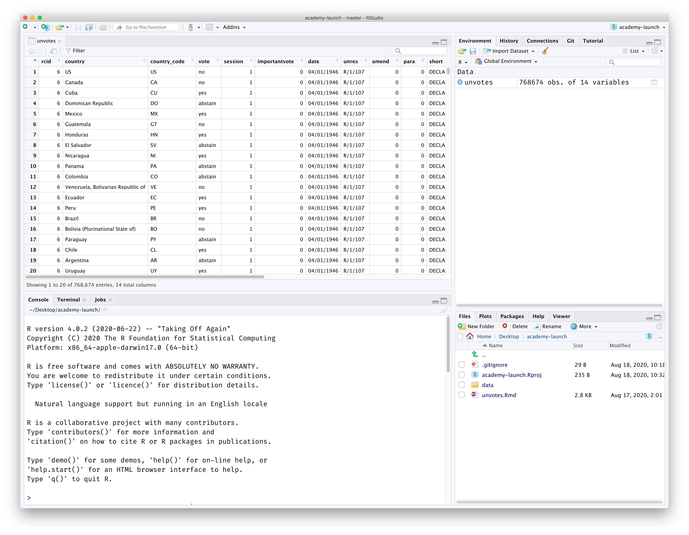
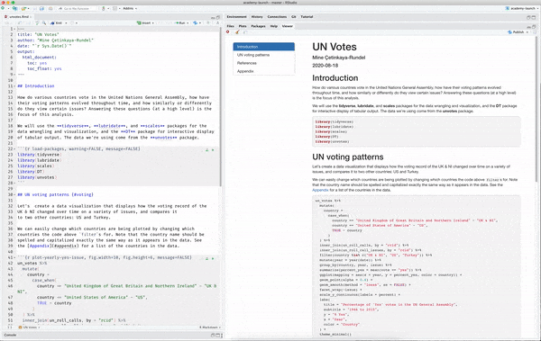
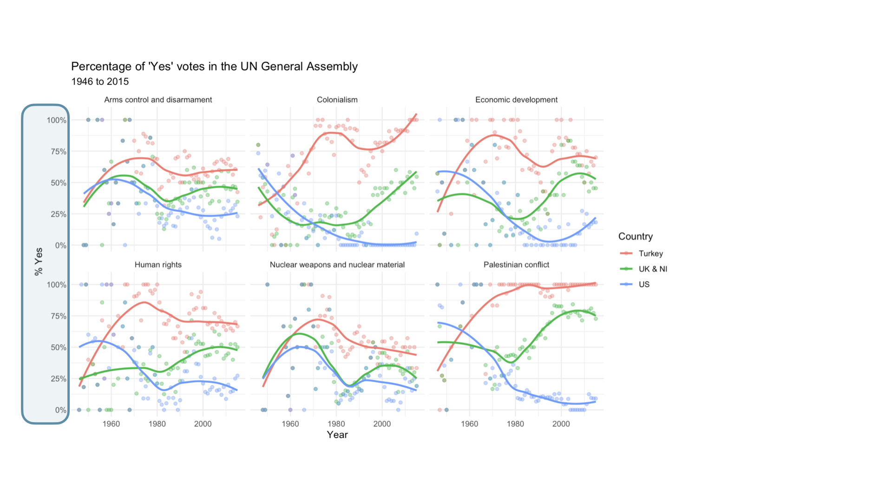
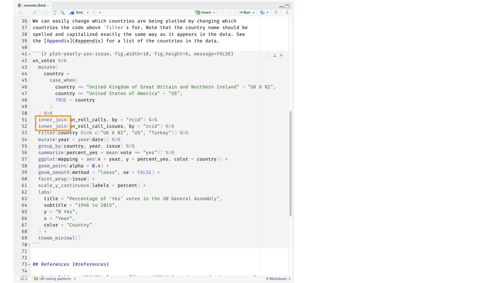
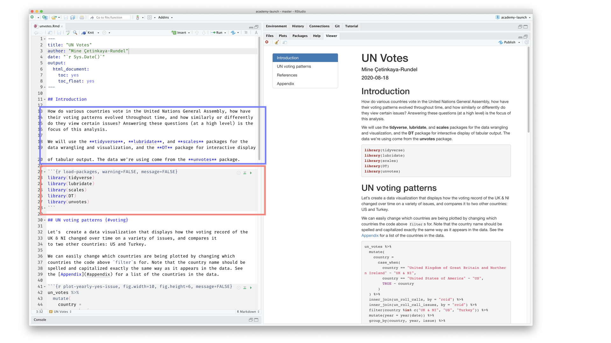

```{r setup, include=FALSE}
options(htmltools.dir.version = FALSE)

library(xaringanthemer)
library(emoji)
library(emojifont)

#See slide on xaringanthemer
library(xaringanthemer)
# style_duo_accent(
# primary_color = "#d19f2a",     # KHP color
# secondary_color = "#e2c47c",   # KHP light
style_mono_accent(
base_color = "#002147",
header_font_google = google_font("Josefin Sans"),
text_font_google = google_font("Montserrat", "300", "300i"),
code_font_google = google_font("Fira Mono")
)

```

```{r packages, echo=FALSE, message=FALSE, warning=FALSE}
# Remember to compile
#xaringan::inf_mr(cast_from = "..")
#       slideNumberFormat: ""  
library(tidyverse)
if (!require("emo")) devtools::install_github("")
library(emo)
if (!require("jasmines")) devtools::install_github("djnavarro/jasmines")
if (!require("mathart")) devtools::install_github("marcusvolz/mathart")
```


## Hello world! `r emo::ji('smile')`  

- Office hours: Wednesday 1PM - 3PM (Please write me before  `r emo::ji('calendar')` )

- Room 4B.40; Old Building

- Contact me: tomas.oles@euba.sk
---

# Lecturers 

<div class="left">
  
  
</div>

<div class="left">
  
    
</div>


---

## Data science

.pull-left-wide[
- Data science is an exciting discipline that allows you to turn raw data into understanding, insight, and knowledge. 

- We're going to learn to do this in a `tidy` way -- more on that later!

- This is a course on introduction to data science, with an emphasis on statistical thinking.
]


## Econometrics 

.pull-left-wide[
- Econometrics is a branch of economics that applies statistical and mathematical methods to analyze economic data. 

- We’ll learn how to do this in a structured and methodical way—more details on that as we progress!

- This course provides an introduction to econometrics, with a strong emphasis on statistical and causal design methods for economic analysis.
]

---

## Course FAQ

.pull-left-wide[
**Q - What data science background does this course assume?**  
A - None.

**Q - Is this an intro stat course?**  
A - While statistics $\ne$ data science or econometrics, they are very closely related and have tremendous of overlap. However this course is *not* your typical college statistics course, but we will have one lecture that will recap the *basic statistical concepts* from your previous stat course. 

**Q - Will we be doing computing?**   
A - Yes.

**Q - Will we be doing math?**  
A - Yes, in the second part. 

.pull-left-wide[
**Q - Is this an intro CS course?**  
A - No, but many themes are shared.

**Q - What computing language will we learn?**  
A - R.

**Q: Why not language X?**  
A: We can discuss that over `r emo::ji("coffee")`.
]
]

---


# Software

---

```{r echo=FALSE, out.width="100%", fig.align="left"}
knitr::include_graphics("img/excel.png")
```

---

```{r echo=FALSE, out.width="100%", fig.align="left"}
knitr::include_graphics("img/r.png")
```

---

```{r echo=FALSE, out.width="100%", fig.align="left"}

```

---
# Data science and econometrics life cycle

```{r echo=FALSE, out.width="100%", fig.align="left"}
knitr::include_graphics("img/data-science.png")
```
---

```{r echo=FALSE, out.width="100%", fig.align="left"}

```

---

class: middle

# Let's dive in!

---

background-image: url("img/unvotes/unvotes-01.jpeg")

---

```{r echo=FALSE, out.width="100%"}
knitr::include_graphics("img/unvotes/unvotes-02.jpeg")
```

---

```{r echo=FALSE, out.width="100%"}

```

---

```{r echo=FALSE, out.width="100%"}
knitr::include_graphics("img/unvotes/unvotes-04.jpeg")
```

---


```{r echo=FALSE, out.width="100%"}
knitr::include_graphics("img/unvotes/unvotes-05.jpeg")
```

---


```{r echo=FALSE, out.width="100%"}
knitr::include_graphics("img/unvotes/unvotes-06.jpeg")
```

---


```{r echo=FALSE, out.width="100%"}
knitr::include_graphics("img/unvotes/unvotes-07.jpeg")
```

---


```{r echo=FALSE, out.width="90%"}
knitr::include_graphics("img/unvotes/unvotes-08.jpeg")
```

---


```{r echo=FALSE, out.width="90%"}

```

---

```{r echo=FALSE, out.width="90%"}
knitr::include_graphics("img/unvotes/unvotes-10.jpeg")
```

---


```{r echo=FALSE, out.width="90%"}
knitr::include_graphics("img/unvotes/unvotes-11.jpeg")
```

---

```{r echo=FALSE, out.width="90%"}
knitr::include_graphics("img/unvotes/unvotes-12.jpeg")
```

---

```{r echo=FALSE, out.width="100%"}

```

---

```{r echo=FALSE, out.width="100%"}
knitr::include_graphics("img/unvotes/unvotes-14.jpeg")
```

---

.center[
.large[
[minecr.shinyapps.io/unvotes](https://minecr.shinyapps.io/unvotes/)
]
]

```{r echo=FALSE, out.width="75%"}
knitr::include_graphics("img/unvotes/unvotes-15.png")
```
---

# Organization of the course
**Part I - Applied Data Analysis in R (weeks 1-7)** — introduction to data science, visualization, tidying, wrangling, text analysis, classification and clustering. *Lecture and exercise according to schedule in AIS.*

**Part II - Econometrics in a Nutshell (weeks 8-13)** — introduction to econometrics, linear regression, causal research design methods, panel data techniques. *Lectures Monday 11:00-12:30 and Thursday 11:00-11:45 CET; exercise Thursday 11:45-12:30 CET.*

### Textbooks 

<span style="font-size:90%">
[Wickham, H., Çetinkaya-Rundel, M., Grolemund, G. (2023). R for Data Science. O'Reilly Media, Inc..](https://r4ds.had.co.nz/)

<span style="font-size:90%">
[Gareth, J., Daniela, W., Trevor, H., Robert, T. (2013). An Introduction to Statistical Learning: With Applications in R. Spinger.](https://www.statlearning.com/)

<span style="font-size:90%">
[Silge, J., Robinson D. (2017). Text Mining with R!. O'Reilly](https://www.tidytextmining.com/)
</span>

<span style="font-size:90%">
[Wooldridge, Jeffrey M. Introductory Econometrics: A Modern Approach. 5th ed., US, 2012]()
</span>

<span style="font-size:90%">
[Angrist, J. D., Pischke, J. S. (2009). Mostly Harmless Econometrics: An Empiricist's Companion. Princeton University Press.]()
</span>


---

## What you will learn?

- Acquire knowledge of modern methods for data research and visualization.
-	Learn techniques in classification, linear regression, and general data analysis.
- Gain advanced proficiency in using R for empirical economic research.
- Understand basic econometric concepts, estimation methods, and hypothesis testing.
-	Apply standard econometric modeling methods and interpret statistical results using R.

<div>

*“We are what we repeatedly do. Excellence, then, is not an act, but a habit.”*
 **Aristotle**

---

## Evaluation 


**6 credits + CERGE-EI Certificate of Course Econometrics in a Nutshell**

Part I — quizzes and home assignments — **30%**

Part II — Econometrics in a Nutshell — **35%**

Final data project with a presentation — **35%**

In-class questions and discussion — **not graded**

The final data project concludes both Part I and Part II.

**There is no final written exam.**

---

## Coursework

**Practice quizzes** — three short fill-in-the-blank exercises to work through at
home. Not graded. They are there so the syntax is in your fingers before the
assignments are.

**Home assignment 1** — *Titanic*: summarising and visualising a single dataset.

**Home assignment 2** — three badly formatted raw files turned into one analysis:
cleaning, joining, maps, text and classification.

**Final data project** — your own question, your own data, presented at the end of
the semester. It draws on both parts of the course.

---

## Using AI

You may use any tool you like, including AI assistants.

Two conditions:

- Each home assignment starts from a sample drawn with **your student ID** as the
  seed, so your numbers are yours alone. We re-run your file and check them.

- You must be able to **explain every line you submit** — and say why you rejected
  the alternatives. We will ask, and the answer counts.

.tip[
A tool that writes code you cannot defend has not saved you any time.
]

---

# Quiz 
Extra Quiz
Please go to **kahoot.it** and enter provided code. Please enter your **family name** because the quiz is not anonymous in order to give you the **points**. 

---


# Sources

- [Data science in a Box](https://datasciencebox.org/)

---