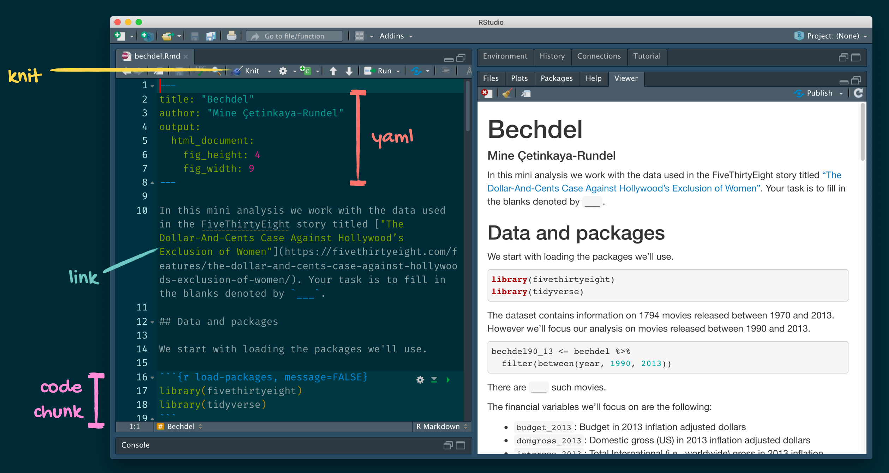
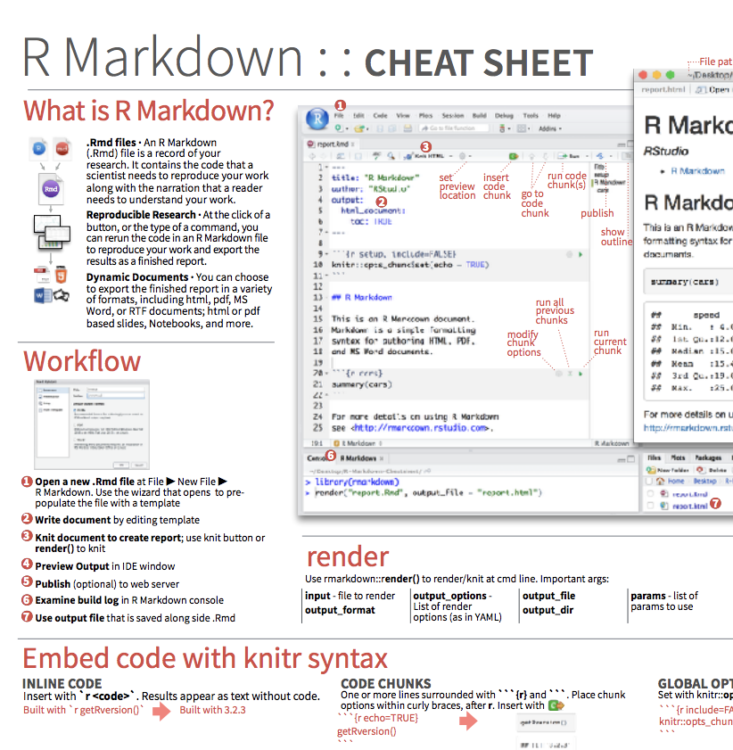
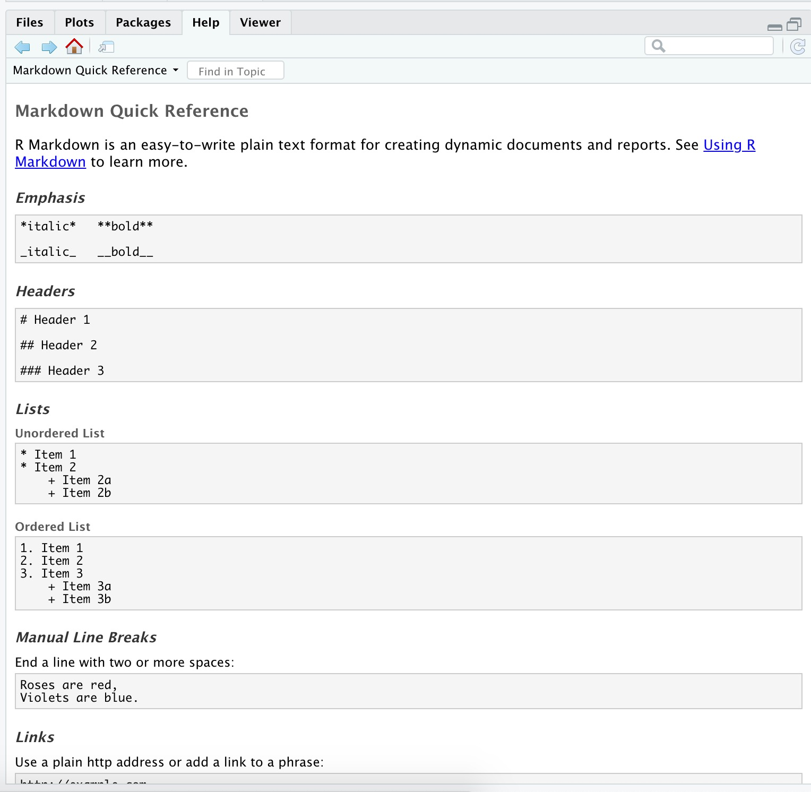
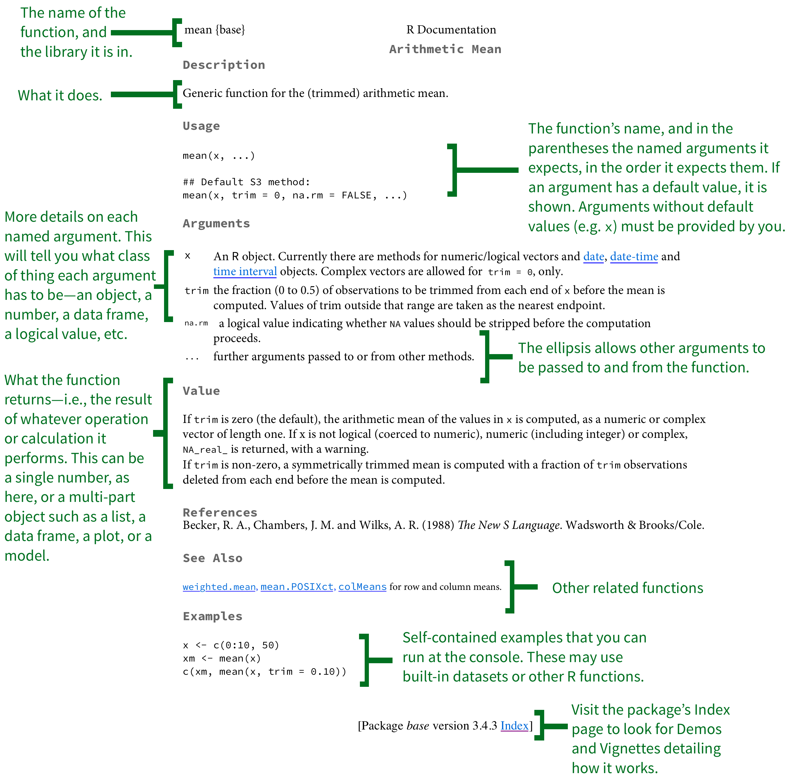

```{r setup, include=FALSE}
options(htmltools.dir.version = FALSE)

library(xaringanthemer)
library(emoji)
library(emojifont)

style_mono_accent(
base_color = "#002147",
header_font_google = google_font("Josefin Sans"),
text_font_google = google_font("Montserrat", "300", "300i"),
code_font_google = google_font("Fira Mono")
)

```

```{r echo=FALSE, message=FALSE, warning=FALSE}
knitr::opts_chunk$set(dev = "ragg_png")
```

```{r packages, echo=FALSE, message=FALSE, warning=FALSE}
library(tidyverse)
library(emo)
```


## Reprodukovateľná dátová analýza

.question[
Čo znamená, že dátová analýza je „reprodukovateľná“?
]

--

Krátkodobé ciele:

- Dajú sa tabuľky a grafy zreprodukovať z kódu a údajov?
- Robí kód naozaj to, čo si myslíte, že robí?
- Je okrem toho, *čo* sa urobilo, jasné aj to, *prečo* sa to urobilo?

Dlhodobé ciele:

- Dá sa kód použiť na iné údaje?
- Viete kód rozšíriť tak, aby robil aj iné veci?

---

## Nástroje reprodukovateľnosti

- Skriptovateľnosť $\rightarrow$ R
- Literárne programovanie (kód, text a výstup na jednom mieste) $\rightarrow$ R Markdown
- Správa verzií $\rightarrow$ Git / GitHub

---


## R a RStudio

.pull-left[
```{r echo=FALSE, out.width="25%"}

```
- R je open-source štatistický **programovací jazyk**
- R je zároveň prostredím pre štatistické výpočty a grafiku
- Ľahko sa rozširuje pomocou *balíkov*
]
.pull-right[
```{r echo=FALSE, out.width="50%"}
knitr::include_graphics("img/RStudio-Logo-Flat.png")
```
- RStudio je pohodlné rozhranie pre R, takzvané **IDE** (integrované vývojové prostredie), napr. *„kód v R píšem v prostredí RStudio“*
- RStudio nie je na programovanie v R nevyhnutné, ale programátori v R a dátoví vedci ho používajú veľmi často
]


---

## Balíky v R

- **Balíky** sú základnými jednotkami reprodukovateľného kódu v R. Obsahujú opakovane použiteľné funkcie, dokumentáciu opisujúcu ich použitie a vzorové údaje<sup>1</sup>

- K septembru 2020 bolo na **CRAN** (Comprehensive R Archive Network) dostupných viac ako 16 000 balíkov<sup>2</sup>

- Budeme pracovať s malou (ale dôležitou) podmnožinou z nich!

.footnote[
<sup>1</sup> Wickham a Bryan, [R Packages](https://r-pkgs.org/).

<sup>2</sup> [Príspevkové balíky na CRAN](https://cran.r-project.org/web/packages/).
]

---

## Prehliadka: R a RStudio

```{r echo=FALSE, out.width="100%"}
knitr::include_graphics("img/tour-r-rstudio.png")
```

---

## Krátky zoznam (zatiaľ) základov jazyka R

- Funkcie sú (najčastejšie) slovesá, za ktorými nasleduje v zátvorkách to, na čo sa majú aplikovať:

```{r eval=FALSE}
do_this(to_this)
do_that(to_this, to_that, with_those)
```

--

- Balíky sa inštalujú funkciou `install.packages` a načítavajú funkciou `library`, raz za reláciu:

```{r eval=FALSE}
install.packages("package_name")
library(package_name)
```

---

## Základy jazyka R (pokračovanie)

- K stĺpcom (premenným) v dátových rámcoch sa pristupuje pomocou `$`:

.small[
```{r eval=FALSE}
dataframe$var_name
```
]

--

- Dokumentácia k objektu je dostupná cez `?`

```{r eval=FALSE}
?mean
```

---

## tidyverse

.pull-left[
```{r echo=FALSE, out.width="99%"}
knitr::include_graphics("img/tidyverse.png")
```
]

.pull-right[
.center[.large[
[tidyverse.org](https://www.tidyverse.org/)
]]

- **tidyverse** je názorovo vyhranená kolekcia balíkov v R navrhnutá pre dátovú vedu
- Všetky balíky zdieľajú spoločnú filozofiu a spoločnú gramatiku
]

---

## rmarkdown

.pull-left[
.center[.large[
[rmarkdown.rstudio.com](https://rmarkdown.rstudio.com/)
]]

- **rmarkdown** a balíky, ktoré ho podporujú, umožňujú používateľom R písať kód aj text v reprodukovateľných výpočtových dokumentoch
- Budeme hovoriť o dokumentoch R Markdown (s príponou `.Rmd`), napr. *„urobte to vo svojom dokumente R Markdown“*, a len zriedka spomenieme načítanie balíka rmarkdown
]

.pull-right[
```{r echo=FALSE, out.width="60%"}

```
]

---

class: middle

# R Markdown

---


## R Markdown

- Plne reprodukovateľné správy — pri každom „knitnutí“ sa analýza spustí od začiatku
- Jednoduchá markdown syntax pre text
- Kód je v blokoch (chunks) vymedzených tromi spätnými apostrofmi, text je mimo blokov

---

## Prehliadka: R Markdown

```{r echo=FALSE, out.width="90%"}

```

---

## Prostredia

.tip[
Prostredie vášho dokumentu R Markdown je oddelené od konzoly!
]

Zapamätajte si to a počítajte s tým, že vás to počas učenia práce s R Markdownom
párkrát potrápi!

---

## Prostredia

.pull-left[
Najprv spustite v konzole nasledujúce

.small[
```{r eval = FALSE}
x <- 2
x * 3
```
]

.question[
Všetko vyzerá v poriadku, však?
]
]

--

.pull-right[
Potom pridajte nasledujúce do bloku R vo svojom dokumente R Markdown

.small[
```{r eval = FALSE}
x * 3
```
]

.question[
Čo sa stane? Prečo tá chyba?
]
]

---

## Pomoc k R Markdownu

.pull-left[
.center[
.midi[Ťahák k R Markdownu  
`Help -> Cheatsheets`]
]
```{r echo=FALSE, out.width="80%"}

```
]
.pull-right[
.center[
.midi[Rýchly prehľad Markdownu  
`Help -> Markdown Quick Reference`]
]
```{r echo=FALSE, out.width="80%"}

```
]

---

## Ako budeme R Markdown používať?

- Každé zadanie / správa / projekt a podobne je dokument R Markdown
- Vždy dostanete šablónu dokumentu R Markdown, z ktorej začnete
- Miera pomocnej štruktúry v šablóne sa bude počas semestra znižovať

---


---

## Práca s R v príkazovom riadku

- Spustite RStudio/R.
- Všimnite si predvolené panely:
    - Konzola (celá ľavá strana)
    - Environment/History (karty vpravo hore)
    - Files/Plots/Packages/Help (karty vpravo dole)


--

- Pre zaujímavosť: predvolené umiestnenie panelov (a mnoho ďalšieho) sa dá zmeniť
  - [Prispôsobenie RStudia](https://support.rstudio.com/hc/en-us/articles/200549016-Customizing-RStudio)

---


## Základy jazyka R

Krátky zoznam (zatiaľ):

- Funkcie sú (najčastejšie) slovesá, za ktorými nasleduje v zátvorkách to, na čo sa majú aplikovať:

```{r eval=FALSE}
do_this(to_this)
do_that(to_this, to_that, with_those)
```

--

- K stĺpcom (premenným) v dátových rámcoch sa pristupuje pomocou `$`:

```{r eval=FALSE}
dataframe$var_name
```

--

- Balíky sa inštalujú funkciou `install.packages` a načítavajú funkciou `library`, raz za reláciu:

```{r eval=FALSE}
install.packages("package_name")
library(package_name)
```

---
### Objekty v R

- Čísla

```{r  error = FALSE}
result <- 5-3
result
class(result)
```
--
- Reťazce
```{r}
Result <- "4"
Result
class(Result)
```

---
- Logické hodnoty
```{r}
RESULTS <- c(TRUE,FALSE,FALSE)
class(RESULTS)

as.integer(RESULTS)
class(RESULTS)
mean(RESULTS)
```
---
## Logické operátory v R

<br>

operátor    | význam                       || operátor     | význam
------------|------------------------------||--------------|----------------
`<`         | menšie ako                   ||`x`&nbsp;&#124;&nbsp;`y`     | `x` ALEBO `y` 
`<=`        |	menšie alebo rovné           ||`is.na(x)`    | test, či je `x` `NA`
`>`         | väčšie ako                   ||`!is.na(x)`   | test, či `x` nie je `NA`
`>=`        |	väčšie alebo rovné           ||`x %in% y`    | test, či `x` je v `y`
`==`        |	presne rovné                 ||`!(x %in% y)` | test, či `x` nie je v `y`
`!=`        |	nerovné                      ||`!x`          | negácia `x`
`x & y`     | `x` A ZÁROVEŇ `y`            ||              |


---


### Vektory

```{r}
world.pop <- c(2525779, 3026003, 3691173, 4449049, 5320817, 6127700,
6916183)
world.pop[2]
world.pop[c(2,4)]
world.pop[-3]
pop.rate <- world.pop / world.pop[1]
pop.rate
```

---
### Základné funkcie
```{r}
length(world.pop)
min(world.pop)
max(world.pop)
range(world.pop)
mean(world.pop)
```
---

### Základné funkcie

- Vytvorenie názvov pozorovaní

```{r}
year <- seq(from = 1950, to = 2010, by = 10)
year
```
--

- Pomenovanie pozorovaní

```{r}
names(world.pop)
names(world.pop) <- year
names(world.pop)
world.pop
```

---
### Tvorba funkcie

- Štruktúra funkcie `r emo::ji('construction')` :
```
mojafunkcia <- function(vstup1, vstup2, ..., vstupN) {
DEFINUJ „výstup“ POMOCOU VSTUPOV
return(vystup)
}
```
--
- Vytvorme funkciu, ktorá spočíta súčet, dĺžku a priemer vektora `r emo::ji('award')` :

```{r}
my.summary <- function(x){ # funkcia má jeden vstup
s.out <- sum(x)
l.out <- length(x)
m.out <- s.out / l.out
out <- c(s.out, l.out, m.out) # definuj výstup
names(out) <- c("sum", "length", "mean") # pridaj popisky
return(out) # ukonči funkciu zavolaním výstupu
}
z <- 1:10
my.summary(z)
```
---

### Dátové súbory


- Načítanie údajov zo súboru


```{r}
UNpop <- read.csv("data/UNpop.csv")
class(UNpop)

names(UNpop)
nrow(UNpop)
ncol(UNpop)
dim(UNpop)
```

---

### Preskúmanie údajov

- Súhrnné štatistiky

```{r}
summary(UNpop)
```
--
- Výber častí

```{r}
UNpop$world.pop
UNpop[, "world.pop"]
```
---

### Preskúmanie údajov (2. časť)

- Vyberte prvky 1, 3, 5, ... premennej „world.pop“

```{r}
UNpop$world.pop[seq(from = 1, to = nrow(UNpop), by = 2)]
world.pop <- c(UNpop$world.pop, NA)
world.pop
mean(world.pop)
mean(world.pop, na.rm = TRUE)
```
---
### Ukladanie údajov

- Ukladanie údajov

```{r}
save(UNpop, file = "data/population.RData")
write.csv(UNpop, file = "data/population.csv")
```

--
- Načítanie údajov

```{r} 
load("data/population.RData")
```
--- 

---
- Ukladanie údajov do „cudzích“ dátových formátov

```{r}
library("foreign") 
write.dta(UNpop, file = "data/UNpop.dta")
read.dta("data/UNpop.dta")
```
---
## Ako získať pomoc
```{r echo=FALSE, out.width="60%"}

```
---

## Ako sa dobre pýtať


.pull-left[
- **Dobre:** opíšte svoj zámer a priložte kód aj chybovú hlášku
- **Lepšie:** opíšte svoj zámer a vytvorte minimálny funkčný príklad
]
--
.pull-right[

- Používajte formátovanie kódu
- Pri problémoch s kódom v R: skopírujte kód a výslednú chybu, nepoužívajte snímky obrazovky!
]

---
## Čo je to s tými šesťuholníkmi?

```{r echo=FALSE, out.width="60%"}
knitr::include_graphics("img/hex-australia.png")
```

.footnote[
Mitchell O'Hara-Wild, [useR! 2018 feature wall](https://www.mitchelloharawild.com/blog/user-2018-feature-wall/)
]

---

class: middle

# Cvičenie

---

**Ste na rade:** `GitHub Bechdel.Rmd`
- [Bechdelovej test](https://sk.wikipedia.org/wiki/Bechdelovej_test) sa pýta, či fiktívne dielo obsahuje aspoň dve ženy, ktoré sa medzi sebou rozprávajú o niečom inom než o mužovi, pričom musí ísť o dve pomenované ženské postavy.
- Prejdite na [GitHub Tomáša Oleša](https://rstudio.cloud/) a otvorte zadanie `- Bechdel.Rmd`.
- Otvorte a skompilujte dokument R Markdown `bechdel.Rmd`, prejdite si ho a doplňte prázdne miesta.


---

# Zdroje

- [Data science in a Box](https://datasciencebox.org/)
