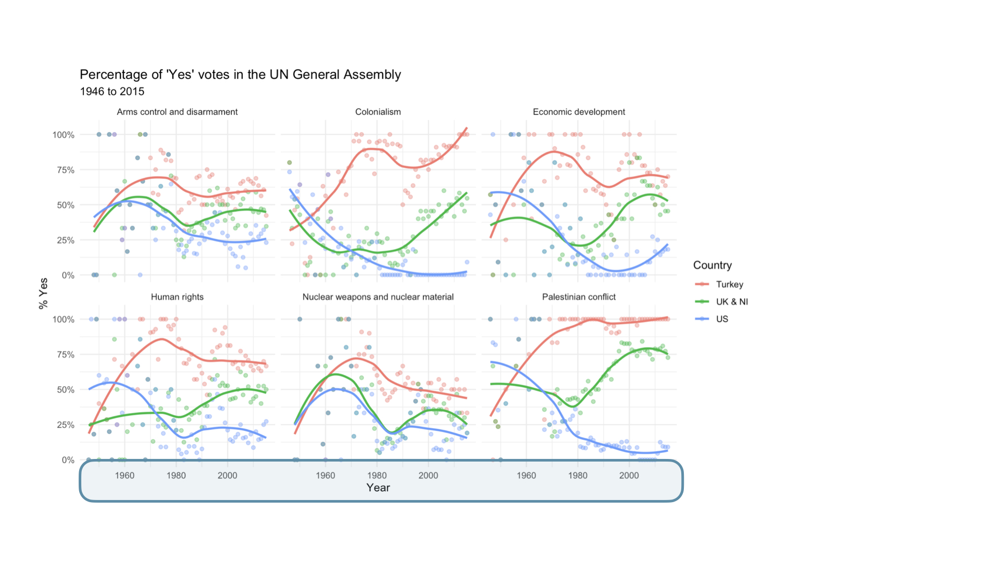
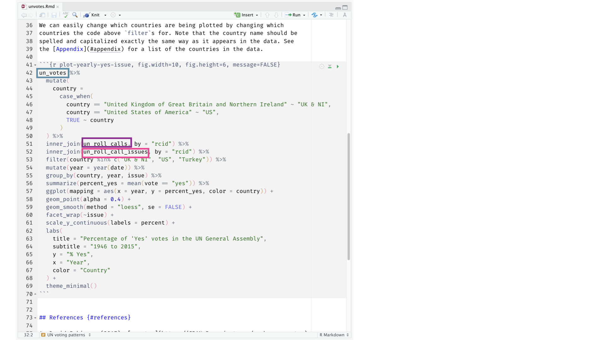
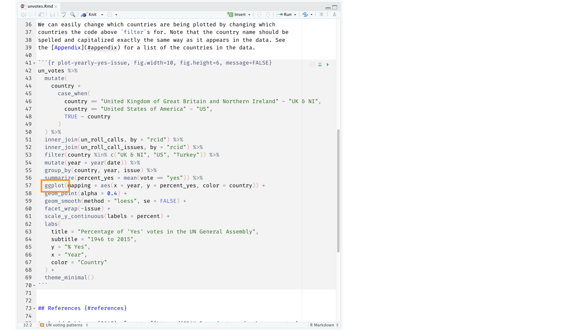
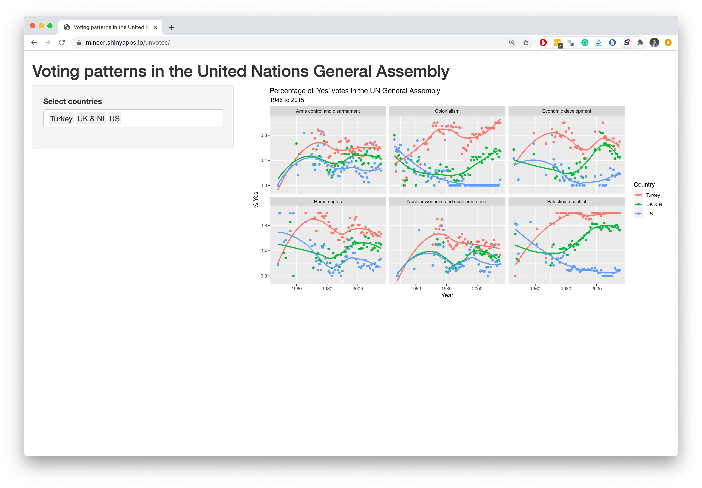

```{r setup, include=FALSE}
options(htmltools.dir.version = FALSE)

library(xaringanthemer)
library(emoji)
library(emojifont)

style_mono_accent(
base_color = "#002147",
header_font_google = google_font("Josefin Sans"),
text_font_google = google_font("Montserrat", "300", "300i"),
code_font_google = google_font("Fira Mono")
)

```

```{r echo=FALSE, message=FALSE, warning=FALSE}
knitr::opts_chunk$set(dev = "ragg_png")
```

```{r packages, echo=FALSE, message=FALSE, warning=FALSE}
library(tidyverse)
library(emo)
```


## Hello world! `r emo::ji('smile')`

- Konzultačné hodiny: streda 13:00 - 15:00 (Prosím, napíšte mi vopred `r emo::ji('calendar')`)

- Miestnosť 4B.40; Stará budova

- Kontakt: tomas.oles@euba.sk
---

# Vyučujúci

<div class="left">
  
  
</div>

<div class="left">
  
    
</div>

.small[
**Tomáš Oleš** — Katedra hospodárskej politiky (týždne 2 – 6)

**Lucia Širochmanová** — Katedra hospodárskej politiky (týždeň 1)

**Martin Vaško** — Katedra hospodárskej politiky (týždeň 7, zhluková analýza)

**Ella Sargsyan, Ph.D.** — CERGE-EI Foundation (týždne 8 – 13, Ekonometria v kocke)
]


---

## Dátová veda

.pull-left-wide[
- Dátová veda je podnetná disciplína, ktorá umožňuje premeniť surové údaje na porozumenie, vhľad a poznanie.

- Naučíme sa to robiť `tidy` spôsobom -- o tom viac neskôr!

- Toto je úvodný kurz dátovej vedy s dôrazom na štatistické myslenie.
]


## Ekonometria

.pull-left-wide[
- Ekonometria je odvetvie ekonómie, ktoré aplikuje štatistické a matematické metódy na analýzu ekonomických údajov.

- Naučíme sa to robiť štruktúrovane a metodicky — podrobnosti postupne doplníme!

- Tento kurz poskytuje úvod do ekonometrie so silným dôrazom na štatistické metódy a kauzálne výskumné dizajny v ekonomickej analýze.
]

---

## Časté otázky ku kurzu

.pull-left-wide[
**Otázka — Akú predchádzajúcu znalosť dátovej vedy kurz predpokladá?**  
Odpoveď — Žiadnu.

**Otázka — Je toto úvodný kurz štatistiky?**  
Odpoveď — Hoci štatistika $\ne$ dátová veda či ekonometria, sú si veľmi blízke a výrazne sa prekrývajú. Tento kurz však *nie je* typickým vysokoškolským kurzom štatistiky; budeme mať jednu prednášku, ktorá zopakuje *základné štatistické pojmy* z vášho predchádzajúceho kurzu.

**Otázka — Budeme programovať?**  
Odpoveď — Áno.

**Otázka — Budeme počítať matematiku?**  
Odpoveď — Áno, v druhej časti.

.pull-left-wide[
**Otázka — Je toto úvodný kurz informatiky?**  
Odpoveď — Nie, ale veľa tém je spoločných.

**Otázka — Aký programovací jazyk sa naučíme?**  
Odpoveď — R.

**Otázka: Prečo nie jazyk X?**  
Odpoveď: To si môžeme prebrať pri `r emo::ji("coffee")`.
]
]

---


# Softvér

---

```{r echo=FALSE, out.width="100%", fig.align="left"}
knitr::include_graphics("img/excel.png")
```

---

```{r echo=FALSE, out.width="100%", fig.align="left"}
knitr::include_graphics("img/r.png")
```

---

```{r echo=FALSE, out.width="100%", fig.align="left"}
knitr::include_graphics("img/rstudio.png")
```

---
# Životný cyklus dátovej vedy a ekonometrie

```{r echo=FALSE, out.width="100%", fig.align="left"}
knitr::include_graphics("img/data-science.png")
```
---

```{r echo=FALSE, out.width="100%", fig.align="left"}
knitr::include_graphics("img/unvotes/unvotes.gif")
```

---

class: middle

# Poďme na to!

---

background-image: url("img/unvotes/unvotes-01.jpeg")

---

```{r echo=FALSE, out.width="100%"}
knitr::include_graphics("img/unvotes/unvotes-02.jpeg")
```

---

```{r echo=FALSE, out.width="100%"}
knitr::include_graphics("img/unvotes/unvotes-03.jpeg")
```

---

```{r echo=FALSE, out.width="100%"}

```

---


```{r echo=FALSE, out.width="100%"}
knitr::include_graphics("img/unvotes/unvotes-05.jpeg")
```

---


```{r echo=FALSE, out.width="100%"}
knitr::include_graphics("img/unvotes/unvotes-06.jpeg")
```

---


```{r echo=FALSE, out.width="100%"}
knitr::include_graphics("img/unvotes/unvotes-07.jpeg")
```

---


```{r echo=FALSE, out.width="90%"}

```

---


```{r echo=FALSE, out.width="90%"}
knitr::include_graphics("img/unvotes/unvotes-09.jpeg")
```

---

```{r echo=FALSE, out.width="90%"}
knitr::include_graphics("img/unvotes/unvotes-10.jpeg")
```

---


```{r echo=FALSE, out.width="90%"}

```

---

```{r echo=FALSE, out.width="90%"}
knitr::include_graphics("img/unvotes/unvotes-12.jpeg")
```

---

```{r echo=FALSE, out.width="100%"}
knitr::include_graphics("img/unvotes/unvotes-13.jpeg")
```

---

```{r echo=FALSE, out.width="100%"}
knitr::include_graphics("img/unvotes/unvotes-14.jpeg")
```

---

.center[
.large[
[minecr.shinyapps.io/unvotes](https://minecr.shinyapps.io/unvotes/)
]
]

```{r echo=FALSE, out.width="75%"}

```
---

# Organizácia kurzu

**Časť I - Aplikovaná dátová analýza v R (týždne 1-7)** — úvod do dátovej vedy, vizualizácia, upratovanie a spracovanie údajov, analýza textu, klasifikácia a zhluková analýza. *Prednáška a cvičenie podľa rozvrhu v AIS.*

**Časť II - Ekonometria v kocke (týždne 8-13)** — úvod do ekonometrie, lineárna regresia, metódy kauzálneho výskumného dizajnu, techniky panelových údajov. *Prednášky pondelok 11:00-12:30 a štvrtok 11:00-11:45 SEČ; cvičenie štvrtok 11:45-12:30 SEČ.*

### Literatúra

<span style="font-size:90%">
[Wickham, H., Çetinkaya-Rundel, M., Grolemund, G. (2023). R for Data Science. O'Reilly Media, Inc..](https://r4ds.hadley.nz/)

<span style="font-size:90%">
[Gareth, J., Daniela, W., Trevor, H., Robert, T. (2013). An Introduction to Statistical Learning: With Applications in R. Springer.](https://www.statlearning.com/)

<span style="font-size:90%">
[Silge, J., Robinson D. (2017). Text Mining with R!. O'Reilly](https://www.tidytextmining.com/)
</span>

<span style="font-size:90%">
[Wooldridge, Jeffrey M. Introductory Econometrics: A Modern Approach. 5th ed., US, 2012]()
</span>

<span style="font-size:90%">
[Angrist, J. D., Pischke, J. S. (2009). Mostly Harmless Econometrics: An Empiricist's Companion. Princeton University Press.]()
</span>


---

## Čo sa naučíte?

- Získate poznatky o moderných metódach dátového výskumu a vizualizácie.
- Osvojíte si techniky klasifikácie, zhlukovania, lineárnej regresie a všeobecnej dátovej analýzy.
- Nadobudnete pokročilú zručnosť v používaní R v empirickom ekonomickom výskume.
- Porozumiete základným ekonometrickým pojmom, metódam odhadu a testovaniu hypotéz.
- Budete vedieť aplikovať štandardné postupy ekonometrického modelovania a interpretovať štatistické výsledky v R.

<div>

*„Sme tým, čo opakovane robíme. Dokonalosť teda nie je čin, ale zvyk.“*
 **Aristoteles**

---

## Hodnotenie


**6 kreditov + certifikát CERGE-EI z kurzu Econometrics in a Nutshell**

Časť I — kvízy a domáce zadania — **30 %**

Časť II — Ekonometria v kocke — **35 %**

Záverečný dátový projekt s prezentáciou — **35 %**

Otázky a diskusia na hodine — **bez bodov**

Záverečný dátový projekt je záverom Časti I aj Časti II.

**Záverečná písomná skúška sa nekoná.**

---

## Práca počas semestra

**Cvičné kvízy** — tri krátke cvičenia s dopĺňaním, na prácu doma. Nehodnotia sa.
Sú tu na to, aby ste mali syntax v prstoch skôr než zadania.

**Domáce zadanie 1** — *Titanic*: sumarizácia a vizualizácia jedného súboru údajov.

**Domáce zadanie 2** — tri zle naformátované surové súbory pretavené do jednej
analýzy: čistenie, spájanie, mapy, text a klasifikácia.

**Záverečný dátový projekt** — vlastná otázka, vlastné údaje, prezentované na konci
semestra. Vychádza z oboch častí predmetu.

---

## Používanie umelej inteligencie

Môžete použiť akýkoľvek nástroj vrátane nástrojov s umelou inteligenciou.

Dve podmienky:

- Každé domáce zadanie vychádza zo vzorky vylosovanej pomocou **vášho čísla
  študenta**, takže vaše čísla patria len vám. Váš súbor spúšťame znova a
  kontrolujeme ich.

- Musíte vedieť **vysvetliť každý riadok, ktorý odovzdáte** — a povedať, prečo ste
  zamietli alternatívy. Budeme sa pýtať a odpoveď sa počíta.

.tip[
Nástroj, ktorý napíše kód, ktorý neviete obhájiť, vám nijaký čas neušetril.
]

---

# Kvíz
Bonusový kvíz
Prejdite na **kahoot.it** a zadajte poskytnutý kód. Zadajte, prosím, svoje **priezvisko**, keďže kvíz nie je anonymný — inak vám nevieme prideliť **body**.

---


# Zdroje

- [Data science in a Box](https://datasciencebox.org/)
