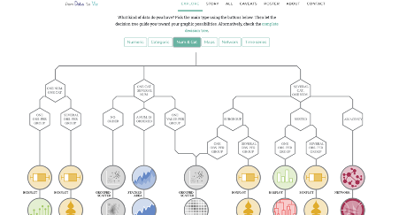

```{r setup, include=FALSE}
options(htmltools.dir.version = FALSE)
library(xaringanthemer)
style_mono_accent(
base_color = "#002147",
header_font_google = google_font("Josefin Sans"),
text_font_google = google_font("Montserrat", "300", "300i"),
code_font_google = google_font("Fira Mono")
)

```

```{r packages, echo=FALSE, message=FALSE, warning=FALSE}
library(tidyverse)
library(emo)
library(Tmisc)
library(dsbox)
library(palmerpenguins)
```

```{r  echo=FALSE, message=FALSE, warning=FALSE}
knitr::opts_chunk$set(fig.retina = 5, dev = "ragg_png")
```

---
class: middle

# Numerické údaje
---
```{r include=FALSE}
library(openintro)
loans_full_schema <- loans_full_schema %>%
  mutate(grade = factor(grade, ordered = TRUE))

write.csv(loans_full_schema, file = "data/loans_data.csv")
```

## Počet zapojených premenných

- Jednorozmerná analýza — rozdelenie jedinej premennej
- Dvojrozmerná analýza — vzťah medzi dvoma premennými
- Viacrozmerná analýza — vzťah medzi viacerými premennými naraz,
  - zvyčajne so zameraním na vzťah dvoch z nich pri kontrole ostatných

---

## Typy premenných

- **Numerické premenné** možno klasifikovať ako **spojité** alebo **diskrétne** podľa toho, či premenná môže nadobúdať nekonečne veľa hodnôt, alebo len nezáporné celé čísla.
- Ak je premenná **kategorická**, môžeme určiť, či je **ordinálna**, podľa toho, či jej úrovne majú prirodzené usporiadanie.


---


## Údaje: Lending Club

```{r}
loans_full_schema <- read.csv(file = "data/loans_data.csv")
```

.pull-left-wide[

- Tisíce pôžičiek poskytnutých cez Lending Club,
  - platformu, ktorá umožňuje jednotlivcom požičiavať si navzájom
- Nie všetky pôžičky sú rovnaké
  - jednoduchosť získania pôžičky závisí od (zdanlivej) schopnosti ju splatiť
- Údaje obsahujú *poskytnuté* pôžičky
  - (nejde o žiadosti o pôžičku)
]
---


## Letmý pohľad na údaje

```{r output.lines=15}
library(openintro)
glimpse(loans_full_schema)
```

---

## Vybrané premenné

```{r}
loans <- loans_full_schema %>%
  select(loan_amount, interest_rate, term, grade, 
         state, annual_income, homeownership, debt_to_income)
glimpse(loans)
```

---

## Vybrané premenné

<br>

.midi[
premenná        | opis
----------------|-------------
`loan_amount`   |	Výška poskytnutej pôžičky v amerických dolároch
`interest_rate` |	Úroková sadzba pôžičky v ročnom percentuálnom vyjadrení
`term`	        | Dĺžka pôžičky, vždy uvedená ako celý počet mesiacov
`grade`	        | Rating pôžičky s hodnotami A až G, ktorý vyjadruje kvalitu pôžičky a pravdepodobnosť jej splatenia
`state`         |	Štát USA, v ktorom dlžník býva
`annual_income` |	Ročný príjem dlžníka vrátane prípadného druhého príjmu v amerických dolároch
`homeownership`	| Udáva, či osoba vlastní bývanie, vlastní ho s hypotékou, alebo si ho prenajíma
`debt_to_income` | Pomer dlhu k príjmu
]

---

## Typy premenných

<br>

premenná        | typ
----------------|-------------
`loan_amount`   |	numerická, spojitá
`interest_rate` |	numerická, spojitá
`term`	        | numerická, diskrétna
`grade`	        | kategorická, ordinálna
`state`         |	kategorická, neordinálna
`annual_income` |	numerická, spojitá
`homeownership`	| kategorická, neordinálna
`debt_to_income` | numerická, spojitá

---

class: middle

# Histogram

---

## Histogram

```{r message = TRUE, out.width = "30%", fig.retina=3}
ggplot(loans, aes(x = loan_amount)) +
  geom_histogram()
```

---

## Histogramy a šírka intervalu

+ binwidth = 1000

```{r out.width = "30%", fig.retina=3}
ggplot(loans, aes(x = loan_amount)) +
  geom_histogram(binwidth = 1000)
```

---

## binwidth = 5000
```{r out.width = "30%", fig.retina=3}
ggplot(loans, aes(x = loan_amount)) +
  geom_histogram(binwidth = 5000)
```

---

## binwidth = 20000

```{r out.width = "50%", fig.retina=3}
ggplot(loans, aes(x = loan_amount)) +
  geom_histogram(binwidth = 20000)
```

---

## Prispôsobenie histogramov

.pull-left[
```{r ref.label = "hist-custom",out.width = "100%", echo = FALSE, warning = FALSE, fig.retina=3}
```

]
.pull-right[.small[
```{r hist-custom, fig.show = "hide", warning = FALSE, fig.retina=3}
ggplot(loans, aes(x = loan_amount)) +
  geom_histogram(binwidth = 5000) +
  labs( #<<
    x = "Výška pôžičky ($)", #<<
    y = "Početnosť", #<<
    title = "Výšky pôžičiek Lending Club" #<<
  ) #<<
```
]
]


---

## Výplň podľa kategorickej premennej

.pull-left[
```{r ref.label = "hist-fill",out.width = "100%", echo = FALSE, warning = FALSE, fig.retina=3}
```
]
.pull-right[.small[
```{r hist-fill, fig.show = "hide", warning = FALSE, fig.retina=3}
ggplot(loans, aes(x = loan_amount, 
                  fill = homeownership)) + #<<
  geom_histogram(binwidth = 5000,
                 alpha = 0.5) + #<<
  labs(
    x = "Výška pôžičky ($)",
    y = "Početnosť",
    title = "Výšky pôžičiek Lending Club"
  )
```
]
]

---

## Fazetovanie podľa kategorickej premennej

.pull-left[
```{r ref.label = "hist-facet", out.width = "100%",echo = FALSE, warning = FALSE, fig.retina=3}
```
]
.pull-right[.small[
```{r hist-facet, fig.show = "hide", warning = FALSE, fig.retina=3}
ggplot(loans, aes(x = loan_amount, fill = homeownership)) + 
  geom_histogram(binwidth = 5000) +
  labs(
    x = "Výška pôžičky ($)",
    y = "Početnosť",
    title = "Výšky pôžičiek Lending Club"
  ) +
  facet_wrap(~ homeownership, nrow = 3) #<<
```
]
]

---

class: middle

# Graf hustoty

---

## Graf hustoty

```{r,out.width = "50%", fig.retina=3}
ggplot(loans, aes(x = loan_amount)) +
  geom_density()
```

---

## Grafy hustoty a úprava šírky pásma

.pull-left[
+ adjust = 0.5
```{r out.width = "50%", fig.retina=3}
ggplot(loans, aes(x = loan_amount)) +
  geom_density(adjust = 0.5)
```
]
.pull-right[
+ adjust = 1
```{r out.width = "50%", fig.retina=3}
ggplot(loans, aes(x = loan_amount)) +
  geom_density(adjust = 1) # predvolená šírka pásma
```
]
---

# adjust = 2
```{r out.width = "50%", fig.retina=3}
ggplot(loans, aes(x = loan_amount)) +
  geom_density(adjust = 2)
```

---

## Prispôsobenie grafov hustoty

.pull-left[
```{r ref.label = "density-custom", echo = FALSE, warning = FALSE,out.width = "100%", fig.retina=3}
```
]
.pull-right[.small[
```{r density-custom, fig.show = "hide", warning = FALSE, fig.retina=3}
ggplot(loans, aes(x = loan_amount)) +
  geom_density(adjust = 2) +
  labs( #<<
    x = "Výška pôžičky ($)", #<<
    y = "Hustota", #<<
    title = "Výšky pôžičiek Lending Club" #<<
  ) #<<
```
]
]

---

## Pridanie kategorickej premennej

.pull-left[
```{r ref.label = "density-cat", echo = FALSE, warning = FALSE,out.width = "100%",  fig.retina=3 }
```
]
.pull-right[.small[
```{r density-cat, fig.show = "hide", warning = FALSE,  fig.retina=3}
ggplot(loans, aes(x = loan_amount, 
                  fill = homeownership)) + #<<
  geom_density(adjust = 2, 
               alpha = 0.5) + #<<
  labs(
    x = "Výška pôžičky ($)",
    y = "Hustota",
    title = "Výšky pôžičiek Lending Club", 
    fill = "Vlastníctvo bývania" #<<
  )
```
]
]

---

class: middle

# Krabicový graf

---

## Krabicový graf
.pull-left[
```{r  warning = FALSE}
ggplot(loans, aes(x = interest_rate)) +
  geom_boxplot()
```
]


.pull-right[


```{r  warning = FALSE}
ggplot(loans, aes(x = annual_income)) +
  geom_boxplot()
```
]

---

## Prispôsobenie krabicových grafov

.pull-left[
```{r ref.label = "box-custom", echo = FALSE, warning = FALSE,out.width = "100%", fig.retina=3}
```
]
.pull-right[.small[
```{r box-custom, fig.show = "hide", warning = FALSE,  fig.retina=3}
ggplot(loans, aes(x = interest_rate)) +
  geom_boxplot() +
  labs(
    x = "Úroková sadzba (%)",
    y = NULL,
    title = "Úrokové sadzby pôžičiek Lending Club"
  ) +
  theme( #<<
    axis.ticks.y = element_blank(), #<<
    axis.text.y = element_blank() #<<
  ) #<<
```
]
]

---

## Pridanie kategorickej premennej

.pull-left[
```{r ref.label = "box-cat", echo = FALSE, warning = FALSE,  fig.retina=3}
```
]
.pull-right[.small[
```{r box-cat, fig.show = "hide", warning = FALSE,  fig.retina=3}
ggplot(loans, aes(x = interest_rate,
                  y = grade)) + #<<
  geom_boxplot() +
  labs(
    x = "Úroková sadzba (%)",
    y = "Rating",
    title = "Úrokové sadzby pôžičiek Lending Club",
    subtitle = "podľa ratingu pôžičky" #<<
  )
```
]
]

---

class: middle

# Vzťahy medzi numerickými premennými

---

## Bodový graf

```{r warning = FALSE, out.width="45%",  fig.retina=3}
ggplot(loans, aes(x = debt_to_income, y = interest_rate)) +
  geom_point()
```

---

class: middle

# Kategorické premenné

---

### Pamätáte sa na tieto údaje?

```{r message=FALSE}
library(tidyverse)
starwars
```


---
### A čo teraz?
```{r}
glimpse(starwars)
```

---
#### Prekódovanie farby vlasov

```{r }
starwars <- starwars %>%
  mutate(hair_color2 =
           fct_other(hair_color,
                     keep = c("black", "brown", "grey", "blond")
           )
  )
```
---


class: middle

# Stĺpcový graf

---

## Stĺpcový graf

```{r out.width="45%", fig.retina=4}
ggplot(data = starwars, mapping = aes(x = gender)) +
  geom_bar()
```

---

## Delený stĺpcový graf: početnosti

```{r out.width="45%", fig.retina=4}

ggplot(data = starwars, mapping = aes(x = gender, 
                  fill = hair_color))+ #<<
  geom_bar()

```

---


## Delené stĺpcové grafy

```{r out.width="45%", fig.retina=4}
ggplot(data = starwars, mapping = aes(x = gender, 
	   fill = hair_color2))+ #<<
  geom_bar()
```

---

## Delené stĺpcové grafy

```{r out.width="45%", fig.retina=4}
ggplot(data = starwars, mapping = aes(x = gender, 
	   fill = hair_color2))+ #<<
  geom_bar()+ 
  coord_flip() #<<
```

---

## Delené stĺpcové grafy: podiely

```{r out.width="45%", fig.retina=4}
ggplot(data = starwars,
       mapping = aes(x = gender, fill = hair_color2)) +
  geom_bar(position = "fill") +
  coord_flip()
labs(y = "podiel")
```


---

.question[
    Ktorý stĺpcový graf je užitočnejším zobrazením vzťahu medzi pohlavím a farbou vlasov?
  ]

.pull-left[
```{r echo=FALSE, out.width = "100%", fig.retina=4}
ggplot(data = starwars, mapping = aes(x = gender, 
                  fill = hair_color2)) +
  geom_bar() +
  coord_flip()
```
]

.pull-right[
```{r echo=FALSE, out.width = "100%", fig.retina=4}
ggplot(data = starwars, mapping = aes(x = gender, 
                  fill = hair_color2)) +
  geom_bar(position = "fill") +
  coord_flip() +
  labs(y = "podiel")
```
]

---

## Prispôsobenie stĺpcových grafov

.pull-left[
```{r ref.label = "bar-custom", echo = FALSE, warning = FALSE, fig.retina=4}
```
]

.pull-right[
```{r bar-custom, fig.show = "hide", warning = FALSE, fig.retina=4}
ggplot(starwars, aes(y = gender, #<<
                  fill = hair_color2)) +
  geom_bar(position = "fill") +
  labs( #<<
    x = "Podiel", #<<
    y = "Pohlavie", #<<
    fill = "Farba vlasov", #<<
    title = "Farby vlasov postáv zo Star Wars", #<<
    subtitle = "podľa pohlavia" #<<
  ) #<<
```
]
---


class: middle

# Vzťahy medzi numerickými a kategorickými premennými

---

## Už sme hovorili o...

- Farbení a fazetovaní histogramov a grafov hustoty
- Krabicových grafoch vedľa seba

---

## Husľové grafy

```{r warning = FALSE, out.width="45%", fig.retina=4}
ggplot(loans, aes(x = homeownership, y = loan_amount)) +
  geom_violin()
```

---

## Hrebeňové grafy

```{r warning = FALSE, out.width="45%", fig.retina=4}
library(ggridges)
ggplot(loans, aes(x = loan_amount, y = grade, fill = grade, color = grade)) + 
  geom_density_ridges(alpha = 0.5)
```

---

### Od údajov k vizualizácii

```{r echo=FALSE, out.width="60%"}

```

.footnote[
Holtz, Y., Healy, C., [From Data to Viz wall](https://www.data-to-viz.com/)
]


---

class: middle

# Cvičenie

---

**Ste na rade:** `GitHub Starwars.Rmd`

- Prejdite na [GitHub Tomáša Oleša](https://github.com/tomasoles/applied_data_analysis) a otvorte zadanie `- Starwars.Rmd`.
- Otvorte a skompilujte dokument R Markdown `Starwars.Rmd`, prejdite si ho, doplňte prázdne miesta a dokončite aj interpretujte analýzu.


---

# Zdroje

- [Data science in a Box](https://datasciencebox.org/)
