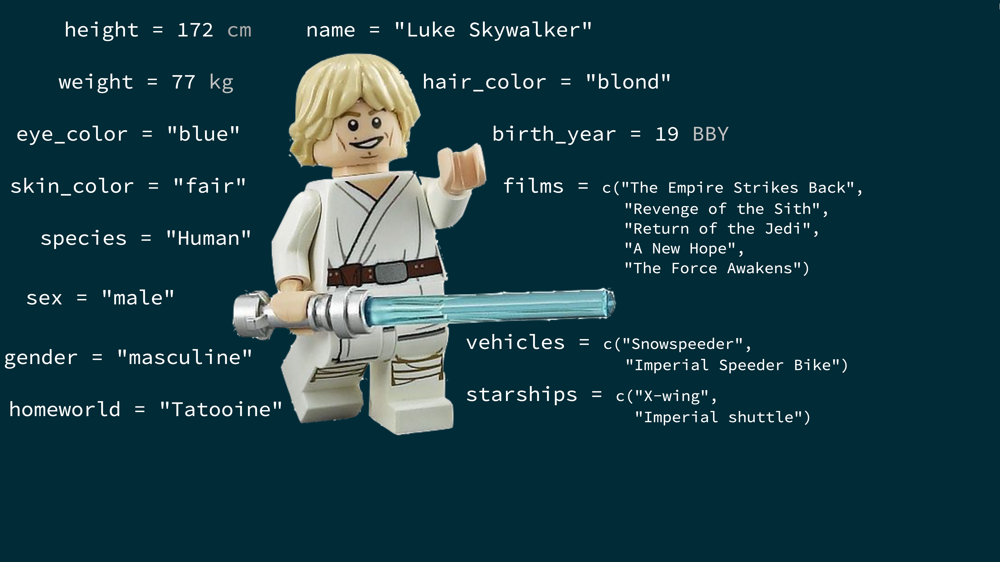
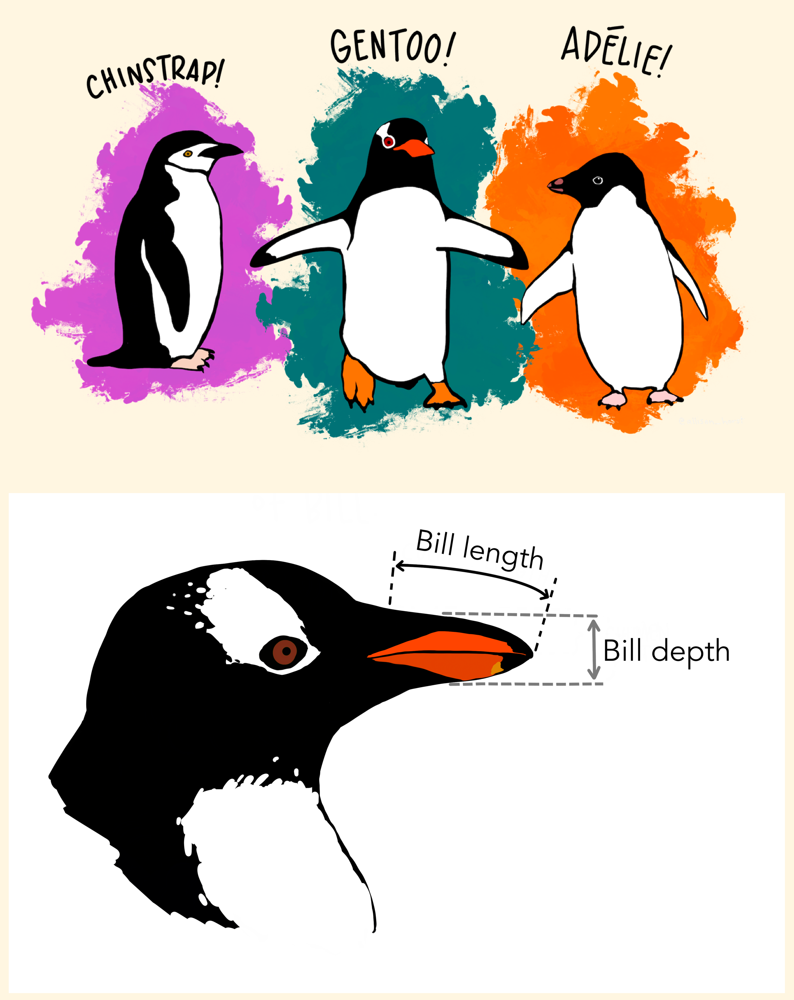

```{r setup, include=FALSE}
options(htmltools.dir.version = FALSE)
library(xaringanthemer)
style_mono_accent(
base_color = "#002147",
header_font_google = google_font("Josefin Sans"),
text_font_google = google_font("Montserrat", "300", "300i"),
code_font_google = google_font("Fira Mono")
)

```

```{r packages, echo=FALSE, message=FALSE, warning=FALSE}
library(tidyverse)
library(emo)
library(Tmisc)
library(dsbox)
library(palmerpenguins)
```

```{r  echo=FALSE, message=FALSE, warning=FALSE}
knitr::opts_chunk$set(fig.retina = 5, dev = "ragg_png")
```

## ggplot $\in$ tidyverse

.pull-right[ 
- **ggplot2** je balík ekosystému tidyverse určený na vizualizáciu údajov
- `gg` v názve „ggplot2“ znamená Grammar of Graphics (gramatika grafiky)
]


```{r echo=FALSE, fig.align='center', out.width='70%'}
knitr::include_graphics("img/gglayers.png")
```
---
# Prvý (a reprodukovateľný) príklad

---

## Načítanie údajov

+ Výšky najvyšších bodov jednotlivých štátov

```{r echo=TRUE}
## 
## načítaj potrebné balíky a údaje
library(tidyverse)
options(tibble.print_min = 10)
heights = read_csv("data/highest-points-by-state.csv")
## prepočet zo stôp na metre
heights$elevation = heights$elevation * .3048
```
---
## Pozrime sa na údaje
```{r echo=TRUE}
heights
```

---
## Pozrime sa ešte raz
```{r echo=TRUE}
arrange(heights, elevation)
```

---
## A ešte raz inak
```{r echo=TRUE}
arrange(heights, desc(elevation))
```

---

## Ďalší pohľad: hustota

.pull-left[
```{r plot-last, fig.show = 'hide'}
ggplot(heights,  aes(x = elevation)) +
    geom_density() +
    geom_rug()
```
]

.pull-right[
```{r ref.label = 'plot-last', echo = FALSE}
```
]
---

---

class: middle

# Čo obsahuje dátový súbor?

---

## Terminológia dátového súboru

- Každý riadok je **pozorovanie**
- Každý stĺpec je **premenná**

.small[
```{r message=FALSE}
starwars
```
]

---

## Luke Skywalker



---

## Čo obsahujú údaje o Star Wars?

Pozrime sa na údaje funkciou `glimpse`:
.small[
```{r}
glimpse(starwars)
```
]
---

.question[
Koľko riadkov a stĺpcov má tento dátový súbor?
Čo predstavuje každý riadok?
Čo predstavuje každý stĺpec?
]

```{r eval = FALSE}
?starwars
```
---
## Vitaj, ggplot2!

.pull-left-wide[
- `ggplot()` je hlavnou funkciou balíka ggplot2
- Grafy sa konštruujú vo vrstvách
- Štruktúru kódu pre grafy možno zhrnúť takto

```{r eval = FALSE}
ggplot(data = [datovy_subor], 
       mapping = aes(x = [premenna-x], y = [premenna-y])) +
   geom_xxx() +
   dalsie_moznosti
```

- Balík ggplot2 je súčasťou ekosystému tidyverse

```{r}
library(tidyverse)
```

- Pomoc k ggplot2 nájdete na [ggplot2.tidyverse.org](http://ggplot2.tidyverse.org/)
]

---
## Hmotnosť vs. výška

.question[ 
Ako by ste opísali vzťah medzi hmotnosťou a výškou postáv zo Star Wars?
Ktoré ďalšie premenné by nám pomohli pochopiť body, ktoré nesledujú celkový trend?
Ktorá postava nie je až taká vysoká, ale je poriadne zavalitá?
]

```{r fig.width=15, warning = FALSE, echo=FALSE, fig.align = 'center', out.width = "95%"}
ggplot(data = starwars, mapping = aes(x = height, y = mass)) +
  geom_point() +
  labs(title = "Hmotnosť vs. výška postáv zo Star Wars",
       x = "Výška (cm)", y = "Hmotnosť (kg)") +
  geom_point(data = starwars %>% filter(name == "Jabba Desilijic Tiure"), size = 10, pch = 1, color = "red", stroke = 3)
```

---

## Hmotnosť vs. výška

```{r mass-height, fig.show = 'hide', out.width = "50%"}
ggplot(data = starwars, mapping = aes(x = height, y = mass)) +
  geom_point() +
  labs(title = "Hmotnosť vs. výška postáv zo Star Wars",
       x = "Výška (cm)", y = "Hmotnosť (kg)")
```


.question[ 
- Ktoré funkcie vykresľujú graf?
- Ktorý dátový súbor sa vykresľuje?
- Ktoré premenné sa mapujú na ktoré vlastnosti (estetiky) grafu?
- Čo znamená to upozornenie?
]


---


class: middle

# Prečo vizualizujeme?

---

## Anscombeho kvarteto

```{r quartet-for-show, eval = FALSE, echo = FALSE}
library(Tmisc)
quartet <- quartet
```

.pull-left[
```{r quartet-view1, echo = FALSE}
quartet[1:22,]
```
] 
.pull-right[
```{r quartet-view2, echo = FALSE}
quartet[23:44,]
```
]

---

## Sumarizácia Anscombeho kvarteta

```{r quartet-summary}
quartet %>%
  group_by(set) %>%
  summarize(
    mean_x = mean(x), 
    mean_y = mean(y),
    sd_x = sd(x),
    sd_y = sd(y),
    r = cor(x, y)
  )
```

---

## Vizualizácia Anscombeho kvarteta

```{r quartet-plot, echo = FALSE, out.width = "80%", fig.asp = 0.5, fig.retina=3}
ggplot(quartet, aes(x = x, y = y)) +
  geom_point() +
  facet_wrap(~ set, ncol = 4)
```

---

## Vek pri prvom bozku

.question[ 
Nevidíte niečo nezvyčajné?
]

```{r echo = FALSE, warning = FALSE, fig.retina=3}
ggplot(student_survey, aes(x = first_kiss)) +
  geom_histogram(binwidth = 1) +
  labs(
    title = "Koľko ste mali rokov pri svojom prvom bozku?", 
    x = "Vek (roky)", y = NULL
    )
```

---

## Návštevy Facebooku

.question[ 
Ako ľudia uvádzajú nižšie a ako vyššie hodnoty počtu návštev FB?
]

```{r echo = FALSE, warning = FALSE, fig.retina=3}
ggplot(student_survey, aes(x = fb_visits_per_day)) +
  geom_histogram(binwidth = 1) +
  labs(
    title = "Koľkokrát denne idete na Facebook?", 
    x = "Počet návštev", y = NULL
    )
```

---

## Údaje: Palmer Penguins

Merania druhov tučniakov, ostrov v Palmerovom súostroví, veľkosť (dĺžka plutvy, telesná hmotnosť, rozmery zobáka) a pohlavie.


.pull-left[
```{r echo=FALSE, out.width="80%"}

```
]

---

## Údaje: Palmer Penguins

Merania druhov tučniakov, ostrov v Palmerovom súostroví, veľkosť (dĺžka plutvy, telesná hmotnosť, rozmery zobáka) a pohlavie.


```{r}
library(palmerpenguins)
glimpse(penguins)
```


---

# Graf

```{r ref.label = "penguins", echo = FALSE, warning = FALSE, out.width = "70%", fig.width = 8, fig.retina=3}
```


---

# Kód

```{r penguins, fig.show = "hide", out.width="80%", fig.retina=3}
ggplot(data = penguins, 
       mapping = aes(x = bill_depth_mm, y = bill_length_mm,
                     color = species)) +
  geom_point() +
  labs(title = "Hĺbka a dĺžka zobáka",
       subtitle = "Rozmery pre tučniaky Adelie, Chinstrap a Gentoo",
       x = "Hĺbka zobáka (mm)", y = "Dĺžka zobáka (mm)",
       color = "Druh")
```

---


# Kódovanie nahlas

---

.midi[
> **Začni dátovým rámcom `penguins`**
]

.pull-left[
```{r penguins-0, fig.show="hide", warning=FALSE}
ggplot(data = penguins) #<<
```
]
.pull-right[
```{r ref.label = "penguins-0", echo = FALSE, warning = FALSE, out.width = "100%", fig.width = 8}
```
]

---

.midi[
> Začni dátovým rámcom `penguins`,
> **namapuj hĺbku zobáka na os x**
]

.pull-left[
```{r penguins-1, fig.show = "hide", warning = FALSE}
ggplot(data = penguins,
       mapping = aes(x = bill_depth_mm)) #<<
```
]
.pull-right[
```{r ref.label = "penguins-1", echo = FALSE, warning = FALSE, out.width = "100%", fig.width = 8}
```
]

---

.midi[
> Začni dátovým rámcom `penguins`,
> namapuj hĺbku zobáka na os x
> **a namapuj dĺžku zobáka na os y.**
]

.pull-left[
```{r penguins-2, fig.show = "hide", warning = FALSE}
ggplot(data = penguins,
       mapping = aes(x = bill_depth_mm,
                     y = bill_length_mm)) #<<
```
]
.pull-right[
```{r ref.label = "penguins-2", echo = FALSE, warning = FALSE, out.width = "100%", fig.width = 8}
```
]

---

.midi[
> Začni dátovým rámcom `penguins`,
> namapuj hĺbku zobáka na os x
> a namapuj dĺžku zobáka na os y.
> **Každé pozorovanie znázorni bodom**
]

.pull-left[
```{r penguins-3, fig.show = "hide", warning = FALSE}
ggplot(data = penguins,
       mapping = aes(x = bill_depth_mm,
                     y = bill_length_mm)) + 
  geom_point() #<<
```
]
.pull-right[
```{r ref.label = "penguins-3", echo = FALSE, warning = FALSE, out.width = "100%", fig.width = 8}
```
]

---

.midi[
> Začni dátovým rámcom `penguins`,
> namapuj hĺbku zobáka na os x
> a namapuj dĺžku zobáka na os y.
> Každé pozorovanie znázorni bodom
> **a namapuj druh na farbu jednotlivých bodov.**
]

.pull-left[
```{r penguins-4, fig.show = "hide", warning = FALSE}
ggplot(data = penguins,
       mapping = aes(x = bill_depth_mm,
                     y = bill_length_mm,
                     color = species)) + #<<
  geom_point()
```
]
.pull-right[
```{r ref.label = "penguins-4", echo = FALSE, warning = FALSE, out.width = "100%", fig.width = 8}
```
]

---

.midi[
> Začni dátovým rámcom `penguins`,
> namapuj hĺbku zobáka na os x
> a namapuj dĺžku zobáka na os y.
> Každé pozorovanie znázorni bodom
> a namapuj druh na farbu jednotlivých bodov.
> **Graf nazvi „Hĺbka a dĺžka zobáka“**
]

.pull-left[
```{r penguins-5, fig.show = "hide", warning = FALSE}
ggplot(data = penguins,
       mapping = aes(x = bill_depth_mm,
                     y = bill_length_mm,
                     color = species)) +
  geom_point() +
  labs(title = "Hĺbka a dĺžka zobáka") #<<
```
]
.pull-right[
```{r ref.label = "penguins-5", echo = FALSE, warning = FALSE, out.width = "100%", fig.width = 8}
```
]

---

.midi[
> Začni dátovým rámcom `penguins`,
> namapuj hĺbku zobáka na os x
> a namapuj dĺžku zobáka na os y.
> Každé pozorovanie znázorni bodom
> a namapuj druh na farbu jednotlivých bodov.
> Graf nazvi „Hĺbka a dĺžka zobáka“,
> **pridaj podnadpis „Rozmery pre tučniaky Adelie, Chinstrap a Gentoo“**
]

.pull-left[
```{r penguins-6, fig.show = "hide", warning = FALSE}
ggplot(data = penguins,
       mapping = aes(x = bill_depth_mm,
                     y = bill_length_mm,
                     color = species)) +
  geom_point() +
  labs(title = "Hĺbka a dĺžka zobáka",
       subtitle = "Rozmery pre tučniaky Adelie, Chinstrap a Gentoo") #<<
```
]
.pull-right[
```{r ref.label = "penguins-6", echo = FALSE, warning = FALSE, out.width = "100%", fig.width = 8}
```
]

---

.midi[
> Začni dátovým rámcom `penguins`,
> namapuj hĺbku zobáka na os x
> a namapuj dĺžku zobáka na os y.
> Každé pozorovanie znázorni bodom
> a namapuj druh na farbu jednotlivých bodov.
> Graf nazvi „Hĺbka a dĺžka zobáka“,
> pridaj podnadpis „Rozmery pre tučniaky Adelie, Chinstrap a Gentoo“,
> **osi x a y označ ako „Hĺbka zobáka (mm)“ a „Dĺžka zobáka (mm)“**
]

.pull-left[
```{r penguins-7, fig.show = "hide", warning = FALSE}
ggplot(data = penguins,
       mapping = aes(x = bill_depth_mm,
                     y = bill_length_mm,
                     color = species)) +
  geom_point() +
  labs(title = "Hĺbka a dĺžka zobáka",
       subtitle = "Rozmery pre tučniaky Adelie, Chinstrap a Gentoo",
       x = "Hĺbka zobáka (mm)", y = "Dĺžka zobáka (mm)") #<<
```
]
.pull-right[
```{r ref.label = "penguins-7", echo = FALSE, warning = FALSE, out.width = "100%", fig.width = 8}
```
]

---

.midi[
> Začni dátovým rámcom `penguins`,
> namapuj hĺbku zobáka na os x
> a namapuj dĺžku zobáka na os y.
> Každé pozorovanie znázorni bodom
> a namapuj druh na farbu jednotlivých bodov.
> Graf nazvi „Hĺbka a dĺžka zobáka“,
> pridaj podnadpis „Rozmery pre tučniaky Adelie, Chinstrap a Gentoo“,
> osi x a y označ ako „Hĺbka zobáka (mm)“ a „Dĺžka zobáka (mm)“,
> **legendu označ ako „Druh“**
]

.pull-left[
```{r penguins-8, fig.show = "hide", warning = FALSE}
ggplot(data = penguins,
       mapping = aes(x = bill_depth_mm,
                     y = bill_length_mm,
                     color = species)) +
  geom_point() +
  labs(title = "Hĺbka a dĺžka zobáka",
       subtitle = "Rozmery pre tučniaky Adelie, Chinstrap a Gentoo",
       x = "Hĺbka zobáka (mm)", y = "Dĺžka zobáka (mm)",
       color = "Druh") #<<
```
]
.pull-right[
```{r ref.label = "penguins-8", echo = FALSE, warning = FALSE, out.width = "100%", fig.width = 8}
```
]

---

.midi[
> Začni dátovým rámcom `penguins`,
> namapuj hĺbku zobáka na os x
> a namapuj dĺžku zobáka na os y.
> Každé pozorovanie znázorni bodom
> a namapuj druh na farbu jednotlivých bodov.
> Graf nazvi „Hĺbka a dĺžka zobáka“,
> pridaj podnadpis „Rozmery pre tučniaky Adelie, Chinstrap a Gentoo“,
> osi x a y označ ako „Hĺbka zobáka (mm)“ a „Dĺžka zobáka (mm)“,
> legendu označ ako „Druh“
> **a pridaj popisok so zdrojom údajov.**
]

.pull-left[
```{r penguins-9, fig.show = "hide", warning = FALSE}
ggplot(data = penguins,
       mapping = aes(x = bill_depth_mm,
                     y = bill_length_mm,
                     color = species)) +
  geom_point() +
  labs(title = "Hĺbka a dĺžka zobáka",
       subtitle = "Rozmery pre tučniaky Adelie, Chinstrap a Gentoo",
       x = "Hĺbka zobáka (mm)", y = "Dĺžka zobáka (mm)",
       color = "Druh",
       caption = "Zdroj: Palmer Station LTER / balík palmerpenguins") #<<
```
]
.pull-right[
```{r ref.label = "penguins-9", echo = FALSE, warning = FALSE, out.width = "100%", fig.width = 8}
```
]

---

.midi[
> Začni dátovým rámcom `penguins`,
> namapuj hĺbku zobáka na os x
> a namapuj dĺžku zobáka na os y.
> Každé pozorovanie znázorni bodom
> a namapuj druh na farbu jednotlivých bodov.
> Graf nazvi „Hĺbka a dĺžka zobáka“,
> pridaj podnadpis „Rozmery pre tučniaky Adelie, Chinstrap a Gentoo“,
> osi x a y označ ako „Hĺbka zobáka (mm)“ a „Dĺžka zobáka (mm)“,
> legendu označ ako „Druh“
> a pridaj popisok so zdrojom údajov.
> **Nakoniec použi diskrétnu farebnú škálu navrhnutú tak, aby ju rozlíšili aj ľudia s bežnými formami farbosleposti.**
]

.pull-left[
```{r penguins-10, fig.show = "hide", warning = FALSE, fig.retina=3}
ggplot(data = penguins,
       mapping = aes(x = bill_depth_mm,
                     y = bill_length_mm,
                     color = species)) +
  geom_point() +
  labs(title = "Hĺbka a dĺžka zobáka",
       subtitle = "Rozmery pre tučniaky Adelie, Chinstrap a Gentoo",
       x = "Hĺbka zobáka (mm)", y = "Dĺžka zobáka (mm)",
       color = "Druh",
       caption = "Zdroj: Palmer Station LTER / balík palmerpenguins") +
  scale_color_viridis_d() #<<
```
]
.pull-right[
```{r ref.label = "penguins-10", echo = FALSE, warning = FALSE, out.width = "100%", fig.width = 8, fig.retina=3}
```
]

---

# Graf

```{r ref.label="penguins-10-nohighlight", echo = FALSE, warning = FALSE, out.width = "70%", fig.width = 8, fig.retina=3}
```

---

# Kód

```{r penguins-10-nohighlight, fig.show = "hide", fig.retina=3}
ggplot(data = penguins,
       mapping = aes(x = bill_depth_mm,
                     y = bill_length_mm,
                     color = species)) +
  geom_point() +
  labs(title = "Hĺbka a dĺžka zobáka",
       subtitle = "Rozmery pre tučniaky Adelie, Chinstrap a Gentoo",
       x = "Hĺbka zobáka (mm)", y = "Dĺžka zobáka (mm)",
       color = "Druh",
       caption = "Zdroj: Palmer Station LTER / balík palmerpenguins") +
  scale_color_viridis_d()
```


---

## Názvy argumentov

.tip[
Názvy prvých dvoch argumentov môžete pri tvorbe grafov funkciou `ggplot()` vynechať.
]

.pull-left[
```{r named-args, eval = FALSE, fig.retina=3}
ggplot(data = penguins,
       mapping = aes(x = bill_depth_mm,
                     y = bill_length_mm,
                     color = species)) +
  geom_point() +
  scale_color_viridis_d()
```
]
.pull-right[
```{r not-named-args, eval = FALSE, fig.retina=3}
ggplot(penguins,
       aes(x = bill_depth_mm,
           y = bill_length_mm,
           color = species)) +
  geom_point() +
  scale_color_viridis_d()
```
]


---

class: middle

# Estetiky

---

## Možnosti estetík

Bežne používané vlastnosti vykresľovaných znakov, ktoré možno **namapovať na konkrétnu premennú** v údajoch, sú

- `color` (farba)
- `shape` (tvar)
- `size` (veľkosť)
- `alpha` (priehľadnosť)

---

## Farba

.pull-left[
```{r color, fig.show = "hide", warning = FALSE}
ggplot(penguins,
       aes(x = bill_depth_mm, 
           y = bill_length_mm,
           color = species)) + #<<
  geom_point() +
  scale_color_viridis_d()
```
]
.pull-right[
```{r ref.label = "color", echo = FALSE, warning = FALSE, out.width = "100%", fig.retina=3}
```
]

---

## Tvar

Namapovaný na inú premennú než `color`

.pull-left[
```{r shape-island, fig.show = "hide", warning = FALSE, fig.retina=3}
ggplot(penguins,
       aes(x = bill_depth_mm, 
           y = bill_length_mm,
           color = species,
           shape = island)) + #<<
  geom_point() +
  scale_color_viridis_d()
```
]
.pull-right[
```{r ref.label = "shape-island", echo = FALSE, warning = FALSE, out.width = "100%", fig.retina=3}
```
]

---

## Tvar

Namapovaný na tú istú premennú ako `color`

.pull-left[
```{r shape-species, fig.show = "hide", warning = FALSE, fig.retina=3}
ggplot(penguins,
       aes(x = bill_depth_mm, 
           y = bill_length_mm,
           color = species,
           shape = species)) + #<<
  geom_point() +
  scale_color_viridis_d()
```
]
.pull-right[
```{r ref.label = "shape-species", echo = FALSE, warning = FALSE, out.width = "100%", fig.retina=3}
```
]

---

## Veľkosť

.pull-left[
```{r size, fig.show = "hide", warning = FALSE, fig.retina=3}
ggplot(penguins,
       aes(x = bill_depth_mm, 
           y = bill_length_mm,
           color = species,
           shape = species,
           size = body_mass_g)) + #<<
  geom_point() +
  scale_color_viridis_d()
```
]
.pull-right[
```{r ref.label = "size", echo = FALSE, warning = FALSE, out.width = "100%", fig.retina=3}
```
]

---

## Alfa (priehľadnosť)

.pull-left[
```{r alpha, fig.show = "hide", warning = FALSE, fig.retina=3}
ggplot(penguins,
       aes(x = bill_depth_mm, 
           y = bill_length_mm,
           color = species,
           shape = species,
           size = body_mass_g,
           alpha = flipper_length_mm)) + #<<
  geom_point() +
  scale_color_viridis_d()
```
]
.pull-right[
```{r ref.label = "alpha", echo = FALSE, warning = FALSE, out.width = "100%", fig.retina=3}
```
]

---

.pull-left[
**Mapovanie**

```{r warning = FALSE, out.width = "100%", fig.retina=3}
ggplot(penguins,
       aes(x = bill_depth_mm,
           y = bill_length_mm,
           size = body_mass_g, #<<
           alpha = flipper_length_mm)) + #<<
  geom_point()
```
]
.pull-right[
**Nastavenie**

```{r warning = FALSE, out.width = "100%", fig.retina=3}
ggplot(penguins,
       aes(x = bill_depth_mm,
           y = bill_length_mm)) + 
  geom_point(size = 2, alpha = 0.5) #<<
```
]

---

## Mapovanie vs. nastavenie

- **Mapovanie:** veľkosť, priehľadnosť a podobne sa určujú podľa hodnôt premennej v údajoch
  - patrí do `aes()`
- **Nastavenie:** veľkosť, priehľadnosť a podobne sa **neurčujú** podľa hodnôt premennej v údajoch
  - patrí do `geom_*()` 
     - (v predchádzajúcom príklade sme použili `geom_point()`, 
         - ale čoskoro spoznáme aj ďalšie geómy!)
  
---

class: middle

# Fazetovanie

---

## Fazetovanie

- Menšie grafy zobrazujúce rôzne podmnožiny údajov
- Užitočné pri skúmaní podmienených vzťahov a rozsiahlych údajov

---

### Graf
```{r ref.label = "facet", echo = FALSE, warning = FALSE, out.width = "70%", fig.retina=3}
```

---

### Kód

```{r facet, fig.show = "hide", fig.retina=3}
ggplot(penguins, aes(x = bill_depth_mm, y = bill_length_mm)) + 
  geom_point() +
  facet_grid(species ~ island) #<<
```


---

```{r warning = FALSE, fig.retina=3}
ggplot(penguins, aes(x = bill_depth_mm, y = bill_length_mm)) + 
  geom_point() +
  facet_grid(species ~ sex) #<<
```

---

```{r warning = FALSE, fig.retina=3}
ggplot(penguins, aes(x = bill_depth_mm, y = bill_length_mm)) + 
  geom_point() +
  facet_grid(sex ~ species) #<<
```

---

```{r warning = FALSE, fig.asp = 0.5, fig.retina=3}
ggplot(penguins, aes(x = bill_depth_mm, y = bill_length_mm)) + 
  geom_point() +
  facet_wrap(~ species) #<<
```

---

```{r warning = FALSE, fig.asp = 0.5, fig.retina=3}
ggplot(penguins, aes(x = bill_depth_mm, y = bill_length_mm)) + 
  geom_point() +
  facet_grid(. ~ species) #<<
```

---

```{r warning = FALSE, fig.retina=3}
ggplot(penguins, aes(x = bill_depth_mm, y = bill_length_mm)) + 
  geom_point() +
  facet_wrap(~ species, ncol = 2) #<<
```

---

## Zhrnutie fazetovania

- `facet_grid()`:
    - dvojrozmerná mriežka
    - `riadky ~ stĺpce`
    - použite `.`, ak sa v danom smere nemá deliť
- `facet_wrap()`: jednorozmerný pás zalomený podľa zadaného počtu riadkov a stĺpcov alebo podľa dostupnej plochy


---

# Zdroje
- [Data Science for Psychologists, S. Mason Garrison](https://datascience4psych.github.io/DataScience4Psych/)

- [Data science in a Box](https://datasciencebox.org/)
