```{r setup, include=FALSE}
options(htmltools.dir.version = FALSE)
library(xaringanthemer)
style_mono_accent(
base_color = "#002147",
header_font_google = google_font("Josefin Sans"),
text_font_google = google_font("Montserrat", "300", "300i"),
code_font_google = google_font("Fira Mono")
)

```

```{r packages, echo=FALSE, message=FALSE, warning=FALSE}
library(tidyverse)
library(emo)
library(DiagrammeR)
library(Tmisc)
library(ggplot2)
library(gridExtra)
library(dsbox)
library(palmerpenguins)
```

```{r  echo=FALSE, message=FALSE, warning=FALSE}
knitr::opts_chunk$set(fig.retina = 5, dev = "ragg_png")
```

## Prehľad prednášky

.pull-left[ 
-   Typy priestorových údajov
  + body, línie, polygóny a rastre
- Stručný úvod do analýzy priestorových zdravotníckych údajov
- Prípadová štúdia: lymská borelióza v štáte New York
- Globálna analýza zhlukovania (Moranovo I)
- Lokálna analýza zhlukovania (LISA – lokálne Moranovo I)
]

.pull-right[ 
```{r echo=FALSE, fig.align='center', out.width='40%'}
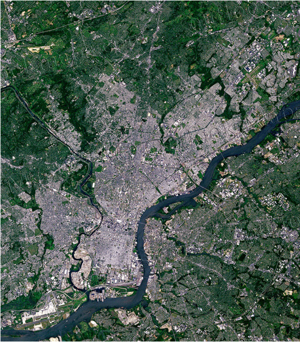
```
<br> 
```{r echo=FALSE, fig.align='center', out.width='40%'}
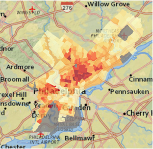
```
<br> 
```{r echo=FALSE, fig.align='center', out.width='40%'}
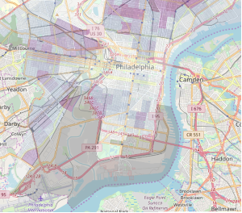
```


]
---

## R na priestorovú analýzu

- Široké možnosti a mnoho balíkov
  + Rámec `sp` tvoril chrbticu nástrojov GIS v R viac ako desaťročie
  + Rámec `sf` (oveľa používateľsky prívetivejší a kompatibilný s `tidyverse`!) bol predstavený pred niekoľkými rokmi a postupne nahrádza `sp`
- Výhody geopriestorovej analýzy v R
  + Schopnosti štatistických výpočtov a pôsobivý grafický engine z neho robia vhodný nástroj na priestorovú analýzu a tvorbu máp
  + Rozhranie príkazového riadku umožňuje, aby bola analýza a vizualizácia prispôsobiteľná, transparentná a reprodukovateľná


```{r echo=FALSE, fig.align='center', out.width='70%'}
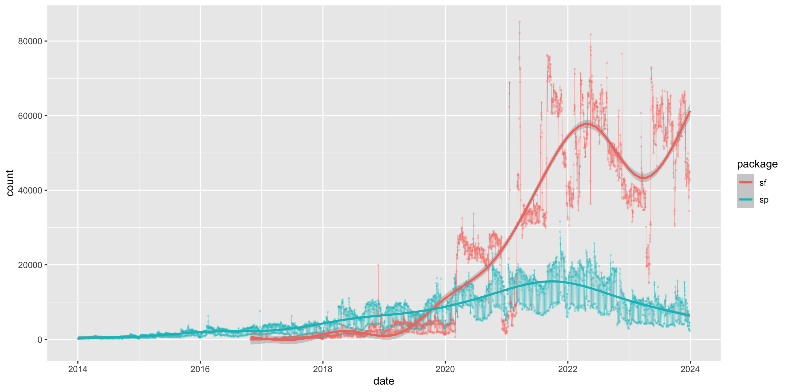
```

---
## Typy geopriestorových údajov

.pull-left[
Vektorové údaje
```{r data-types, echo=FALSE, warning=FALSE}
# Body
points_data <- data.frame(x = c(1, 2, 3), y = c(1, 2, 1))
points_plot <- ggplot(points_data, aes(x, y)) +
  geom_point(size=5, color = "#d19f2a") +
  geom_text(aes(label = paste0("(x", 1:3, ", y", 1:3, ")")),
            nudge_y = 0.3, color = "#d19f2a", size = 4) +
  theme_void() +
  ggtitle("Body") +  
    theme(plot.title = element_text(size = 20))

# Línie
lines_data <- data.frame(x = c(1, 2, 3, 4), y = c(1, 3, 2, 4))
lines_plot <- ggplot(lines_data, aes(x, y)) +
  geom_line(size=1.2, color = "#d19f2a") +
  geom_point(size=5, color = "#d19f2a") +
  theme_void() +
  ggtitle("Línie") +  
    theme(plot.title = element_text(size = 20))

# Polygóny
polygon_data <- data.frame(x = c(1, 3, 4, 2), y = c(1, 1, 3, 4))
polygon_plot <- ggplot(polygon_data, aes(x, y)) +
  geom_polygon(fill = "#d19f2a", alpha = 0.4) +
  geom_point(size=5, color = "#d19f2a") +
  theme_void() +
  ggtitle("Polygóny")+  
    theme(plot.title = element_text(size = 20))

grid.arrange(points_plot, lines_plot, polygon_plot, ncol=1)
```
]


.pull-right[
Rastrové údaje
- Údaje uložené v pravidelnej mriežke buniek, napr. nadmorská výška a satelitné snímky

```{r echo=FALSE}
# Raster (zjednodušený ako štvorce)
raster_data <- expand.grid(x = 1:10, y = 1:20)

raster_data$cluster <- ifelse(raster_data$x > 5 & raster_data$x < 9 & raster_data$y > 10 & raster_data$y < 15, "#debb69",  "#d19f2a")


ggplot(raster_data, aes(x, y)) +
  geom_tile(aes(fill = cluster), color = "#debb69", size = 0.8) +
  scale_fill_identity() +  # použi identickú škálu na vlastné farby
  theme_void() +
  ggtitle("")
```
]
---
### Príklad vektorových údajov

<div style="display: flex;">
  
  <div style="text-align: center;">
    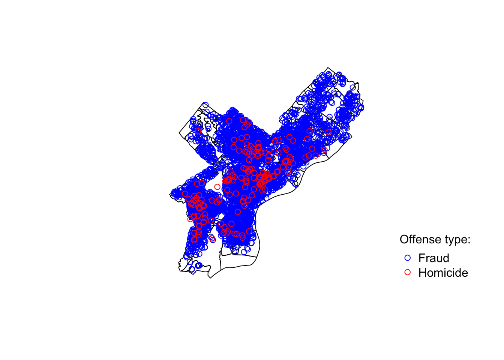
  </div>
  <div style="text-align: center;">
    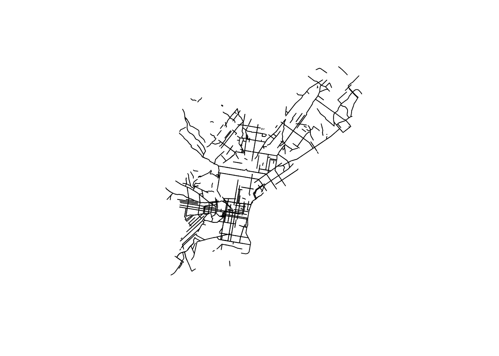
  <div style="text-align: center;">
    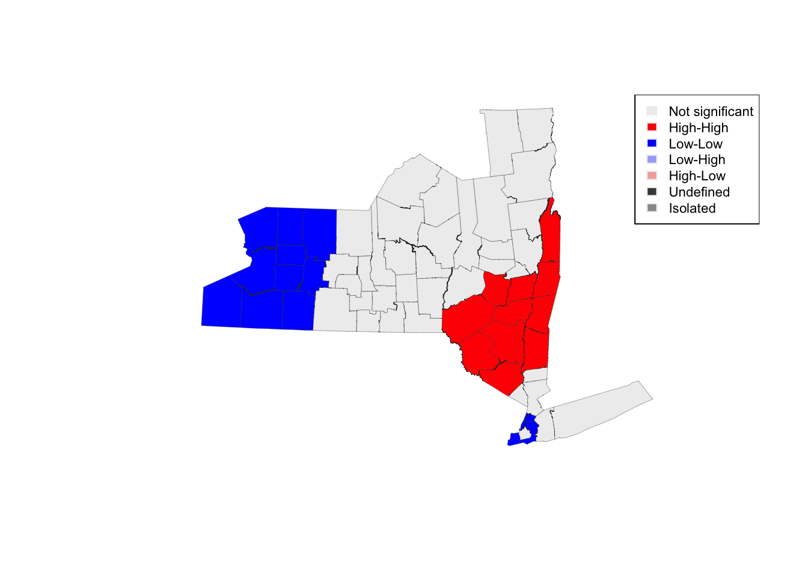
  </div>
</div>

---
### Príklad rastrových údajov
.pull-left[
Satelitná mapa
```{r echo=FALSE, fig.align='center', out.width='100%'}

```
]

.pull-right[
Využitie územia
```{r echo=FALSE, fig.align='center', out.width='100%'}
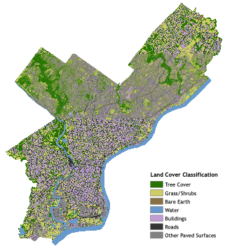
```
]


---

## Triedy priestorových údajov v R (sf)

```{r echo=FALSE, fig.align='center', out.width='100%'}
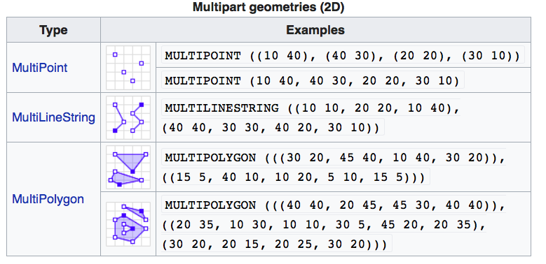
```
* sf dokáže pracovať iba s vektorovými údajmi

---
## Priestorové objekty v R pozostávajú z priestorových a dátových atribútov


```{r echo=FALSE, out.width="100%"}
grViz("
digraph flowchart {
  
  graph [layout = dot, rankdir = LR]
  
  # definície uzlov
  node [shape = box, style = filled, fillcolor = white, fontsize = 14]
  
  A [label = 'objekt sp \n alebo sf']
  B [label = 'Priestorové\natribúty']
  C [label = 'Geosúradnice']
  D [label = 'Hranice']
  E [label = 'Projekcia']
  F [label = 'Dátové\natribúty \n(formát data.frame)']

  # definície hrán
  A -> B
  A -> F
  B -> C
  B -> D
  B -> E
}
")
```
---
## Analýza priestorových ekonomických a zdravotníckych údajov

- Vo všeobecnosti je cieľom posúdiť priestorové vzory rizika ochorenia alebo ekonomickej aktivity

- Prítomnosť priestorových vzorov môže podporiť určité etiológie alebo rizikové faktory (napr. environmentálne hrozby či infekčné procesy), prípadne priestorové zafixovanie (lock-in) alebo preliatia nepozorovanej technológie

- Formálne skúmanie priestorových vzorov sa opiera o priestorovú štatistiku

---

## Typy priestorových vzorov

<div style="display: flex; justify-content: space-around;">
  
  <div style="text-align: center;">
    <div><strong>Bez priest. autokorelácie </strong></div>
    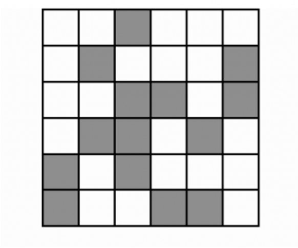
  </div>

  <div style="text-align: center;">
    <div><strong>Pozitívna priest. autokorelácia </strong></div>
    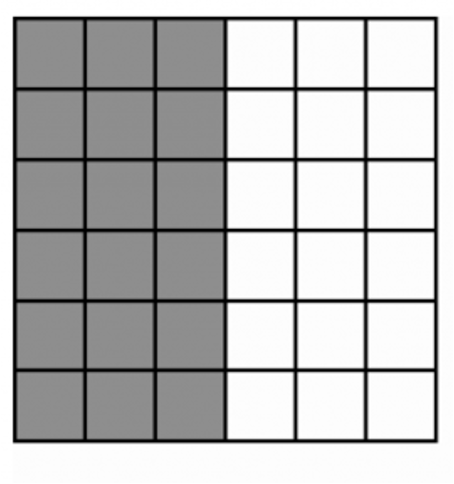
  </div>

  <div style="text-align: center;">
    <div><strong>Negatívna priest. autokorelácia</strong></div>
    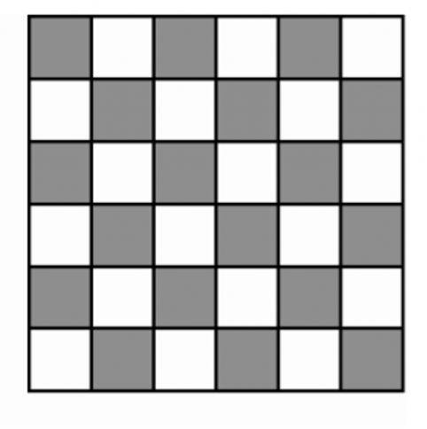
  </div>

</div>

---
## Príklad pozitívnej priestorovej autokorelácie


```{r echo=FALSE, fig.align='center', out.width='90%'}
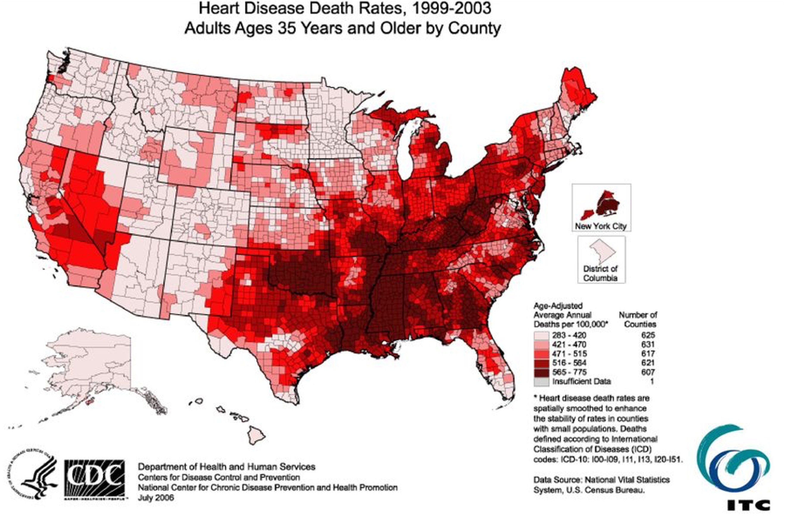
```

---
## Incidencia covidu (7-dňový priemer) 4. 10. 2020
```{r echo=FALSE, fig.align='center', out.width='80%'}
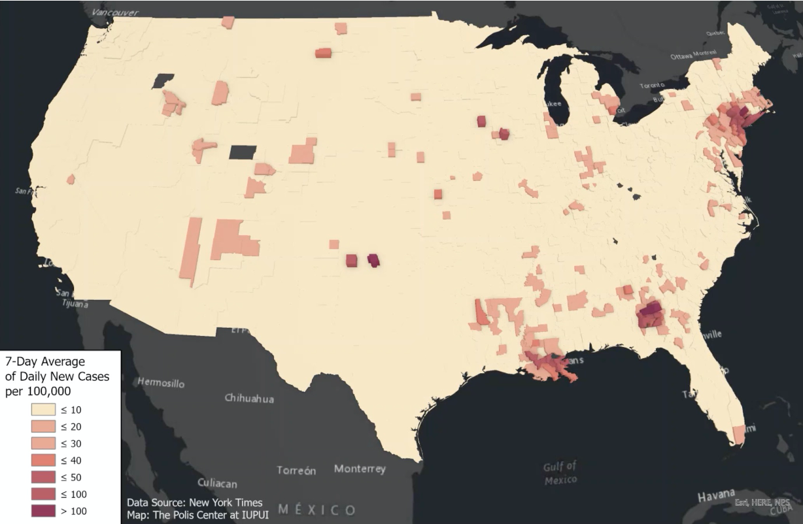
```
---
## Incidencia covidu (7-dňový priemer) 15. 7. 2020
```{r echo=FALSE, fig.align='center', out.width='80%'}
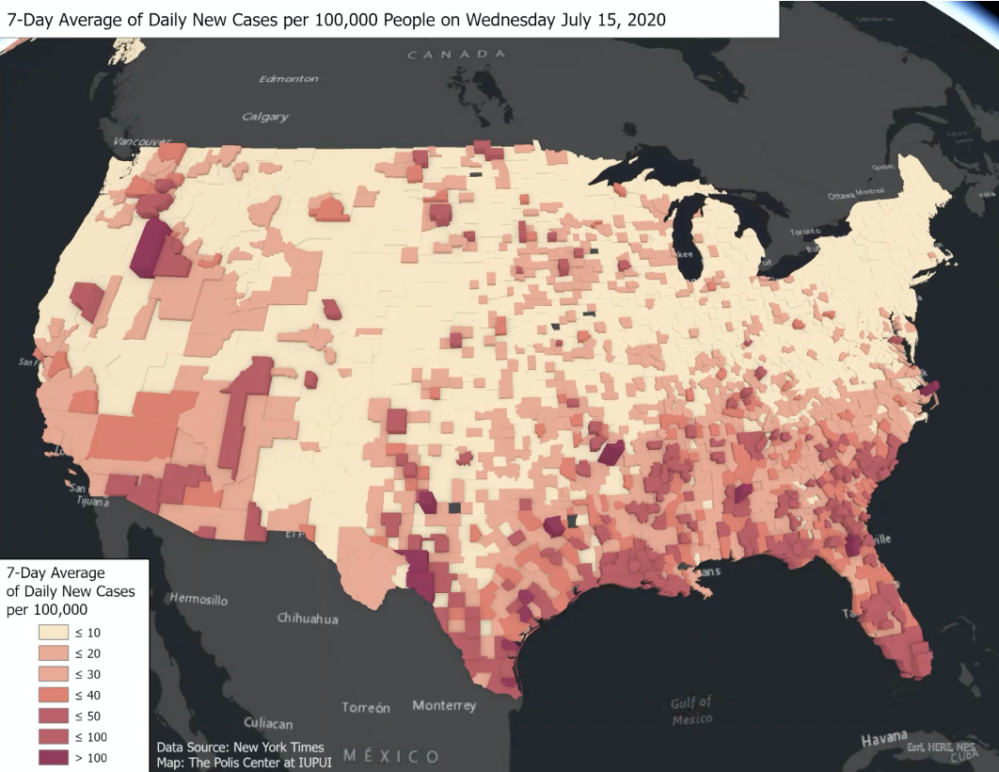
```
---
## Incidencia covidu (7-dňový priemer) 14. 11. 2020
```{r echo=FALSE, fig.align='center', out.width='80%'}
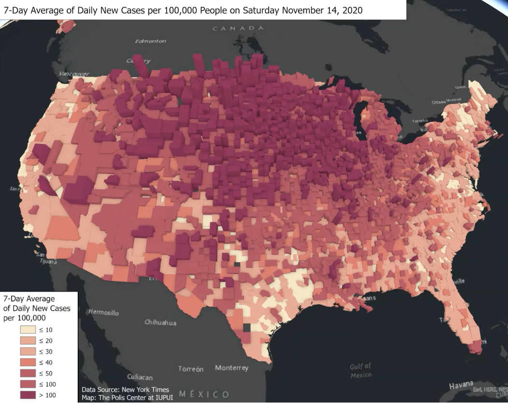
```

---

## Testovanie priestorových hypotéz

- Pripomeňme, že cieľom priestorovej štatistiky je posúdiť významné priestorové vzory alebo trendy

- Existujú dve široké kategórie testov:

 1. Testy GLOBÁLNYCH trendov: hľadajú dôkazy priestorovej heterogenity naprieč celým skúmaným územím

 2. Testy LOKÁLNYCH trendov: dokážu posúdiť konkrétne zhluky
 

---

## Posudzovanie globálnych trendov
- $H_0$: hypotéza konštantného rizika — t. j. riziko ochorenia je v priestore konštantné

  + Počty ochorení sú rovnaké pre regióny s rovnakou celkovou rizikovou populáciou
  
  + Miery incidencie sú rovnaké, ak sa regióny líšia celkovou rizikovou populáciou
  
- Štatistika $Moranovo\ I$ je mierou globálnej priestorovej autokorelácie
  + Ak je $p-hodnota$ významná (napr. $p < 0.05$): dôkaz priestorovej heterogenity
  
  + Ak $p-hodnota$ významná nie je: nulovú hypotézu nezamietame

---
## Moranovo I
.center[
$I = \frac{N}{\sum_{n=1}^2(x_i - \bar{x})^2} \frac {\sum_{i=1}^N \sum_{j=1}^N w_{ij}(x_i-\bar x) (x_j-\bar x)} {\sum_{i=1}^N (w_{ij})}$
]

- Moranovo I je v podstate VÁŽENÁ KOVARIANČNÁ FUNKCIA.
 Je VEĽKÉ vtedy, keď sú $x_i$ a $x_j$ veľké súčasne
- Ako zvolíme váhy?
  
---
## Rôzne definície susedstva

<div style="display: flex; justify-content: space-around;">
  
  <div style="text-align: center;">
    <div><strong>Na základe susednosti </strong></div>
    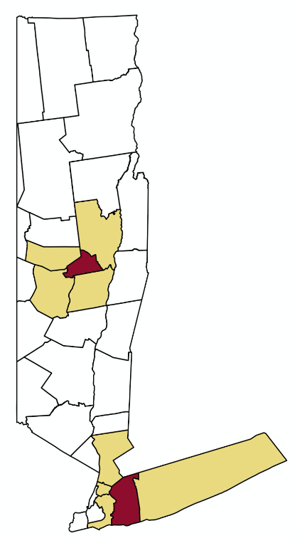
  </div>

  <div style="text-align: center;">
    <div><strong>Na základe vzdialenosti </strong></div>
    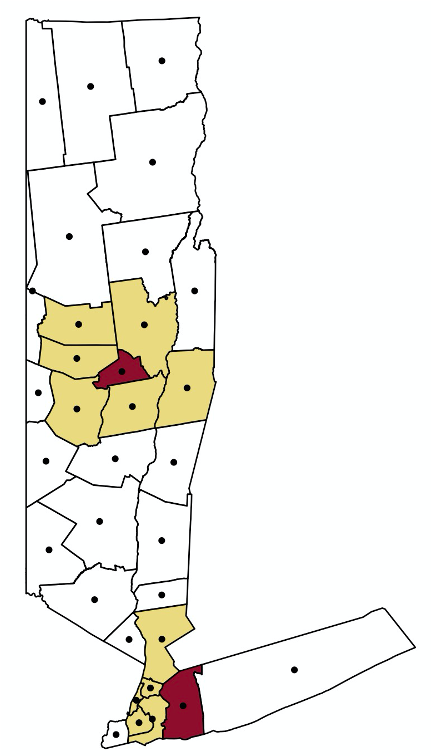
  </div>

  <div style="text-align: center;">
    <div><strong>k-najbližších susedov</strong></div>
    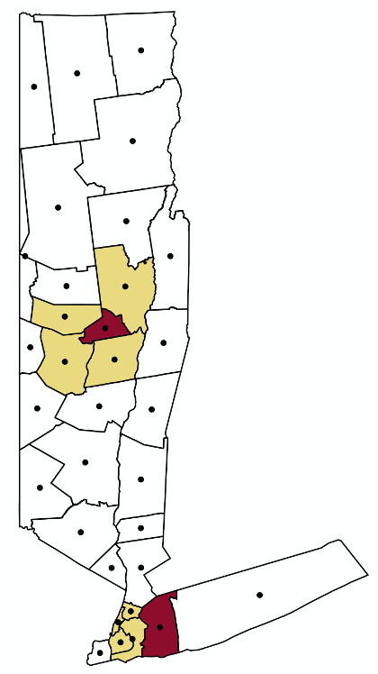
  </div>

</div>

---

## Susednosť typu dáma vs. veža

```{r echo=FALSE, fig.align='center', out.width='100%'}
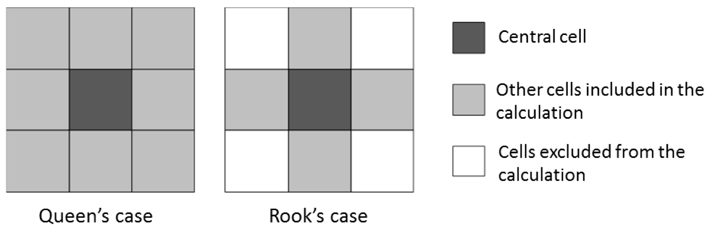
```
---
## Posudzovanie lokálnych trendov
- Lokálny indikátor priestorovej asociácie (LISA) poskytuje štatistiku pre každú lokalitu spolu s posúdením významnosti

- Umožňuje identifikovať konkrétne zhluky ochorení

- Lokálne Moranovo I je rozšírením Moranovho I, definované pre každý región i
.center[
$I = \frac {x_i - \bar{X}}{S_i^2}\sum_{i=1}^N w_{i,j}(x_j-\bar{X})$
]
---
## Lokálne Moranovo I

- Štatistika lokálneho Moranovho I a miera významnosti (pseudo p-hodnota) sa počítajú pre každú lokalitu (polygón)

- Polygón s VYSOKOU hodnotou lokálneho Moranovho I je taký, ktorý má vysoký počet/mieru ochorení a je obklopený ďalšími polygónmi s vysokým počtom/mierou

- Polygón s nízkou hodnotou je taký, ktorý má nízky počet/mieru ochorení a je obklopený ďalšími polygónmi s nízkym počtom/mierou

- Zhluky vysoká–vysoká a nízka–nízka označujú významné ohniská (hot spots), resp. chladné miesta (cold spots) výskytu ochorenia


---
# Zdroje
- [Sherrie Xie, Spatial Analysis in R](https://github.com/sherriexie/SpatialAnalysisinR/tree/main)

- [Claudia Engel, Using Spatial Data with R](https://cengel.github.io/R-spatial/intro.html)
---
