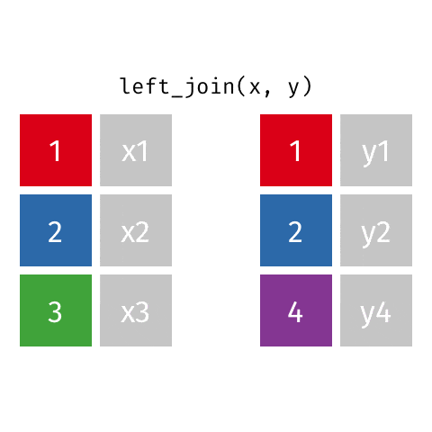
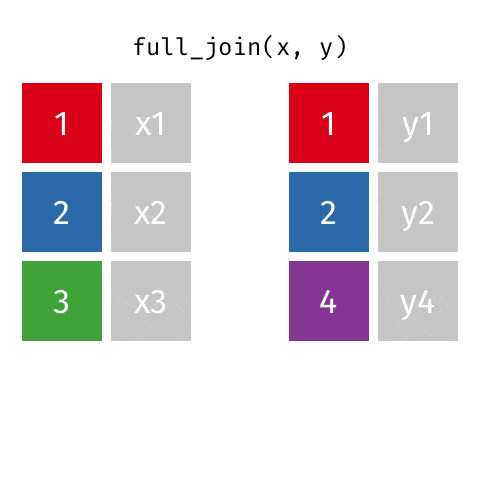
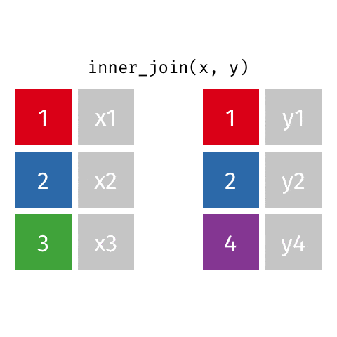
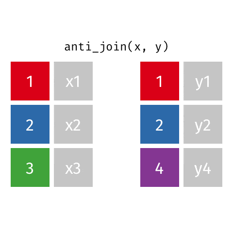

```{r setup, include=FALSE}
options(htmltools.dir.version = FALSE)

library(xaringanthemer)
library(emoji)
library(emojifont)

#See slide on xaringanthemer
library(xaringanthemer)
# style_duo_accent(
# primary_color = "#d19f2a",     # KHP color
# secondary_color = "#e2c47c",   # KHP light
style_mono_accent(
base_color = "#002147",
header_font_google = google_font("Josefin Sans"),
text_font_google = google_font("Montserrat", "300", "300i"),
code_font_google = google_font("Fira Mono")
)

```

```{r  echo=FALSE, message=FALSE, warning=FALSE}
knitr::opts_chunk$set(fig.retina = 5, dev = "ragg_png")
```

```{r packages, echo=FALSE, message=FALSE, warning=FALSE}
# Remember to compile
#xaringan::inf_mr(cast_from = "..")
#       slideNumberFormat: ""  
library(tidyverse)
if (!require("emo")) devtools::install_github("")
library(emo)
if (!require("jasmines")) devtools::install_github("djnavarro/jasmines")
if (!require("mathart")) devtools::install_github("marcusvolz/mathart")


library(knitr)
options(
  dplyr.print_min = 10, 
  dplyr.print_max = 10
  )


```


---
class: middle, center
# Spájanie údajov

---

---
```{r echo=TRUE}
professions <- read_csv("data/scientists/professions.csv")
dates <- read_csv("data/scientists/dates.csv")
works <- read_csv("data/scientists/works.csv")
```

---
## Údaje: ženy vo vede

Informácie o 10 ženách vo vede, ktoré zmenili svet

.small[
```{r echo=FALSE}
professions %>% select(name) %>% kable()
```
]


.footnote[
Zdroj: [Discover Magazine](https://www.discovermagazine.com/the-sciences/meet-10-women-in-science-who-changed-the-world)
]

---

## Vstupy

+ Povolania
```{r}
professions
```

---
## Vstupy

+ Dátumy
```{r}
dates
```

---

## Vstupy

+ Diela

```{r}
works
```

---

## Požadovaný výstup

.small[
```{r echo=FALSE}
professions %>%
  left_join(dates) %>%
  left_join(works)
```
]
---

## Vstupy, reminder

.pull-left[.midi[
```{r}
names(professions)
names(dates)
names(works)
```
]
]
.pull-right[
```{r}
nrow(professions)
nrow(dates)
nrow(works)
```
]

---

class: middle

# Spájanie údajovdata frames

---

## Spájanie údajovdata frames

```{r eval=FALSE}
something_join(x, y)
```

- `left_join()`: všetky riadky z x
- `right_join()`: všetky riadky z y
- `full_join()`: všetky riadky z x aj y
- `semi_join()`: všetky riadky z x, ku ktorým existuje zhoda v y, pričom sa ponechajú len stĺpce z x
- `inner_join()`: všetky riadky z x, ku ktorým existuje zhoda v y; pri viacnásobných zhodách
vráti všetky ich kombinácie
- `anti_join()`: vráti všetky riadky z x, ku ktorým v y neexistuje zhoda, a nikdy riadky z x neduplikuje
- ...
 
---

## Príprava

Pre nasledujúcich pár slajdov...

.pull-left[
```{r echo=FALSE}
x <- tibble(
  id = c(1, 2, 3),
  value_x = c("x1", "x2", "x3")
  )
```
```{r}
x
```
]
.pull-right[
```{r echo=FALSE}
y <- tibble(
  id = c(1, 2, 4),
  value_y = c("y1", "y2", "y4")
  )
```
```{r}
y
```
]

---

## `left_join()`

.pull-left[
```{r echo=FALSE, out.width="80%", out.extra ='style="background-color: #FDF6E3"'}

```
]
.pull-right[
```{r}
left_join(x, y)
```
]

---

## `left_join()`

```{r}
professions %>%
  left_join(dates) #<<
```

---

## `right_join()`

.pull-left[
```{r echo=FALSE, out.width="80%", out.extra ='style="background-color: #FDF6E3"'}

```
]
.pull-right[
```{r}
right_join(x, y)
```
]

---

## `right_join()`


```{r}
professions %>%
  right_join(dates) #<<
```

---

## `full_join()`

.pull-left[
```{r echo=FALSE, out.width="80%", out.extra ='style="background-color: #FDF6E3"'}

```
]
.pull-right[
```{r}
full_join(x, y)
```
]

---

## `full_join()`

```{r}
dates %>%
  full_join(works) #<<
```

---

## `inner_join()`

.pull-left[
```{r echo=FALSE, out.width="80%", out.extra ='style="background-color: #FDF6E3"'}

```
]
.pull-right[
```{r}
inner_join(x, y)
```
]

---

## `inner_join()`

```{r}
dates %>%
  inner_join(works) #<<
```

---

## `semi_join()`

.pull-left[
```{r echo=FALSE, out.width="80%", out.extra ='style="background-color: #FDF6E3"'}

```
]
.pull-right[
```{r}
semi_join(x, y)
```
]

---

## `semi_join()`

```{r}
dates %>%
  semi_join(works) #<<
```

---

## `anti_join()`

.pull-left[
```{r echo=FALSE, out.width="80%", out.extra ='style="background-color: #FDF6E3"'}

```
]
.pull-right[
```{r}
anti_join(x, y)
```
]

---

## `anti_join()`

```{r}
dates %>%
  anti_join(works) #<<
```

---

## Všetko dokopy

```{r}
professions %>%
  left_join(dates) %>%
  left_join(works)
```


---

class: middle

# Prípadové štúdie

---

## Prípad: záznamy o študentoch

- Máme:
  - Zápis: oficiálne univerzitné záznamy o zápise
  - Dotazník: údaje od študentov — chýbajú tí, čo ho nikdy nevyplnili, a naopak sú tam aj tí, čo ho vyplnili, ale predmet zrušili
- Chceme: údaje z dotazníka pre všetkých zapísaných na predmet

--

```{r include=FALSE}
enrollment <- read_csv("data/students/enrollment.csv")
survey <- read_csv("data/students/survey.csv")
```

.pull-left[
```{r message = FALSE}
enrollment
```
]
.pull-right[
```{r message = FALSE}
survey
```
]

---

## Záznamy o študentoch

+ Zapísaní na predmete
```{r}
enrollment %>% 
  left_join(survey, by = "id") #<<
```
]

---

## Záznamy o študentoch

+ Chýbajúci dotazník
```{r}
enrollment %>% 
  anti_join(survey, by = "id") #<<
```
---

## Záznamy o študentoch

+ Zrušili predmet
```{r}
survey %>% 
  anti_join(enrollment, by = "id") #<<
```

---

class: middle

# Prípadová štúdia: predaj potravín

---

## Predaj potravín

- Máme:
  - Nákupy: jeden riadok na zákazníka a položku so zoznamom uskutočnených nákupov
  - Ceny: jeden riadok na položku v obchode s jej cenou
- Chceme: celkové tržby

--

```{r include=FALSE}
purchases <- read_csv("data/sales/purchases.csv")
prices <- read_csv("data/sales/prices.csv")
```

.pull-left[
```{r message = FALSE}
purchases
```
]
.pull-right[
```{r message = FALSE}
prices
```
]

---

## Predaj potravín

+ Celkové tržby

.pull-left[
```{r}
purchases %>% 
  left_join(prices) #<<
```
]

.pull-right[
```{r}
purchases %>% 
  left_join(prices) %>%
  summarize(total_revenue = sum(price)) #<<
```
]

---

## Predaj potravín

+ Tržby na zákazníka

.pull-left[
```{r}
purchases %>% 
  left_join(prices)
```
]
.pull-right[
```{r}
purchases %>% 
  left_join(prices) %>%
  group_by(customer_id) %>% #<<
  summarize(total_revenue = sum(price))
```
]


---
# Zdroje
- [Data Science for Psychologists, S. Mason Garrison](https://datascience4psych.github.io/DataScience4Psych/)

- [Data science in a Box](https://datasciencebox.org/)

---