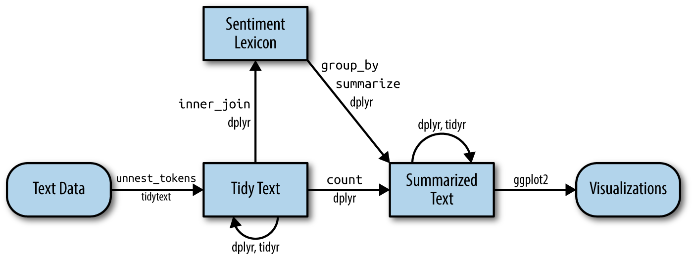

```{r setup, include=FALSE}
options(htmltools.dir.version = FALSE)
library(xaringanthemer)
style_mono_accent(
base_color = "#002147",
header_font_google = google_font("Josefin Sans"),
text_font_google = google_font("Montserrat", "300", "300i"),
code_font_google = google_font("Fira Mono")
)

```

```{r packages, echo=FALSE, message=FALSE, warning=FALSE}
library(tidyverse)
library(emo)
library(ggplot2)
library(gridExtra)
library(tibble)
# predvolene zobrazuj iba 5 riadkov tibble
options(tibble.print_max = 5, tibble.print_min = 5)
```

```{r  echo=FALSE, message=FALSE, warning=FALSE}
knitr::opts_chunk$set(fig.retina = 5, dev = "ragg_png")
```

---


class: middle

# Usporiadaný textový formát

---

# Text ako údaje

* **Reťazec (string)**: Text sa dá, samozrejme, uchovávať ako reťazce, t. j. znakové vektory v R, a textové údaje sa do pamäte často načítavajú práve v tejto podobe.

* **Korpus**: Tieto typy objektov zvyčajne obsahujú surové reťazce doplnené o metaúdaje a ďalšie podrobnosti.

* **Matica dokument–term**: Riedka matica opisujúca kolekciu (t. j. korpus) dokumentov, ktorá má jeden riadok pre každý dokument a jeden stĺpec pre každý term. Hodnotou v matici býva počet výskytov slova alebo tf-idf.
---


## Znakové vektory

```{r text}
text <- c("Because I could not stop for Death -",
          "He kindly stopped for me -",
          "The Carriage held but just Ourselves -",
          "and Immortality")

text
```
Toto vieme premeniť na usporiadaný (tidy) súbor údajov

```{r text_df}
library(dplyr)
text_df <- tibble(line = 1:4, text = text)
```

---

### Tokenizácia

Tokenizácia — token je zmysluplná jednotka textu, najčastejšie slovo, ktorú chceme použiť v ďalšej analýze.


```{r}
library(tidytext)

text_df %>%
  unnest_tokens(word, text)
```
---
### Tokenizácia pomocou `unnest_tokens()`

+ Rozdelí každý riadok tak, aby v každom riadku nového dátového rámca bol jeden token (slovo)
+ Interpunkcia je odstránená
+ Text je prevedený na malé písmená (`to_lower = TRUE`)

Predvolene sa tokenizuje na slová, ale ďalšie možnosti zahŕňajú **znaky, n-gramy, vety, riadky, odseky alebo delenie podľa regulárneho výrazu**. (... postupne si na to zvykneme)


```{r tidyflow-ch1, echo = FALSE, out.width = '100%', fig.cap = "Vývojový diagram typickej textovej analýzy podľa princípov usporiadaných údajov."}
knitr::include_graphics("img/tmwr_0101.png")
```
--- 
---
## Upratovanie textu

```{r, output=FALSE}
library(janeaustenr)
library(dplyr)
library(stringr)

original_books <- austen_books() %>%
  group_by(book) %>%
  mutate(linenumber = row_number(),
         chapter = cumsum(str_detect(text, 
                                     regex("^chapter [\\divxlc]",
                                           ignore_case = TRUE)))) %>%
  ungroup()

#original_books
```
Tokenizácia

```{r}
tidy_books <- original_books %>%
  unnest_tokens(word, text)

#tidy_books
```
Aký je rozmer objektov `original_books` a `tidy_books`?
---
--- 
### Vykreslime rozdelenie tokenov
```{r echo=FALSE}
library(ggplot2)

tidy_books %>%
  count(word, sort = TRUE) %>%
  filter(n > 1200) %>%
  mutate(word = reorder(word, n)) %>%
  ggplot(aes(n, word)) +
  geom_col() +
  labs(y = NULL)
```
.question[*Nezdá sa vám niečo nezvyčajné?*]
---

### Odstránenie stop slov

```{r}

data(stop_words)

tidy_books <- tidy_books %>%
  anti_join(stop_words, by = join_by(word))

tidy_books %>%
  count(word, sort = TRUE) 
```

O čom sú Austenovej romány? `r emo::ji("girls")`

--- 
---

## Frekvencie slov

```{r}
# Jane Eyrová, Búrlivé výšiny
library(gutenbergr)

hgwells <- gutenberg_download(c(35, 36))

tidy_hgwells <- hgwells %>%
  unnest_tokens(word, text) %>%
  anti_join(stop_words)
```
---

```{r}
bronte <- gutenberg_download(c(1260, 768))

tidy_bronte <- bronte %>%
  unnest_tokens(word, text) %>%
  anti_join(stop_words)

tidy_bronte %>%
  count(word, sort = TRUE)
```

---

```{r}
library(tidyr)

frequency <- bind_rows(mutate(tidy_bronte, author = "Brontë Sisters"),
                       mutate(tidy_hgwells, author = "H.G. Wells"), 
                       mutate(tidy_books, author = "Jane Austen")) %>% 
  mutate(word = str_extract(word, "[a-z']+")) %>%
  count(author, word) %>%
  group_by(author) %>%
  mutate(proportion = n / sum(n)) %>% 
  select(-n) %>% 
  pivot_wider(names_from = author, values_from = proportion) %>%
  pivot_longer(`Brontë Sisters`:`H.G. Wells`,
               names_to = "author", values_to = "proportion")

frequency

```

---

```{r eval=FALSE, message=FALSE, warning=FALSE, include=TRUE}
library(scales)

# očakávajte upozornenie o odstránení riadkov s chýbajúcimi hodnotami
ggplot(frequency, aes(x = proportion, y = `Jane Austen`, 
                      color = abs(`Jane Austen` - proportion))) +
  geom_abline(color = "gray40", lty = 2) +
  geom_jitter(alpha = 0.1, size = 2.5, width = 0.3, height = 0.3) +
  geom_text(aes(label = word), check_overlap = TRUE, vjust = 1.5) +
  scale_x_log10(labels = percent_format()) +
  scale_y_log10(labels = percent_format()) +
  scale_color_gradient(limits = c(0, 0.001), 
                       low = "darkslategray4", high = "gray75") +
  facet_wrap(~author, ncol = 2) +
  theme(legend.position="none") +
  labs(y = "Jane Austen", x = NULL)

```

---


```{r echo=FALSE, warning=FALSE, out.width="80%", fig.align="center"}
library(scales)

ggplot(frequency, aes(x = proportion, y = `Jane Austen`, 
                      color = abs(`Jane Austen` - proportion))) +
  geom_abline(color = "gray40", lty = 2) +
  geom_jitter(alpha = 0.1, size = 2.5, width = 0.3, height = 0.3) +
  geom_text(aes(label = word), check_overlap = TRUE, vjust = 1.5) +
  scale_x_log10(labels = percent_format()) +
  scale_y_log10(labels = percent_format()) +
  scale_color_gradient(limits = c(0, 0.001), 
                       low = "darkslategray4", high = "gray75") +
  facet_wrap(~author, ncol = 2) +
  theme(legend.position="none") +
  labs(y = "Jane Austen", x = NULL)

```

---

class: middle

# Analýza sentimentu na usporiadaných údajoch

---


### S využitím **tidytext**, **dplyr** a spol. v R


```{r tidyflow-ch2, echo = FALSE, out.width = '100%', fig.cap = "Vývojový diagram typickej textovej analýzy, ktorá používa tidytext na analýzu sentimentu."}

```


Táto prezentácia pokrýva: usporiadané lexikóny sentimentu, pripájanie lexikónov k tokenizovanému textu, výpočet trajektórií sentimentu, porovnanie slovníkov, najvplyvnejšie slová, slovné mraky a tokenizáciu na vety a kapitoly.


---

## Čo je analýza sentimentu?


+ Programový prístup k odhadu **názoru/emócie** v texte (pozitívny/negatívny alebo emócie ako radosť, hnev).
+ Usporiadaný prístup: text chápeme ako **tokeny (slová)**; sentiment dokumentu počítame **kombináciou skóre jednotlivých slov**.
+ Úskalia: negácie (napr. *„nie je dobrý“*), sarkazmus, nesúlad domény a vplyv veľkosti úseku.


---

## Balíky

```{r}
# install.packages(c("tidytext","janeaustenr","dplyr","stringr","tidyr","ggplot2","wordcloud","reshape2"))

library(tidytext)
library(janeaustenr)
library(dplyr)
library(stringr)
library(tidyr)
library(ggplot2)
library(wordcloud)
library(reshape2)
```

---

## Lexikóny sentimentu dostupné cez `tidytext`


+ **AFINN** (číselné skóre −5…+5)
+ **bing** (binárne: pozitívne/negatívne)
+ **nrc** (binárne: poz./neg. + emócie: radosť, hnev, strach, dôvera, smútok, prekvapenie, znechutenie, očakávanie)

Načítanie ľubovoľného lexikónu:


```{r echo=TRUE, warning=FALSE}
library(tidytext)
library(textdata)
library(dplyr)
get_sentiments("afinn")   # alebo "bing", "nrc"

```


**Na licencii záleží**: pred použitím si overte licenciu každého lexikónu.


---

## Zostavenie usporiadaného korpusu z diela Jane Austenovej

```{r  echo=TRUE, warning=FALSE}
# 1 token na riadok, s metaúdajmi o knihe/riadku/kapitole

tidy_books <- austen_books() %>%
  group_by(book) %>%
  mutate(
    linenumber = row_number(),
    chapter = cumsum(str_detect(text, regex("^chapter [\\divxlc]", ignore_case = TRUE)))
  ) %>%
  ungroup() %>%
  unnest_tokens(word, text)
```


Stĺpec s tokenmi pomenúvame **word**, aby zodpovedal lexikónom — spájanie je potom jednoduchšie.


---

## Slová radosti v románe *Emma* (NRC)

```{r  echo=TRUE, warning=FALSE}
nrc_joy <- get_sentiments("nrc") %>% filter(sentiment == "joy")

joy_counts <- tidy_books %>%
  filter(book == "Emma") %>%
  inner_join(nrc_joy, by = "word") %>%
  count(word, sort = TRUE)

head(joy_counts, 15)
```

---

## Výpočet sentimentu naprieč každým románom (Bing)

```{r  echo=TRUE, warning=FALSE}
jane_austen_sentiment <- tidy_books %>%
  inner_join(get_sentiments("bing"), by = "word") %>%
  count(book, index = linenumber %/% 80, sentiment) %>%
  pivot_wider(names_from = sentiment, values_from = n, values_fill = 0) %>%
  mutate(sentiment = positive - negative)
```

Tip: `%/%` je **celočíselné delenie**; veľkosť úseku voľte tak, aby ste vyvážili šum a vyhladenie.

---

### Vizualizácia sentimentu naprieč každým románom (Bing)

```{r out.width = '50%', fig.align="center"}
ggplot(jane_austen_sentiment, aes(index, sentiment, fill = book)) +
  geom_col(show.legend = FALSE) +
  facet_wrap(~book, ncol = 2, scales = "free_x") +
  labs(x = "Index naratívu (úseky po 80 riadkoch)", y = "Čistý sentiment (poz. - neg.)")

```
---

## Porovnanie AFINN, Bing a NRC na románe *Pýcha a predsudok*

```{r  echo=TRUE, warning=FALSE}
pp <- tidy_books %>% filter(book == "Pride & Prejudice")

afinn <- pp %>%
  inner_join(get_sentiments("afinn"), by = "word") %>%
  group_by(index = linenumber %/% 80) %>%
  summarise(sentiment = sum(value), .groups = "drop") %>%
  mutate(method = "AFINN")

bing_nrc <- bind_rows(
  pp %>% inner_join(get_sentiments("bing"), by = "word") %>% mutate(method = "Bing"),
  pp %>% inner_join(get_sentiments("nrc") %>% filter(sentiment %in% c("positive","negative")), by = "word") %>% mutate(method = "NRC")
) %>%
  count(method, index = linenumber %/% 80, sentiment) %>%
  pivot_wider(names_from = sentiment, values_from = n, values_fill = 0) %>%
  mutate(sentiment = positive - negative)

```
---
### Vizualizácia naprieč lexikónmi sentimentu

```{r out.width='50%', fig.align="center"}

bind_rows(afinn, bing_nrc) %>%
  ggplot(aes(index, sentiment, fill = method)) +
  geom_col(show.legend = FALSE) +
  facet_wrap(~method, ncol = 1, scales = "free_y") +
  labs(x = "Index naratívu", y = "Čistý sentiment")

```

**Vzory**: podobné vzostupy a poklesy naprieč metódami; odlišné absolútne škály (AFINN býva väčší; NRC je posunutý pozitívnejšie; Bing vykazuje dlhšie súvislé úseky).


---

## Prečo je NRC posunutý vyššie?

```{r  echo=TRUE, warning=FALSE}
get_sentiments("nrc") %>%
  filter(sentiment %in% c("positive","negative")) %>%
  count(sentiment)

get_sentiments("bing") %>%
  count(sentiment)
```


Zloženie lexikónov sa líši (pomer negatívnych a pozitívnych tokenov). Záleží aj na pokrytí slovnej zásoby autora zhodami so slovami lexikónu.


---

## Najvplyvnejšie slová (Bing)

```{r  echo=TRUE, warning=FALSE, out.width='60%', fig.align="center"}
bing_word_counts <- tidy_books %>%
  inner_join(get_sentiments("bing"), by = "word") %>%
  count(word, sentiment, sort = TRUE) %>%
  ungroup()

bing_word_counts
```

---

```{r out.width='40%', fig.align="center"}
bing_word_counts %>%
  group_by(sentiment) %>%
  slice_max(n, n = 10) %>%
  ungroup() %>%
  mutate(word = reorder(word, n)) %>%
  ggplot(aes(n, word, fill = sentiment)) +
  geom_col(show.legend = FALSE) +
  facet_wrap(~sentiment, scales = "free_y") +
  labs(x = "Príspevok k sentimentu", y = NULL)
```


Pozor na anomálie ako **„miss“** (oslovenie slečna vs. negatívne sloveso minúť); zvážte **vlastný zoznam stop slov**.


---

## Príklad vlastných stop slov

```{r  echo=TRUE, warning=FALSE}
custom_stop_words <- bind_rows(
  tibble(word = c("miss"), lexicon = c("custom")),
  stop_words
)
```

---

## Slovné mraky

```{r echo=TRUE, warning=FALSE, out.width='50%', fig.align="center"}
# všetky slová okrem stop slov
library(wordcloud)
tidy_books %>%
  anti_join(stop_words, by = "word") %>%
  count(word) %>%
  with(wordcloud(word, n, max.words = 100))
```
---
```{r  echo=TRUE, warning=FALSE, out.width='50%', fig.align="center"}
# porovnávací mrak: pozitívne vs negatívne (Bing)
library(reshape2)
tidy_books %>%
  inner_join(get_sentiments("bing"), by = "word") %>%
  count(word, sentiment, sort = TRUE) %>%
  acast(word ~ sentiment, value.var = "n", fill = 0) %>%
  comparison.cloud(colors = c("gray20","gray80"), max.words = 100)
```

---

## Za hranicou slov: vety a kapitoly

```{r  echo=TRUE, warning=FALSE}
# tokenizácia na vety (napr. pre metódy zohľadňujúce negáciu)
pp_sentences <- tibble(text = prideprejudice) %>%
  unnest_tokens(sentence, text, token = "sentences")
pp_sentences$sentence[2]
```

```{r  echo=TRUE, warning=FALSE}
# tokenizácia na kapitoly pomocou regulárneho výrazu

austen_chapters <- austen_books() %>%
  group_by(book) %>%
  unnest_tokens(chapter, text, token = "regex",
                pattern = "Chapter|CHAPTER [\\dIVXLC]") %>%
  ungroup()

```
---

```{r}
austen_chapters %>% group_by(book) %>% summarise(chapters = n())
```

---

### Najnegatívnejšia kapitola v každej knihe (normalizovane)

```{r  echo=TRUE, warning=FALSE}
bing_negative <- get_sentiments("bing") %>% filter(sentiment == "negative")

wordcounts <- tidy_books %>%
  group_by(book, chapter) %>%
  summarise(words = n(), .groups = "drop")

neg_chapters <- tidy_books %>%
  semi_join(bing_negative, by = "word") %>%
  group_by(book, chapter) %>%
  summarise(negativewords = n(), .groups = "drop") %>%
  left_join(wordcounts, by = c("book","chapter")) %>%
  mutate(ratio = negativewords / words) %>%
  filter(chapter != 0) %>%
  arrange(book)
```
---
```{r}
most_neg_chapters <- neg_chapters %>%
  group_by(book) %>%
  slice_max(ratio, n = 1) 

most_neg_chapters

```
---

## Praktické úskalia a rady


* **Negácia/sarkazmus**: lexikóny nad jednotlivými slovami nezachytia rozsah negácie; zvážte prístupy na úrovni viet alebo závislostnej syntaxe.
* **Nesúlad domény**: overte voľbu lexikónu na svojej doméne; vyskúšajte viacero lexikónov a porovnajte ich.
* **Veľkosť úseku**: ladíte veľkosť úseku (riadky, vety, odseky) tak, aby ste zachovali naratívnu štruktúru bez nadmerného šumu.
* **Predspracovanie**: buďte dôslední (malé písmená, tokenizácia, práca s menami a postavami).
* **Reprodukovateľnosť**: nastavte semienko tam, kde vstupuje náhoda; zaznamenajte verzie balíkov.


---
# Zdroje
- [Silge, J., Robinson D. (2017). Text Mining with R!. O'Reilly](https://www.tidytextmining.com/)
