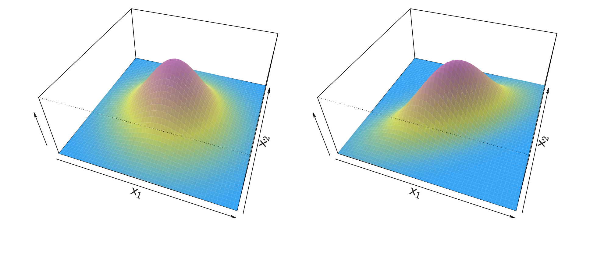
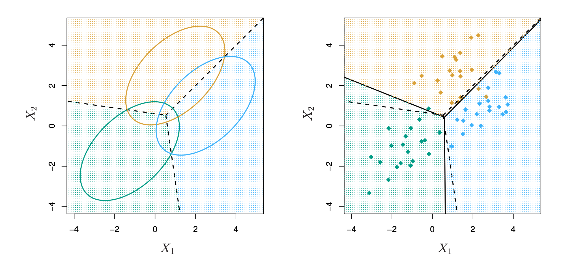

```{r setup, include=FALSE}
options(htmltools.dir.version = FALSE)

library(xaringanthemer)


#See slide on xaringanthemer
library(xaringanthemer)
# style_duo_accent(
# primary_color = "#d19f2a",     # KHP color
# secondary_color = "#e2c47c",   # KHP light
style_mono_accent(
base_color = "#002147",
header_font_google = google_font("Josefin Sans"),
text_font_google = google_font("Montserrat", "300", "300i"),
code_font_google = google_font("Fira Mono")
)

```

```{r  echo=FALSE, message=FALSE, warning=FALSE}
knitr::opts_chunk$set(fig.retina = 5, dev = "ragg_png")
```

```{r packages, echo=FALSE, message=FALSE, warning=FALSE}

 
if (!require("emo")) devtools::install_github("")
library(emo)


library(knitr)
options(
  dplyr.print_min = 10, 
  dplyr.print_max = 10
  )


library(tidyverse)
library(tidymodels)
library(ggtext)
library(knitr)
library(kableExtra)
library(plotly)
library(widgetframe)
library(patchwork)
library(bestglm)
library(gridExtra)
library(dplyr)
library(MASS)
require(ISLR)


set.seed(1234)
```

## Prehľad prednášky


 - Problém klasifikácie vs. regresie
 
 - Logistická regresia
  + dve triedy
  + viac ako dve triedy
  
- Diskriminačná analýza

- Logistická regresia vs. lineárna diskriminačná analýza


---

## Klasifikácia

Kvalitatívne premenné nadobúdajú hodnoty z neusporiadanej množiny $C$, napríklad:
   $$ \text{farba očí} \in {\{} \text{hnedá, modrá, zelená} \} $$
  $$ \text{e-mail} \in \{ \text{spam, ham} \} $$

Majme vektor príznakov $X$ a kvalitatívnu odozvu $Y \in \mathcal{C}$. Úlohou klasifikácie je zostrojiť funkciu $C(X)$, ktorá na vstupe vezme vektor príznakov $X$ a predpovie jeho hodnotu $Y$, t. j. $C(X) \in \mathcal{C}$

Často odhadujeme *pravdepodobnosti* toho, že $X$ patrí do jednotlivých kategórií množiny $\mathcal{C}$

--

Napríklad je cennejšie mať odhad pravdepodobnosti, že poistná udalosť je podvodná, než len zaradenie „podvod / nie podvod“.

---


## Príklad: nesplácanie kreditnej karty
.pull-left[
```{r echo=FALSE}
data(Default)

ggplot(Default, aes(x = balance, y = income, color = default)) +
  geom_point(size = 0.5, alpha = 1, shape = 4) +
  scale_color_manual(values = c("No" = "cornflowerblue", "Yes" = "coral")) +
  labs(title = "Bodový graf zostatku a príjmu podľa stavu nesplácania",
       x = "Príjem",
       y = "Zostatok") +
  theme_minimal()
```
]


.pull-right[
```{r echo=FALSE}
plot_income <- ggplot(Default, aes(x = default, y = income, fill = default)) +
  geom_boxplot() +
  scale_fill_manual(values = c("No" = "cornflowerblue", "Yes" = "coral")) +
  labs(title = "Príjem podľa stavu nesplácania",
       x = "Stav nesplácania",
       y = "Príjem") +
  theme_minimal()

plot_balance <- ggplot(Default, aes(x = default, y = balance, fill = default)) +
  geom_boxplot() +
  scale_fill_manual(values = c("No" = "cornflowerblue", "Yes" = "coral")) +
  labs(title = "Zostatok podľa stavu nesplácania",
       x = "Stav nesplácania",
       y = "Zostatok") +
  theme_minimal()

grid.arrange(plot_income, plot_balance, ncol = 2)
```
]
---
## Môžeme použiť lineárnu regresiu?

Predpokladajme, že pri klasifikačnej úlohe `Default` zakódujeme

$$
Y =
\begin{cases}
0, & \text{ak Nie} \\
1, & \text{ak Áno.}
\end{cases}
$$
Môžeme jednoducho urobiť lineárnu regresiu $Y$ na $X$ a klasifikovať ako `Yes`, ak $\hat{Y} > 0.5$?
--
  + Pri binárnom výsledku si lineárna regresia ako klasifikátor počína dobre a je ekvivalentná lineárnej diskriminačnej analýze, o ktorej hovoríme neskôr.
  
  + Keďže v populácii platí $E(Y | X = x) = \Pr(Y = 1 | X = x)$, mohlo by sa zdať, že regresia je na túto úlohu ideálna.
  
  + Lineárna regresia však môže dávať pravdepodobnosti menšie než nula alebo väčšie než jedna. Vhodnejšia je logistická regresia.

---

## Lineárna verzus logistická regresia

```{r echo=FALSE, fig.height=5, fig.width=10, warning=FALSE}
lm_model <- lm(default ~ balance, data = Default)

glm_model <- glm(default ~ balance, data = Default, family = "binomial")

Default$pred_lm <- predict(lm_model, newdata = Default)
Default$pred_glm <- 1+predict(glm_model, newdata = Default, type = "response")

plot_lm <- ggplot(Default, aes(x = balance, y = default)) +
  geom_point(color = "coral", shape = 3, alpha = 0.5) +
  geom_line(aes(y = pred_lm), color = "cornflowerblue", size = 1) +
  labs(title = "Lineárna regresia",
       x = "Zostatok",
       y = "Pravdepodobnosť nesplácania") +
  theme_minimal()

plot_glm <- ggplot(Default, aes(x = balance, y = default)) +
  geom_point(color = "coral", shape = 3, alpha = 0.5) +
  geom_line(aes(y = pred_glm), color = "cornflowerblue", size = 1) +
  labs(title = "Logistická regresia",
       x = "Zostatok",
       y = "Pravdepodobnosť nesplácania") +
  theme_minimal()

grid.arrange(plot_lm, plot_glm, ncol = 2)

```

Oranžové značky znázorňujú odozvu $Y$, teda 0 alebo 1. Lineárna regresia odhaduje $Pr(Y = 1|X)$ zle. Logistická regresia sa na túto úlohu hodí oveľa lepšie.

---
## Lineárna regresia — pokračovanie

Predpokladajme teraz, že odozva má tri možné hodnoty. Na pohotovosť príde pacient a my ho musíme zaradiť podľa príznakov.

$$
Y =
\begin{cases}
1, & \text{ak mozgová príhoda;} \\
2, & \text{ak predávkovanie liekmi;} \\
3, & \text{ak epileptický záchvat.}
\end{cases}
$$
Toto kódovanie naznačuje usporiadanie a fakticky implikuje, že rozdiel medzi **mozgovou príhodou** a **predávkovaním** je rovnaký ako medzi **predávkovaním** a **epileptickým záchvatom**.

<br>
--

Lineárna regresia tu nie je vhodná. Vhodnejšia je **viactriedna logistická regresia** alebo **diskriminačná analýza**.

---
## Logistická regresia

Označme si v skratke $p(X) = \Pr(Y = 1 | X)$ a skúsme predpovedať nesplácanie pomocou zostatku. Logistická regresia má tvar

$$p(X) = \frac{e^{\beta_0 + \beta_1 X}}{1 + e^{\beta_0 + \beta_1 X}}.$$
( $e \approx 2.71828$ je matematická konštanta, Eulerovo číslo.)

Ľahko vidno, že nech $\beta_0$, $\beta_1$ či $X$ nadobúdajú akékoľvek hodnoty, $p(X)$ bude vždy medzi 0 a 1.

--
Menšou úpravou dostaneme

$$\log \left( \frac{p(X)}{1 - p(X)} \right) = \beta_0 + \beta_1 X.$$
Táto monotónna transformácia sa nazýva **logaritmus šancí (log odds)** alebo **logitová transformácia** $p(X)$. ($\log$ tu znamená prirodzený logaritmus $\ln$.)

---

## Lineárna verzus logistická regresia

```{r echo=FALSE, fig.height=5, fig.width=10, warning=FALSE}
lm_model <- lm(default ~ balance, data = Default)

glm_model <- glm(default ~ balance, data = Default, family = "binomial")

Default$pred_lm <- predict(lm_model, newdata = Default)
Default$pred_glm <- 1+predict(glm_model, newdata = Default, type = "response")

plot_lm <- ggplot(Default, aes(x = balance, y = default)) +
  geom_point(color = "coral", shape = 3, alpha = 0.5) +
  geom_line(aes(y = pred_lm), color = "cornflowerblue", size = 1) +
  labs(title = "Lineárna regresia",
       x = "Zostatok",
       y = "Pravdepodobnosť nesplácania") +
  theme_minimal()

plot_glm <- ggplot(Default, aes(x = balance, y = default)) +
  geom_point(color = "coral", shape = 3, alpha = 0.5) +
  geom_line(aes(y = pred_glm), color = "cornflowerblue", size = 1) +
  labs(title = "Logistická regresia",
       x = "Zostatok",
       y = "Pravdepodobnosť nesplácania") +
  theme_minimal()

grid.arrange(plot_lm, plot_glm, ncol = 2)

```

Logistická regresia zabezpečí, že náš odhad $p(X)$ leží medzi 0 a 1.
---

## Metóda maximálnej vierohodnosti

Na odhad parametrov používame metódu maximálnej vierohodnosti.

$$\mathcal{l}(\beta_0, \beta_1) = \prod_{i : y_i = 1} p(x_i) \prod_{i : y_i = 0} (1 - p(x_i)).$$

Táto vierohodnostná funkcia udáva pravdepodobnosť pozorovaných núl a jednotiek v údajoch. $\beta_0$ a $\beta_1$ volíme tak, aby sme vierohodnosť pozorovaných údajov maximalizovali.

Väčšina štatistických balíkov dokáže odhadnúť logistické regresné modely
metódou maximálnej vierohodnosti. V `R` používame funkciu `glm`


---
## Tvorba predpovede

$$\begin{array}{c c c c c }
\hline
& \text{Koeficient} & \text{Št. chyba} & \text{Z-štatistika} & \text{P-hodnota} \\
\hline
\text{Konštanta} & -10.6513 & 0.3612 & -29.5 & < 0.0001 \\
\text{Zostatok} & 0.0055 & 0.0002 & 24.9 & < 0.0001 \\\hline
\end{array}$$
Aká je naša odhadovaná pravdepodobnosť nesplácania pre osobu so zostatkom 1000 $?

$$\hat{p}(X) = \frac{e^{\hat{\beta}_0 + \hat{\beta}_1 X}}{1 + e^{\hat{\beta}_0 + \hat{\beta}_1 X}} = \frac{e^{-10.6513 + 0.0055 \times 1000}}{1 + e^{-10.6513 + 0.0055 \times 1000}} = 0.006.$$
A so zostatkom 2000 $?

--

$$\hat{p}(X) = \frac{e^{\hat{\beta}_0 + \hat{\beta}_1 X}}{1 + e^{\hat{\beta}_0 + \hat{\beta}_1 X}} = \frac{e^{-10.6513 + 0.0055 \times 2000}}{1 + e^{-10.6513 + 0.0055 \times 2000}} = 0.586$$


---
Urobme to znova, tentoraz s prediktorom **student**.

$$\begin{array}{c c c c c }
\hline
& \text{Koeficient} & \text{Št. chyba} & \text{Z-štatistika} & \text{P-hodnota} \\
\hline
\text{Konštanta} & -3.5041 & 0.0707 & -49.55 & < 0.0001 \\
\text{student[Yes]} & 0.4049 & 0.1150 & 3.52 & 0.0004 \\
\hline
\end{array}$$

$$\Pr(\text{default} = \text{Yes} | \text{student} = \text{Yes}) = \frac{e^{-3.5041 + 0.4049 \times 1}}{1 + e^{-3.5041 + 0.4049 \times 1}} = 0.0431$$

$$\Pr(\text{default} = \text{Yes} | \text{student} = \text{No}) = \frac{e^{-3.5041 + 0.4049 \times 0}}{1 + e^{-3.5041 + 0.4049 \times 0}} = 0.0292$$
---
## Logistická regresia with several variables 
$$\log \left( \frac{p(X)}{1 - p(X)} \right) = \beta_0 + \beta_1 X_1 + \cdots + \beta_p X_p$$

$$p(X) = \frac{e^{\beta_0 + \beta_1 X_1 + \cdots + \beta_p X_p}}{1 + e^{\beta_0 + \beta_1 X_1 + \cdots + \beta_p X_p}}$$
$$\begin{array}{c c c c c }
\hline
& \text{Koeficient} & \text{Št. chyba} & \text{Z-štatistika} & \text{P-hodnota} \\
\hline
\text{Konštanta} & -10.8690 & 0.4923 & -22.08 & < 0.0001 \\
\text{balance} & 0.0057 & 0.0002 & 24.74 & < 0.0001 \\
\text{income} & 0.0030 & 0.0082 & 0.37 & 0.7115 \\
\text{student[Yes]} & -0.6468 & 0.2362 & -2.74 & 0.0062 \\
\hline
\end{array}$$
Prečo je koeficient pri **student** záporný, hoci predtým bol kladný?
---
## Skreslenie tretím faktorom (confounding)

```{r echo=FALSE, fig.height=5, fig.width=10, message=FALSE, warnings=FALSE}

Default$default <- as.numeric(Default$default == "Yes")

plot_data <- Default %>%
  group_by(student, balance = cut(balance, breaks = seq(500, 2500, by = 500))) %>%
  summarise(default_rate = mean(default, na.rm = TRUE)) %>%
  filter(!is.na(balance))

plot_default_rate <- ggplot(plot_data, aes(x = as.numeric(gsub("[^0-9]", "", balance)), 
                                           y = default_rate, color = student)) +
  geom_line(size = 1, show.legend = FALSE) +
  labs(title = "Miera nesplácania podľa zostatku na karte \n a statusu študenta",
       x = "Zostatok na kreditnej karte",
       y = "Miera nesplácania") +
  theme_minimal() +
  scale_color_manual(values = c("No" = "cornflowerblue", "Yes" = "coral"))

plot_balance_boxplot <- ggplot(Default, aes(x = student, y = balance, fill = student)) +
  geom_boxplot() +
  labs(title = "Zostatok na kreditnej karte podľa statusu študenta",
       x = "Status študenta",
       y = "Zostatok na kreditnej karte") +
  theme_minimal() +
  scale_fill_manual(values = c("No" = "cornflowerblue", "Yes" = "coral"))


grid.arrange(plot_default_rate, plot_balance_boxplot, ncol = 2, widths = c(2, 2), padding = unit(1, "cm"))
```
 - Študenti mávajú vyššie zostatky než neštudenti, takže ich marginálna miera nesplácania je vyššia.
 - Pri danej úrovni zostatku však študenti nesplácajú menej často než neštudenti.
 - Viacnásobná logistická regresia dokáže tento efekt oddeliť.

---
## Príklad: srdcové ochorenia v Južnej Afrike

- 160 prípadov infarktu myokardu (IM) a 302 kontrol (samí muži vo veku 15 – 64 rokov) zo Západného Kapska v Južnej Afrike zo začiatku 80. rokov.
-  Celková prevalencia je v tomto regióne veľmi vysoká: 5,1 %.
- Merania siedmich prediktorov (rizikových faktorov), zobrazené v matici bodových grafov.
- Cieľom je určiť relatívnu silu a smer pôsobenia rizikových faktorov.
- Išlo o súčasť intervenčnej štúdie zameranej na osvetu o zdravšom stravovaní.

```{r}
#install.packages('bestglm')
data(SAheart)
```

---

```{r echo=FALSE, fig.height=7, fig.width=10, message=FALSE, warning=FALSE, paged.print=TRUE, warnings=FALSE}
data(SAheart)
library(GGally)
SAheart$MI <-  factor(SAheart$chd)
ggpairs(SAheart,
        columns = c("sbp", "tobacco", "ldl", "famhist", "obesity", "alcohol", "age"),
        aes(color = MI, alpha = 0.7),
        lower = list(continuous = wrap("points")),
        diag = list(continuous = wrap("densityDiag")),
        upper = list(continuous = wrap("cor", size = 3))) +
  scale_color_manual(values = c("1" = "red", "0" = "turquoise")) +
  theme_minimal()

```
Matica bodových grafov údajov o srdcových ochoreniach v Južnej Afrike. Odozva je farebne
odlíšená — prípady (IM) sú červené, kontroly tyrkysové. `famhist` je binárna premenná, kde 1 znamená výskyt IM v rodine.
---

```{r echo=TRUE, message=FALSE, warning=FALSE, paged.print=FALSE}
data(SAheart)
heartfit <- glm (chd ~ ., data = SAheart , family = binomial)
summary(heartfit)
```
---
## Štúdia prípadov a kontrol

- V juhoafrických údajoch je 160 prípadov a 302 kontrol — podiel prípadov je $\tilde{\pi} = 0.35$. Prevalencia IM v tomto regióne je pritom $\pi = 0.05$.

- Pri výberoch typu prípad-kontrola vieme regresné parametre $\beta_j$ odhadnúť presne (ak je model správny), konštanta $\beta_0$ je však nesprávna.

- Odhadnutú konštantu vieme opraviť jednoduchou transformáciou:

$$\hat{\beta}_0^* = \hat{\beta}_0 + \log \frac{\pi}{1 - \pi} - \log \frac{\tilde{\pi}}{1 - \tilde{\pi}}.$$
---

## Logistická regresia with more than two classes

Doteraz sme hovorili o logistickej regresii s dvoma triedami. Ľahko sa zovšeobecňuje na viac tried. Jedna verzia (používaná v balíku `glmnet`) má symetrický tvar:

$$\Pr(Y = k | X) = \frac{e^{\beta_{0k} + \beta_{1k} X_1 + \dots + \beta_{pk} X_p}}{\sum_{k'=1}^{K} e^{\beta_{0k'} + \beta_{1k'} X_1 + \dots + \beta_{pk'} X_p}}$$

Tu máme lineárnu funkciu pre **každú** triedu.

Viactriedna logistická regresia sa označuje aj ako **multinomická regresia**.
---
## Diskriminačná analýza

- Prístup spočíva v tom, že rozdelenie $X$ modelujeme v každej triede samostatne a potom pomocou **Bayesovej vety** vzťah obrátime a získame $\Pr(Y | X)$.

- Ak pre každú triedu použijeme normálne (Gaussovo) rozdelenie, dostaneme lineárnu alebo kvadratickú diskriminačnú analýzu.

- Tento prístup je však veľmi všeobecný a dajú sa použiť aj iné rozdelenia. My sa sústredíme na normálne rozdelenie.
---
## Bayesova veta v klasifikácii

Thomas Bayes bol slávny matematik, ktorého meno dnes označuje významnú oblasť štatistického a pravdepodobnostného modelovania. Sústredíme sa na jednoduchý výsledok známy ako Bayesova veta:

$$\Pr(Y = k | X = x) = \frac{\Pr(X = x | Y = k) \cdot \Pr(Y = k)}{\Pr(X = x)}.$$

V diskriminačnej analýze sa zapisuje mierne odlišne:

$$\Pr(Y = k | X = x) = \frac{\pi_k f_k(x)}{\sum_{l=1}^{K} \pi_l f_l(x)},$$

- $f_k(x) = \Pr(X = x | Y = k)$ je ***hustota*** $X$ v triede $k$. Použijeme pre ne normálne hustoty, samostatne v každej triede.
- $\pi_k = \Pr(Y = k)$ je marginálna alebo **apriórna** pravdepodobnosť triedy $k$.
---
## Zaraďujeme podľa najvyššej hustoty
```{r echo=FALSE, fig.height=5, fig.width=10}
# Create data for the plots
x <- seq(-5, 5, length.out = 100)
set.seed(42)

# Define the densities for each class
density1 <- dnorm(x, mean = -2, sd = 1)  # Class 1 (left)
density2 <- dnorm(x, mean = 2, sd = 1)   # Class 2 (right)

# Create data frames for ggplot
data1 <- data.frame(x = x, density = density1, class = "Class 1")
data2 <- data.frame(x = x, density = density2, class = "Class 2")

# Combine data frames for equal mass distributions
plot_data_equal <- rbind(data1, data2)

# Create the same data for unequal mass distributions
data1_unequal <- data.frame(x = x, density = 0.3 * density1, class = "Class 1 (0.3 mass)")
data2_unequal <- data.frame(x = x, density = 0.7 * density2, class = "Class 2 (0.7 mass)")

# Combine data frames for unequal mass distributions
plot_data_unequal <- rbind(data1_unequal, data2_unequal)

# Plot for equal mass (pi1 = 0.5, pi2 = 0.5)
plot1 <- ggplot(plot_data_equal, aes(x = x, y = density, color = class)) +
  geom_line(size = 1) +
  geom_vline(xintercept = 0, linetype = "dashed") +  # Decision boundary at 0
  labs(title = expression(pi[1] == 0.5 * "," ~ pi[2] == 0.5),
       x = NULL, y = "Hustota") +
  theme_minimal() +
  scale_color_manual(values = c("Class 1" = "cornflowerblue", "Class 2" = "coral")) +
  theme(legend.position = "none")

# Plot for unequal mass (pi1 = 0.3, pi2 = 0.7)
plot2 <- ggplot(plot_data_unequal, aes(x = x, y = density, color = class)) +
  geom_line(size = 1) +
  geom_vline(xintercept = -0.22, linetype = "dashed") +  
  labs(title = expression(pi[1] == 0.3 * "," ~ pi[2] == 0.7),
       x = NULL, y = "Hustota") +
  theme_minimal() +
  scale_color_manual(values = c("Class 1 (0.3 mass)" = "cornflowerblue", "Class 2 (0.7 mass)" = "coral")) +
  theme(legend.position = "none")

grid.arrange(plot1, plot2, ncol = 2)

```
Nový bod zaradíme podľa toho, ktorá hustota je najvyššia.
Ak sú apriórne pravdepodobnosti rôzne, zohľadníme aj ich a porovnávame $\pi_k f_k(x)$. Vpravo uprednostňujeme oranžovú triedu — rozhodovacia hranica sa posunula doľava.
---
## Prečo diskriminačná analýza?

 Keď sú triedy dobre oddelené, odhady parametrov logistickej regresie sú prekvapivo nestabilné. Lineárna diskriminačná analýza týmto problémom netrpí.

Ak je $n$ malé a rozdelenie prediktorov $X$ je v každej triede približne normálne, lineárny diskriminačný model je opäť stabilnejší než logistická regresia.

 Lineárna diskriminačná analýza je obľúbená pri viac ako dvoch triedach odozvy, pretože poskytuje aj nízkorozmerné pohľady na údaje.

---
### Lineárna diskriminačná analýza pre $p = 1$

Gaussova hustota má tvar:
$$    f_k(x) = \frac{1}{\sqrt{2\pi\sigma_k}} e^{-\frac{1}{2} \left( \frac{x - \mu_k}{\sigma_k} \right)^2}$$
kde $\mu_k$ je stredná hodnota a $\sigma_k^2$ rozptyl (v triede $k$). Predpokladáme, že všetky $\sigma_k = \sigma$ sú rovnaké.

Po dosadení do Bayesovho vzorca dostaneme pomerne zložitý výraz pre $p_k(x) = \Pr(Y = k | X = x)$:

$$p_k(x) = \frac{\pi_k \frac{1}{\sqrt{2\pi\sigma}} e^{-\frac{1}{2} \left( \frac{x - \mu_k}{\sigma} \right)^2}}{\sum_{l=1}^K \pi_l \frac{1}{\sqrt{2\pi\sigma}} e^{-\frac{1}{2} \left( \frac{x - \mu_l}{\sigma} \right)^2}}$$
Našťastie sa dá veľa zjednodušiť a poskracovať.

---
### Diskriminačná funkcia

Na zaradenie pri hodnote $X = x$ potrebujeme zistiť, ktoré $p_k(x)$ je najväčšie. Po zlogaritmovaní a vynechaní členov nezávislých od $k$ zistíme, že je to ekvivalentné priradeniu $x$ do triedy s najväčším **diskriminačným skóre**:

$$\delta_k(x) = x \cdot \frac{\mu_k}{\sigma^2} - \frac{\mu_k^2}{2\sigma^2} + \log(\pi_k)$$

Všimnite si, že $\delta_k(x)$ je lineárnou funkciou $x$.

Ak máme $K = 2$ triedy a $\pi_1 = \pi_2 = 0.5$, rozhodovacia hranica je v bode:

$$x = \frac{\mu_1 + \mu_2}{2}$$
---
```{r echo=FALSE, fig.height=5, fig.width=10}
# Parameters for the distributions
set.seed(42)
mu1 <- -2
mu2 <- 2
sigma <- 1
n_samples <- 50  # Number of samples to draw

# Create density data for plotting
x <- seq(-5, 5, length.out = 100)
density1 <- dnorm(x, mean = mu1, sd = sigma)
density2 <- dnorm(x, mean = mu2, sd = sigma)

# Create data frames for the density plots
data1 <- data.frame(x = x, density = density1, class = "Class 1")
data2 <- data.frame(x = x, density = density2, class = "Class 2")
plot_data_equal <- rbind(data1, data2)

# Sample data to create empirical distributions
samples_class1 <- rnorm(n_samples, mean = mu1, sd = sigma)
samples_class2 <- rnorm(n_samples, mean = mu2, sd = sigma)
plot_data_hist <- data.frame(
  x = c(samples_class1, samples_class2),
  class = factor(rep(c("Class 1", "Class 2"), each = n_samples))
)

plot1 <- ggplot(plot_data_equal, aes(x = x, y = density, color = class)) +
  geom_line(size = 1) +
  geom_vline(xintercept = 0, linetype = "dashed") +  # Decision boundary at 0
  labs(title = expression(pi[1] == 0.5 * "," ~ pi[2] == 0.5),
       x = NULL, y = "Hustota") +
  theme_minimal() +
  scale_color_manual(values = c("Class 1" = "cornflowerblue", "Class 2" = "coral")) +
  theme(legend.position = "none")

plot2 <- ggplot(plot_data_hist, aes(x = x, fill = class)) +
  geom_histogram(aes(y = ..density..), color = "black", alpha = 0.6, position = "identity", bins = 30) +
  geom_vline(xintercept = 0, linetype = "dashed") + 
  geom_vline(xintercept = 0.3, linetype = "solid") +  
  labs(title = "", x = NULL, y = "Početnosť") +
  theme_minimal() +
  scale_fill_manual(values = c("Class 1" = "cornflowerblue", "Class 2" = "coral")) +
  theme(legend.position = "none")

grid.arrange(plot1, plot2, ncol = 2)

```
Príklad s $\mu_1=-2, \mu_2 = 2, \sigma^2 = 1$

Tieto parametre zvyčajne nepoznáme, máme len tréningové údaje. V takom prípade parametre jednoducho odhadneme a dosadíme do pravidla.

---
## Odhad parametrov

$$\hat{k} = \frac{n_k}{n}$$
$$\hat{\mu}_k = \frac{1}{n_k} \sum_{i: y_i = k} x_i$$

$$\hat{\sigma}^2 = \frac{1}{n - K} \sum_{k=1}^{K} \sum_{i: y_i = k} (x_i - \hat{\mu}_k)^2 = \sum_{k=1}^{K} \frac{n_k - 1}{n - K} \cdot \hat{\sigma_k}^2$$


kde 
$$\hat{\sigma}^2_k = \frac{1}{n_k - 1} \sum_{i: y_i = k} (x_i - \hat{\mu}_k)^2$$
je obvyklý vzorec pre odhad rozptylu v $k$-tej triede.

---
## Lineárna diskriminačná analýza pre $p > 1$ 

<center>

Zdroj: ISLR
</center>

Hustota: $f(x) = \frac{1}{(2\pi)^{p/2} |\Sigma|^{1/2}} e^{-\frac{1}{2} (x - \mu)^T \Sigma^{-1} (x - \mu)}$

Diskriminačná funkcia: $\delta_k(x) = x^T \Sigma^{-1} \mu_k - \frac{1}{2} \mu_k^T \Sigma^{-1} \mu_k + \log \pi_k$

Napriek zložitému tvaru je $\delta_k(x) = c_{k0} + c_{k1} x_1 + c_{k2} x_2 + \dots + c_{kp} x_p$ — teda lineárna funkcia.

---
### Ilustrácia: p = 2 a K = 3 triedy

<center>

Zdroj: ISLR


</center>

Tu $\pi_1 = \pi_2 = \pi_3 = 1/3$

Prerušované čiary sa nazývajú Bayesove rozhodovacie hranice. Keby sme ich poznali, dávali by najmenej chýb v klasifikácii spomedzi všetkých možných klasifikátorov.

---
```{r echo=FALSE, fig.height=7, fig.width=10, message=FALSE, warning=FALSE, paged.print=TRUE, warnings=FALSE}
# Load the Iris dataset
data(iris)

# Create the pair plot using ggpairs
pair_plot <- ggpairs(
  iris, 
  mapping = aes(color = Species),
  columns = 1:4,  # Use the first four columns (Sepal.Length, Sepal.Width, Petal.Length, Petal.Width)
  title = "Fisherove údaje o kosatcoch",
  upper = list(continuous = wrap("points", alpha = 0.5)),
  lower = list(continuous =  wrap("points", alpha = 0.5)),
  diag = list(continuous = "blankDiag")  
) +
  theme_minimal() +
  scale_color_manual(values = c("setosa" = "skyblue", "versicolor" = "orange", "virginica" = "seagreen"))  +
  theme(legend.position = "right")
pair_plot
```

4 premenné, 3 druhy, 50 vzoriek na triedu.

LDA správne zaradí všetkých okrem 3 zo 150 tréningových vzoriek

---
```{r echo=FALSE, fig.height=7, fig.width=10, message=FALSE, warning=FALSE, paged.print=TRUE, warnings=FALSE}

# Perform LDA on the iris dataset
lda_model <- lda(Species ~ ., data = iris)

# Predict the LDA values
lda_values <- predict(lda_model)

# Create a data frame with LDA results
lda_df <- data.frame(lda_values$x, Species = iris$Species)

# Plot the LDA results
ggplot(lda_df, aes(x = LD1, y = LD2, color = Species)) +
  geom_point(size = 2) +
  labs(x = "Diskriminačná premenná 1", y = "Diskriminačná premenná 2") +
  theme_minimal() +
  scale_color_manual(values = c("setosa" = "skyblue", "versicolor" = "orange", "virginica" = "seagreen"))
```

---
# Od $\delta_{k}(x)$ k pravdepodobnostiam

Od $\delta_{k}(x)$ k pravdepodobnostiam

Keď máme odhady $\delta_{k}(x)$, vieme ich premeniť na odhady pravdepodobností tried:

$$\Pr(Y = k \mid X = x) = \frac{e^{\delta_{k}(x)}}{\sum_{l=1}^{K} e^{\delta_{l}(x)}}.$$

Zaradenie podľa najväčšieho $\delta_{k}(x)$ teda zodpovedá zaradeniu do triedy, pre ktorú je $\Pr(Y = k \mid X = x)$ najväčšie.

Ak $K = 2$, zaradíme do triedy 2, keď $\Pr(Y = 2 \mid X = x) \geq 0.5$, 
inak do triedy 1.

---
# LDA na údajoch o kreditoch

$$\begin{array}{l|ccc}
\textit{Predpovedaný stav} & {\textit{Skutočný stav nesplácania}} \\
& \textit{Nie} & \textit{Áno} & \textbf{Spolu} \\
\hline
\textit{Nie} & 9644 & \mathbf{252} & 9896 \\
\textit{Áno} & \mathbf{23} & 81 & 104 \\
\hline
\textbf{Spolu} & 9667 & \mathbf{333} & 10000
\end{array}$$

  + Ide o \textbf{tréningovú chybu} a môžeme model pretrénovať. Tu to nie je veľký problém, keďže $n = 10000$ a $p = 2$.
  + Ak by sme zaraďovali podľa apriórnej pravdepodobnosti (t. j. vždy do triedy Nie), dopustili by sme sa $\frac{333}{10000} = 3.33\%$ chýb.
  + Zo skutočných „Nie“ urobíme $\frac{23}{9667} \approx 0.2\%$ chýb.
  + Zo skutočných „Áno“ urobíme $\frac{252}{333} \approx 75.7\%$ chýb.


---
## Typy chýb

**Miera falošne pozitívnych:** podiel negatívnych prípadov zaradených ako pozitívne — v tomto príklade $0.2\%$.  

**Miera falošne negatívnych:** podiel pozitívnych prípadov zaradených ako negatívne — v tomto príklade $75.7\%$.

Túto tabuľku sme získali zaradením do triedy \textit{Áno}, ak:
$$\Pr(\text{Default = Yes} \mid \text{Balance, Student}) \geq 0.5.$$

Obidve miery chybovosti vieme meniť zmenou prahu z $0.5$ na inú hodnotu z $[0, 1]$:
$$\Pr(\text{Default = Yes} \mid \text{Balance, Student}) \geq \text{threshold};$$
a prah meniť.

---
## Ďalšie formy diskriminačnej analýzy

$$\Pr(Y = k \mid X = x) = \frac{\pi_k f_k(x)}{\sum_{l=1}^{K} \pi_l f_l(x)}.$$

Keď sú $f_k(x)$ Gaussove hustoty s rovnakou kovariančnou maticou $\Sigma$ v každej triede, dostaneme lineárnu diskriminačnú analýzu (LDA).

Zmenou tvaru $f_k(x)$ získame rôzne klasifikátory:

  + Pri Gaussových hustotách s odlišnými $\Sigma_k$ v každej triede dostaneme **kvadratickú diskriminačnú analýzu (QDA)**.
  + Pri $f_k(x) = \prod_{j=1}^p f_{jk}(x_j)$ (model podmienenej nezávislosti) v každej triede dostaneme **naivný Bayesov klasifikátor**. Pri Gaussových hustotách to znamená, že $\Sigma_k$ sú diagonálne.
  + Mnoho ďalších foriem vznikne návrhom konkrétnych modelov hustoty $f_k(x)$ vrátane **neparametrických prístupov**.

--- 
---
# Naivný Bayesov klasifikátor

Predpokladá, že príznaky sú v každej triede nezávislé.  
Užitočný pri veľkom $p$, keď viacrozmerné metódy ako QDA a dokonca aj LDA zlyhávajú.

Gaussov naivný Bayes predpokladá, že každá $\Sigma_k$ je diagonálna:  
$$\delta_k(x) \propto \log \left( \pi_k \prod_{j=1}^p f_{kj}(x_j) \right)
= -\frac{1}{2} \sum_{j=1}^p \left[ \frac{(x_j - \mu_{kj})^2}{\sigma_{kj}^2} + \log \sigma_{kj}^2 \right] + \log \pi_k.$$

Dá sa použiť aj na **zmiešané** vektory príznakov (kvalitatívne aj kvantitatívne).  
Ak je $X_j$ kvalitatívna, nahradíme $f_{kj}(x_j)$ pravdepodobnostnou funkciou (histogramom) nad diskrétnymi kategóriami.

Napriek silným predpokladom dáva naivný Bayes často dobré výsledky klasifikácie.

--- 
---
## Logistická regresia verzus LDA

Pri dvojtriednej úlohe sa dá pre LDA ukázať, že:
$$\log \frac{p_1(x)}{1 - p_1(x)} = \log \frac{p_1(x)}{p_2(x)} = c_0 + c_1 x_1 + \dots + c_p x_p.$$

Má teda rovnaký tvar ako logistická regresia.  
Rozdiel je v tom, ako sa odhadujú parametre.


  + Logistická regresia využíva podmienenú vierohodnosť založenú na $\Pr(Y \mid X)$ (tzv. diskriminatívne učenie).
  + LDA využíva plnú vierohodnosť založenú na $\Pr(X, Y)$ (tzv. generatívne učenie).

Napriek týmto rozdielom bývajú výsledky v praxi často veľmi podobné.

Poznámka: logistická regresia dokáže odhadnúť aj kvadratické hranice, ak do modelu explicitne zahrnieme kvadratické členy.

---
---
# Zhrnutie
Logistická regresia je pri klasifikácii veľmi obľúbená, najmä keď $K = 2$.

LDA je užitočná pri malom $n$, pri dobre oddelených triedach a keď sú Gaussove predpoklady rozumné. Hodí sa aj pri $K > 2$.

Naivný Bayes je užitočný, keď je $p$ veľmi veľké.

---
# Zdroje

- [Introduction to Statistical Learning, Gareth James, Daniela Witten, Trevor Hasie, Robert Tibshirani](https://www.statlearning.com/)
---